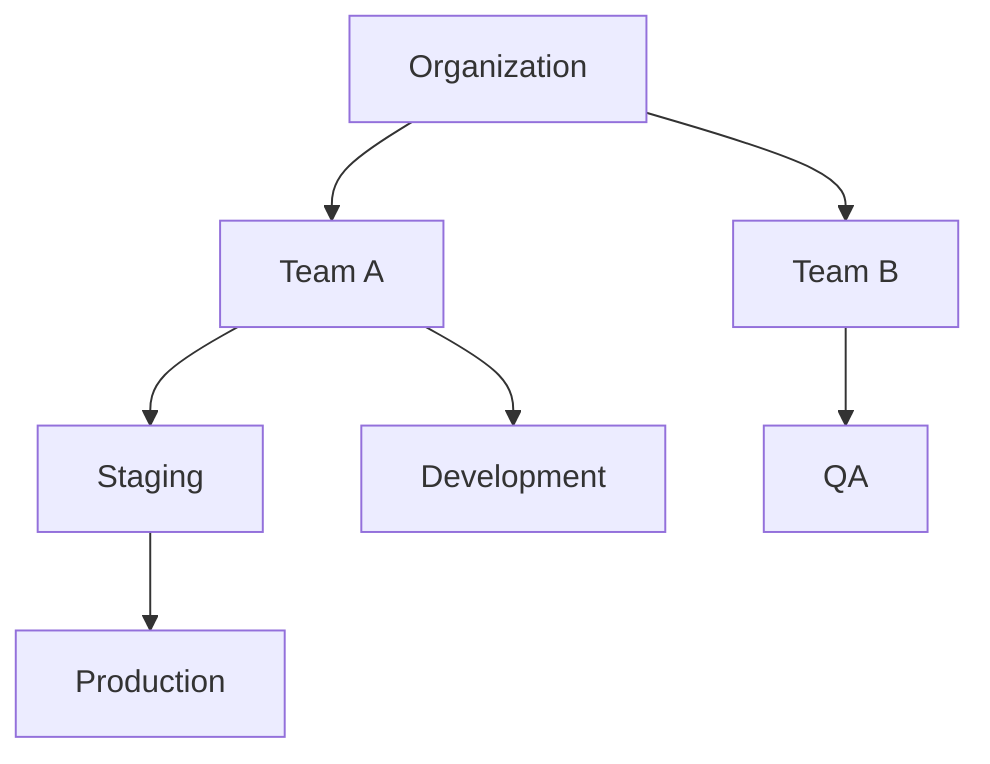

# Account model

The Platform Mesh account model maps organization structure to isolated control-plane spaces.

Accounts are the Platform Mesh concept users interact with. kcp workspaces are the backing control-plane mechanism that gives each account its own API surface and authorization boundary.

## Account hierarchy

The hierarchy lets organizations model teams, projects, and environments without creating a physical Kubernetes cluster for every boundary.

## What accounts provide

Accounts provide:

- a place to bind provider APIs
- an authorization boundary
- an organization and team context
- a portal navigation context
- a scope for service lifecycle objects

## Provider-consumer boundaries

Provider and consumer accounts stay isolated. A provider exposes a declarative API; a consumer binds that API into its own account workspace. Platform Mesh mediates the relationship through kcp, identity, authorization, and account lifecycle automation.

## Relationship to identity and authorization

Account lifecycle is tied to identity and authorization state. Keycloak provides authentication. OpenFGA stores relationship-based authorization state. Platform Mesh components wire those systems to account and workspace lifecycle.

## Related

- [Control planes](./control-planes.md)
- [Account model reference](/reference/concepts/account-model.md)
- [Account CR reference](/reference/concepts/account-cr.md)
