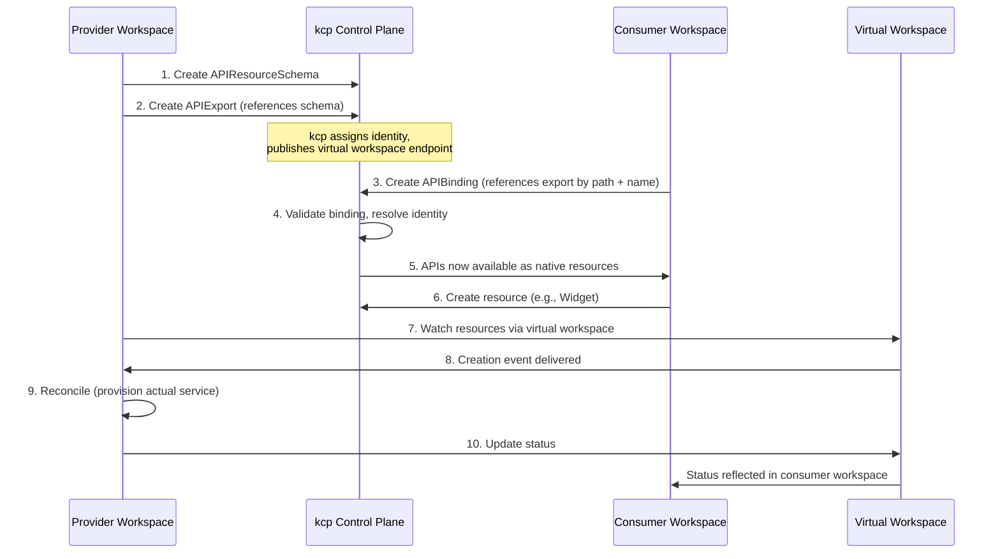

# APIExport & APIBinding

APIExport and APIBinding are the **upstream kcp** mechanism that makes cross-workspace API composition possible. Platform Mesh builds on this mechanism — providers publish an APIExport in their workspace, consumers bind to it with an APIBinding, and the exported resources appear in the consumer's workspace as if they were native Kubernetes types.

::: info Upstream concept
This page covers the parts of APIExport/APIBinding that matter for Platform Mesh: how the objects connect, who creates them, and how Platform Mesh uses them. For the full specification — identity hash internals, etcd storage, virtual workspace URL structure, admission webhook behavior, maximal permission policy — see the upstream [kcp documentation](https://docs.kcp.io/).
:::

## The Three Objects

APIExport/APIBinding is built on three custom resources, each with a single responsibility.

| Object | Where it lives | Created by | Purpose |
|---|---|---|---|
| **APIResourceSchema** | Provider workspace | Provider (often generated from a CRD) | Defines a single API type. Structurally like a CRD, but creating it does not serve the API — the provider explicitly activates it via an APIExport. Immutable once created. |
| **APIExport** | Provider workspace | Provider | Publishes one or more APIResourceSchemas for consumption. References the schemas by name. Gets a unique identity assigned by kcp so multiple providers can export the same group/resource without collision. |
| **APIBinding** | Consumer workspace | Consumer | Binds the consumer's workspace to a provider's APIExport by path + name. Once bound, the exported APIs appear in `kubectl api-resources` for the consumer. |

::: tip apigen
APIResourceSchemas are rarely written by hand. kcp ships an [`apigen` CLI](https://github.com/kcp-dev/sdk/tree/main/cmd/apigen) that generates them 1:1 from existing CRDs. Platform Mesh's [api-syncagent](/overview/api-syncagent) automates this further — it reads CRDs on the service cluster and creates the matching APIResourceSchemas in the provider workspace for you.
:::

## Binding Flow

The following sequence shows who does what — from API definition on the provider side to status reflection on the consumer side.



Steps 1-2 happen once during provider setup. Step 3 happens once per consumer binding. Steps 6-10 repeat for every resource lifecycle event.

**Key point:** the consumer never talks to the provider directly. Everything flows through kcp and the virtual workspace. The consumer writes a resource; the provider sees it via the virtual workspace; the provider writes status; kcp reflects it back to the consumer.

## Permission Claims

By default, a provider has access only to the resources defined in their own APIExport. Providers that need more — for example, a certificate provider that reads Secrets or a database provider that writes a ConfigMap with connection details — request additional access via `permissionClaims` on the APIExport.

Claims are **two-sided**: the provider declares what it needs, and the consumer explicitly accepts each claim in their APIBinding. Neither side can unilaterally escalate. If the provider requests `["*"]` but the consumer accepts only `["get", "list"]`, the provider gets read-only access.

```yaml
# Provider declares (in APIExport):
spec:
  permissionClaims:
  - group: ""
    resource: configmaps
    verbs: ["get", "list", "create"]

# Consumer accepts (in APIBinding):
spec:
  permissionClaims:
  - resource: configmaps
    verbs: ["get", "list", "create"]
    state: Accepted
    selector:
      matchAll: true
```

Consumers can scope access further with `matchLabels` or `matchExpressions` selectors — restricting providers to a subset of objects in the workspace. New claims added to an existing APIExport do not retroactively apply to existing bindings; consumers must update the binding to accept them.

## Virtual Workspace (How Providers See Consumer Resources)

Once a binding is active, the provider needs a way to watch and reconcile resources that consumers create — potentially across many consumer workspaces at once. kcp solves this with the **APIExport virtual workspace**: a proxy endpoint, published in the APIExport status, that aggregates all instances of the exported types across all bound consumers.

Providers use the wildcard path (`clusters/*`) to watch every consumer workspace at once. Platform Mesh's [api-syncagent](/overview/api-syncagent) and controllers built with [multi-cluster-runtime](/overview/multi-cluster-runtime) both use this endpoint under the hood. You do not interact with the virtual workspace URL directly when you use either of those tools.

## How Platform Mesh Uses This

The APIExport/APIBinding primitive is generic kcp. Platform Mesh layers **account structure and metadata** on top:

- **Where APIExports live:** Platform Mesh provisions dedicated provider workspaces under a known path (e.g., `root:providers:<name>`). The platform owner creates these; providers do not pick arbitrary workspace locations.
- **Who consumes:** Consumer workspaces are mapped to [Accounts](/concepts/account-model) in the PM hierarchy. APIBindings are created inside a consumer Account's workspace.
- **Metadata:** PM expects specific [annotations](/concepts/pm-annotations) (`core.platform-mesh.io/*`) on APIExports and APIBindings so the Portal, IAM wiring, and marketplace discovery can find them. Without those annotations an APIExport is valid kcp but invisible to PM.
- **Authorization:** When a binding is activated, PM provisions relationship tuples in the consumer Account's [IAM store](/concepts/iam-store) so the new API surfaces are covered by OpenFGA authorization alongside the rest of the workspace.

A bare APIExport without PM annotations works fine in vanilla kcp but will not be discoverable through the Platform Mesh Portal, will not participate in IAM wiring, and will not appear in the marketplace catalog.

## What's Next

- [**api-syncagent**](/overview/api-syncagent) — the primary tool for publishing CRDs from a Kubernetes service cluster as APIExports, with bidirectional sync
- [**multi-cluster-runtime**](/overview/multi-cluster-runtime) — a Go library for building custom controllers that reconcile across consumer workspaces using the virtual workspace
- [**Control Planes & Workspaces**](/concepts/control-planes) — the workspace hierarchy that APIExport/APIBinding operates inside
- [**Platform Mesh Annotations**](/concepts/pm-annotations) — metadata PM expects on APIExports/APIBindings
- [**Provider Quick Start**](/guides/provider-quick-start) — hands-on walkthrough that creates an APIExport end to end
