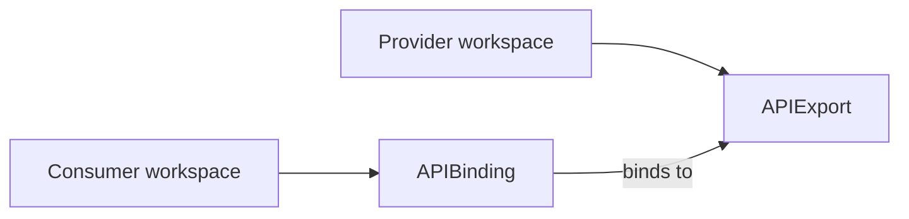

# API sharing

Platform Mesh uses kcp API sharing primitives to connect service providers and service consumers without giving consumers direct access to provider runtimes.

This page explains how Platform Mesh uses those primitives. kcp owns the canonical behavior and field-level semantics.

## Provider and consumer boundary

A service provider publishes a service API from a provider workspace. A service consumer makes that API available in a consumer workspace and creates desired-state resources there.

The provider owns the API contract and service automation. The consumer owns the requested service resources in its account workspace. Platform Mesh mediates the relationship through workspaces, identity, authorization, and declarative APIs.

## kcp primitives used by Platform Mesh

| Primitive | Platform Mesh role |
| --- | --- |
| APIExport | Provider-side contract for a service API. |
| APIBinding | Consumer-side binding that makes a provider API available in a consumer workspace. |
| APIResourceSchema | Schema object behind exported kcp APIs. |
| Permission claim | Provider request for bounded access to related consumer-side resources, such as Secrets or ConfigMaps. |
| Virtual workspace | Wildcard endpoint per APIExport that providers watch to see consumer-bound objects without per-workspace credentials. |
| Identity hash | Stable tag in `APIExport.status.identityHash` providers use to scope wildcard reads when multiple providers export the same group/resource. |

## Platform Mesh usage

- api-syncagent can publish CRD-based provider services through APIExports.
- multicluster-runtime can be used by provider controllers that watch resources across workspaces.
- Marketplace and portal workflows can guide or create APIBindings for consumers.
- Permission claims are part of the provider-consumer trust boundary and should be accepted intentionally.

## Permission claims

A provider often needs bounded access to a few resources outside its own API — to write a `Secret` with connection credentials, read a credential the consumer placed in the workspace, or emit `events`. Permission claims are the consent mechanic for that access: the provider declares what it needs on the APIExport; the consumer accepts each claim explicitly on the APIBinding. Neither side can unilaterally escalate.

Claims can be scoped by verb (read-only versus full access) and, in principle, by object selector. Platform Mesh itself is bootstrapped through this mechanism — the `core.platform-mesh.io` APIExport in `platform-mesh-system` claims access to workspaces, apibindings, logical clusters, and secrets so the account-operator can reconcile them on every account's behalf.

For the full Platform Mesh examples, see [API sharing reference](/reference/components/kcp/api-sharing.md). For field-level semantics, see [permission claims](https://docs.kcp.io/kcp/main/concepts/apis/exporting-apis/#permission-claims) in the kcp docs.

## Virtual workspaces

A provider with many consumer bindings cannot watch each consumer workspace separately. kcp solves this by publishing *virtual workspace* endpoints — wildcard views that aggregate all bound objects across consumers on one kcp shard. Provider controllers connect to that one endpoint, see every relevant object annotated with its source workspace, and write status back through the same path.

Every Platform Mesh operator (account-operator, security-operator, rebac-authz-webhook, the GraphQL gateway, marketplace, and per-service operators) consumes virtual workspaces this way. Controllers do not construct URLs by hand; they read them from `APIExportEndpointSlice.status`.

For URL contracts, terminating-phase endpoints, and Go discovery snippets, see [Virtual workspaces reference](/reference/components/kcp/virtual-workspaces.md).

## How Platform Mesh layers on this

The kcp primitives are generic. Platform Mesh layers account structure and lifecycle wiring on top:

- **Where APIExports live.** Platform Mesh provisions dedicated provider workspaces under a known path. The platform owner controls those locations; providers do not pick arbitrary paths.
- **Who consumes.** Consumer workspaces are mapped to [Accounts](./account-model.md) in the Platform Mesh hierarchy. APIBindings live inside a consumer Account's workspace.
- **Authorization wiring.** When a binding is activated, Platform Mesh updates the consumer Account's [IAM store](./identity-and-authorization.md) so the new API surfaces are covered by OpenFGA alongside the rest of the workspace.

A bare APIExport without Platform Mesh wiring works fine in vanilla kcp but does not appear in the marketplace, does not participate in IAM enforcement, and is not discoverable through the Platform Mesh Portal.

## Upstream kcp ownership

kcp owns APIExport, APIBinding, APIResourceSchema, permission claim, identity, and virtual workspace semantics.

Reference upstream kcp documentation for canonical behavior:

- [Exporting and binding APIs](https://docs.kcp.io/kcp/main/concepts/apis/exporting-apis/)
- [APIBinding CRD reference](https://docs.kcp.io/kcp/main/reference/crd/apis.kcp.io/apibindings/)
- [APIExport CRD reference](https://docs.kcp.io/kcp/main/reference/crd/apis.kcp.io/apiexports/)
- [APIResourceSchema CRD reference](https://docs.kcp.io/kcp/main/reference/crd/apis.kcp.io/apiresourceschemas/)

## Related

- [API sharing in kcp](/reference/components/kcp/api-sharing.md) — primitives reference
- [Control planes](./control-planes.md)
- [Integration paths](./integration-paths.md)
- [Provider to consumer](./interaction-patterns/provider-to-consumer.md)
