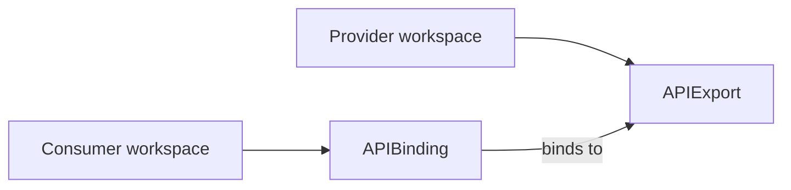

# API sharing

Platform Mesh uses kcp API sharing primitives to connect service providers and service consumers without giving consumers direct access to provider runtimes.

This page explains how Platform Mesh uses those primitives. kcp owns the canonical behavior and field-level semantics.

## Provider and consumer boundary

A service provider publishes a service API from a provider workspace. A service consumer makes that API available in a consumer workspace and creates desired-state resources there.

The provider owns the API contract and service automation. The consumer owns the requested service resources in its account workspace. Platform Mesh mediates the relationship through workspaces, identity, authorization, and declarative APIs.

## kcp primitives used by Platform Mesh

| Primitive | Platform Mesh role |
| --- | --- |
| APIExport | Provider-side contract for a service API. |
| APIBinding | Consumer-side binding that makes a provider API available in a consumer workspace. |
| APIResourceSchema | Schema object behind exported kcp APIs. |
| Permission claim | Provider request for bounded access to related consumer-side resources, such as Secrets or ConfigMaps. |

## Platform Mesh usage

- api-syncagent can publish CRD-based provider services through APIExports.
- multi-cluster-runtime can be used by provider controllers that watch resources across workspaces.
- Marketplace and portal workflows can guide or create APIBindings for consumers.
- Permission claims are part of the provider-consumer trust boundary and should be accepted intentionally.

## How Platform Mesh layers on this

The kcp primitives are generic. Platform Mesh layers account structure and lifecycle wiring on top:

- **Where APIExports live.** Platform Mesh provisions dedicated provider workspaces under a known path. The platform owner controls those locations; providers do not pick arbitrary paths.
- **Who consumes.** Consumer workspaces are mapped to [Accounts](./account-model.md) in the Platform Mesh hierarchy. APIBindings live inside a consumer Account's workspace.
- **Authorization wiring.** When a binding is activated, Platform Mesh updates the consumer Account's [IAM store](./identity-and-authorization.md) so the new API surfaces are covered by OpenFGA alongside the rest of the workspace.

A bare APIExport without Platform Mesh wiring works fine in vanilla kcp but will not appear in the marketplace, will not participate in IAM enforcement, and will not be discoverable through the Platform Mesh Portal.

## Upstream kcp ownership

kcp owns APIExport, APIBinding, APIResourceSchema, permission claim, identity, and virtual workspace semantics.

Use upstream kcp documentation for canonical behavior:

- [Exporting and binding APIs](https://docs.kcp.io/kcp/main/concepts/apis/exporting-apis/)
- [APIBinding CRD reference](https://docs.kcp.io/kcp/main/reference/crd/apis.kcp.io/apibindings/)
- [APIExport CRD reference](https://docs.kcp.io/kcp/main/reference/crd/apis.kcp.io/apiexports/)
- [APIResourceSchema CRD reference](https://docs.kcp.io/kcp/main/reference/crd/apis.kcp.io/apiresourceschemas/)

## Related

- [Control planes](./control-planes.md)
- [Provider to consumer](./interaction-patterns/provider-to-consumer.md)
- [Provider to provider](./interaction-patterns/provider-to-provider.md)
- [Integration paths](./integration-paths.md)
