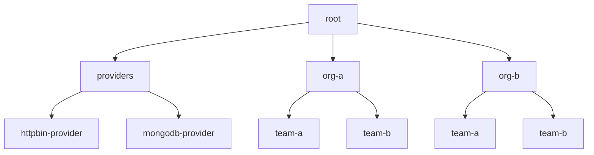
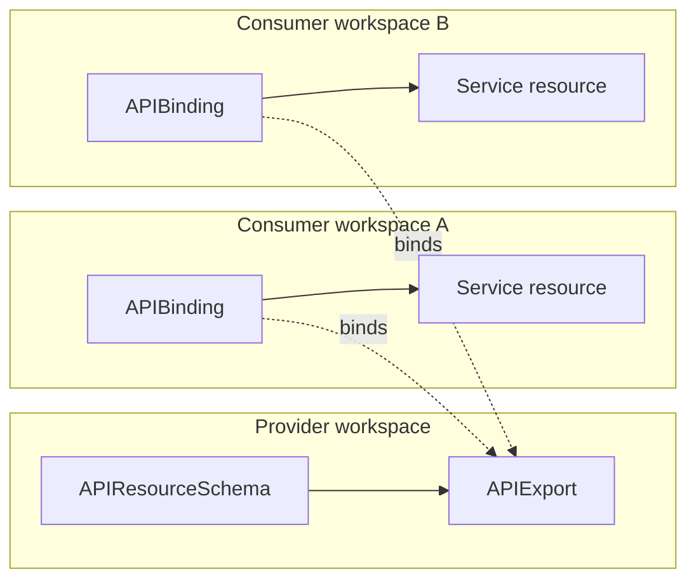

# Control planes and workspaces

Platform Mesh uses kcp as its control-plane substrate. kcp provides the Kubernetes-compatible API layer, workspace isolation, and API sharing primitives that Platform Mesh builds on for accounts, providers, consumers, and marketplace-style service consumption.

This page explains the Platform Mesh usage model. It intentionally does not replace the upstream kcp documentation for kcp-owned behavior.

## Why kcp is the substrate

Platform Mesh needs a shared control plane where service providers can publish declarative APIs and service consumers can use those APIs without getting direct access to provider runtimes.

kcp fits that role because it keeps the Kubernetes Resource Model as the common API shape while separating it from Kubernetes cluster scheduling. In Platform Mesh terms, kcp acts as the API orchestration layer: it gives providers and consumers a Kubernetes-style API surface for service management instead of a container orchestration surface.

That means existing Kubernetes clients and controller patterns still apply, but the resources describe service requests, bindings, account state, and provider integrations rather than pods on a workload cluster.

## Workspaces in Platform Mesh

Platform Mesh uses kcp workspaces to provide isolated Kubernetes-compatible API surfaces for accounts, providers, consumers, and marketplace-related flows.

The important Platform Mesh idea is:

- account boundaries map to control-plane boundaries
- provider APIs are published from provider spaces
- consumer accounts bind provider APIs into their own workspaces
- Platform Mesh components reconcile across those spaces while preserving authorization boundaries

The Account is the Platform Mesh abstraction. The workspace is the kcp mechanism that gives the account its isolated API surface and authorization boundary.

## Workspace hierarchy

Workspaces are hierarchical. Platform Mesh can use that hierarchy to represent organizational and account structure while keeping API resources isolated at each level.

A workspace has a path, such as `:root:org-a:team-a`. This avoids name conflicts between branches and gives platform owners a way to map organizational structure into the control plane.

kcp workspace types can define which APIs are available by default and which parts of the hierarchy are allowed in a given area. Platform Mesh can use that to separate provider spaces, consumer account spaces, and marketplace or registry spaces without making every workspace identical.

## Provider and consumer workspaces

Provider integration is based on the `APIExport` and `APIBinding` pattern:

- a provider publishes a service API from a provider workspace with an `APIExport`
- a consumer binds that exported API into its own workspace with an `APIBinding`
- the consumer creates desired-state resources in its own workspace
- the provider reconciles those resources and reports status back through the control plane

This is the main control-plane relationship between providers and consumers. APIExports and APIBindings connect the workspaces, while the account model decides who owns each workspace and who is allowed to use it.

Provider controllers do not need full access to every consumer workspace. kcp exposes APIExport virtual workspaces that let a provider watch and reconcile the resources created from the APIs it provides. Access remains limited to the exported API surface and is guarded by authorization checks.

## Marketplace and composition

The same export and binding model enables a marketplace-like flow. Consumers can discover APIs they are allowed to see, bind the ones they want to use, and then manage provider services through declarative resources in their own workspace.

The API schema is the contract between provider and consumer. This keeps provider implementation details behind the API boundary while still giving consumers a consistent way to request, update, and observe service instances.

Because the shared interface follows the Kubernetes Resource Model, consumers and providers can also compose services across provider boundaries. For example, one provider can write credentials or connection details as Kubernetes-style resources, and another provider can consume them through a separate API contract.

## Platform Mesh mapping

| Platform Mesh concept | kcp mechanism | Purpose |
| --- | --- | --- |
| Account | Workspace | Gives an organization, team, provider, or consumer an isolated API surface. |
| Provider API | APIResourceSchema and APIExport | Publishes the schema and API surface a provider offers. |
| Consumer subscription | APIBinding | Makes a provider API available in a consumer workspace. |
| Provider reconciliation | APIExport virtual workspace | Lets provider automation observe and reconcile consumer-created resources for its exported API. |

## What to learn from upstream kcp

kcp owns the full semantics of workspaces, workspace types, virtual workspaces, APIExports, APIBindings, APIResourceSchemas, permission claims, and sharding behavior.

Use these upstream docs for canonical behavior:

- [kcp workspaces](https://docs.kcp.io/kcp/main/concepts/workspaces/)
- [kcp exporting and binding APIs](https://docs.kcp.io/kcp/main/concepts/apis/exporting-apis/)

## Related

- [Account model](./account-model.md)
- [API sharing](./api-sharing.md)
- [Integration paths](./integration-paths.md)
