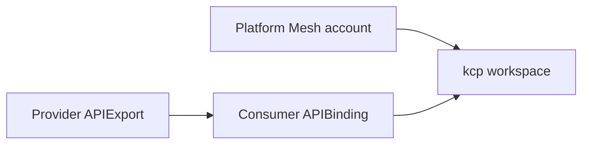

# Control planes

Platform Mesh uses kcp as its control-plane substrate. This page explains the Platform Mesh usage model and links to upstream kcp documentation for kcp-owned details.

## Platform Mesh usage

Platform Mesh uses kcp workspaces to provide isolated Kubernetes-compatible API surfaces for accounts, providers, consumers, and marketplace-related flows.

The important Platform Mesh idea is:

- account boundaries map to control-plane boundaries
- provider APIs are published from provider spaces
- consumer accounts bind provider APIs into their own workspaces
- Platform Mesh components reconcile across those spaces while preserving authorization boundaries

## What to learn from upstream kcp

kcp owns the full semantics of workspaces, workspace types, virtual workspaces, APIExports, APIBindings, APIResourceSchemas, permission claims, and sharding behavior.

Use these upstream docs for canonical behavior:

- [kcp workspaces](https://docs.kcp.io/kcp/main/concepts/workspaces/)
- [kcp exporting and binding APIs](https://docs.kcp.io/kcp/main/concepts/apis/exporting-apis/)

## Platform Mesh mapping

The Account is the Platform Mesh abstraction. The workspace is the kcp mechanism. APIExports and APIBindings connect provider and consumer workspaces.

## Related

- [Account model](./account-model.md)
- [Integration paths](./integration-paths.md)
- [Control planes and workspaces reference](/reference/concepts/control-planes.md)
