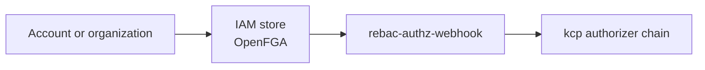

# Identity and authorization

Platform Mesh separates authentication, authorization data, and control-plane enforcement across several runtime components.

Use this page to understand the conceptual relationship. Use Reference only for concrete component and resource lookup.

## Runtime roles

| Area | Platform Mesh role |
| --- | --- |
| Authentication | Keycloak is the default identity provider used by the local setup. |
| Authorization data | The OpenFGA engine holds one *IAM store* per organization, declared by a [`Store` CR](/reference/resources/iamstore-resource.md). Account workspaces under that organization share the organization's store, which carries relationship-based authorization data for the organization, its accounts, and provider-consumer relationships. |
| Enforcement | rebac-authz-webhook participates in kcp authorization decisions. |
| Account lifecycle | Platform Mesh automation wires identity and authorization state as accounts and organizations are created. |

## Runtime relationship

Missing or stale authorization data can surface as authorization failures in kcp, the Kubernetes GraphQL gateway, or the portal.

## Authorizer chain

Every API request that reaches kcp passes through this chain in order. When a request is denied, the deny comes from one of these stages:

- **Front proxy** — terminates TLS and validates the request's identity against the OIDC issuer (Keycloak). A request without a valid token never reaches the authorizers.
- **kcp built-in chain** — RBAC, required-groups, workspace-content, and maximal-permission-policy authorizers run in order. Standard Kubernetes RBAC denials happen here.
- **rebac-authz-webhook** — the last stage. kcp sends a `SubjectAccessReview` to the webhook, which translates it into a [Check](https://openfga.dev/docs/getting-started/perform-check) against the organization OpenFGA store for the target account workspace and returns allow or deny. This is where Platform Mesh's relationship-based decisions land.

If every stage returns "no opinion", the request is denied by default. The webhook is configured with `failurePolicy: NoOpinion` so an unreachable webhook does not unilaterally allow traffic.

For the actual `AuthorizationConfiguration` YAML, the webhook deployment args, and per-workspace OIDC, see [Identity and authorization reference](/reference/components/kcp/identity-and-authorization.md).

## Related

- [Security architecture](/concepts/security/) — design view: separation of concerns, OIDC federation, ReBAC, account-model integration
- [Account model](./account-model.md)
- [IAM Store resource](/reference/resources/iamstore-resource.md)
- [Keycloak](/reference/components/keycloak.md)
- [OpenFGA](/reference/components/openfga.md)
- [rebac-authz-webhook](/reference/components/rebac-authz-webhook.md)
- [Security operator](/reference/components/security-operator.md)
