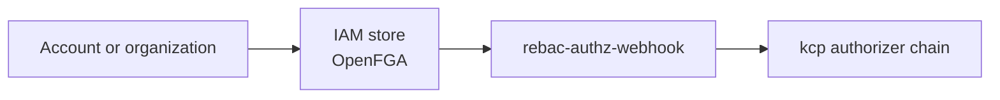

# Identity and authorization

Platform Mesh separates authentication, authorization data, and control-plane enforcement across several runtime components.

Use this page to understand the conceptual relationship. Use Reference only for concrete component and resource lookup.

## Runtime roles

| Area | Platform Mesh role |
| --- | --- |
| Authentication | Keycloak is the default identity provider used by the local setup. |
| Authorization data | OpenFGA stores relationship-based authorization data for organizations, accounts, and provider-consumer relationships. |
| Enforcement | rebac-authz-webhook participates in kcp authorization decisions. |
| Account lifecycle | Platform Mesh automation wires identity and authorization state as accounts and organizations are created. |

## IAM store concept

An IAM store represents authorization state associated with an organization or account. Platform Mesh uses OpenFGA stores for relationship-based authorization data.

IAM stores can contain:

- authorization models
- relationship tuples
- account and organization relationships
- provider-consumer relationships used for access decisions

The exact model is owned by the security and IAM components. Users should not edit IAM stores manually unless the relevant component documentation says so.

## Runtime relationship

Missing or stale authorization data can surface as authorization failures in kcp, the Kubernetes GraphQL gateway, or the portal.

## Related

- [Account model](./account-model.md)
- [Keycloak](/reference/components/keycloak.md)
- [OpenFGA](/reference/components/openfga.md)
- [rebac-authz-webhook](/reference/components/rebac-authz-webhook.md)
- [Security operator](/reference/components/security-operator.md)
