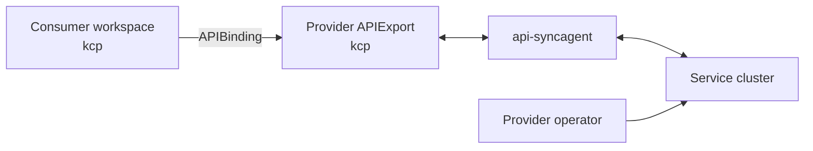
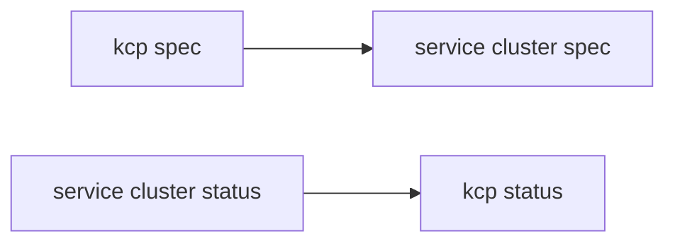
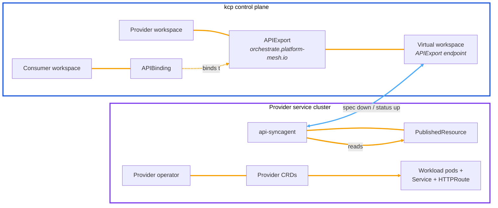
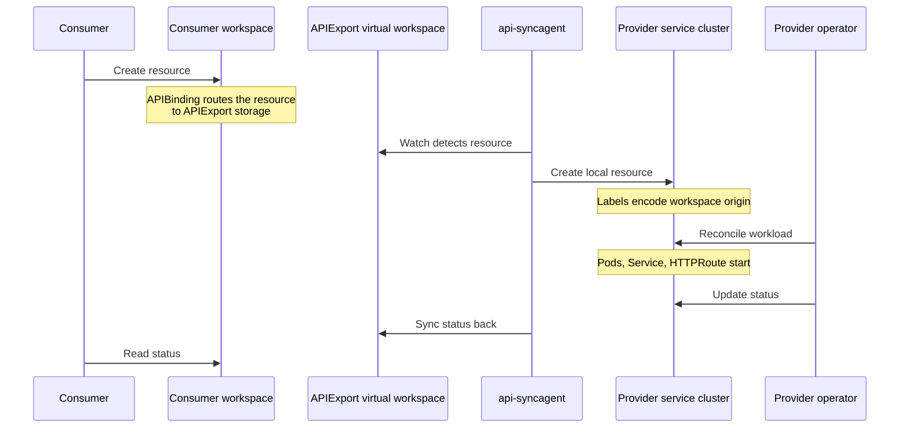

# api-syncagent

api-syncagent is the low-effort integration path for providers that already expose Kubernetes CRDs.

## Platform Mesh role

api-syncagent connects a provider service cluster to kcp. It publishes CRD-based provider APIs through APIExports and synchronizes consumer-created resources to the provider service cluster.

## Data direction

Consumer desired state flows from kcp to the service cluster. Provider status flows from the service cluster back to kcp.

## When to use it

Use api-syncagent when:

- the service already exposes CRDs
- synchronization can follow spec-down/status-up
- the provider wants a configuration-driven integration
- related resources such as Secrets or ConfigMaps need to be synchronized

Use [multi-cluster-runtime](./multi-cluster-runtime.md) when the provider needs full control over synchronization logic.

## How api-syncagent works

A provider using api-syncagent has four moving parts across the kcp control plane and the provider service cluster.

| Component | Runs on | Purpose |
| --- | --- | --- |
| APIExport | kcp provider workspace | Publishes the API for consumers to bind. |
| api-syncagent | Provider service cluster | Bridges kcp and the service cluster and syncs resources bidirectionally. |
| Provider operator | Provider service cluster | Reconciles synced resources into the actual workload. |
| PublishedResource | Provider service cluster | Tells api-syncagent which CRD to publish to kcp. |

Consumers interact only with their kcp workspace. They do not access the provider service cluster directly.

## PublishedResource

The provider configures api-syncagent with a `PublishedResource`. It says which service-cluster CRD should be exposed through kcp.

api-syncagent then:

1. Converts the CRD into an APIResourceSchema in kcp.
2. Adds the schema to the provider APIExport.
3. Watches the APIExport virtual workspace for consumer resources.
4. Syncs consumer spec down to the service cluster.
5. Syncs provider status back to the consumer workspace.

The schema name in kcp is versioned and immutable. If the CRD changes, api-syncagent creates a new APIResourceSchema and updates the export.

api-syncagent labels synced service-cluster objects with the source workspace and object identity. Operators can use those labels to derive names and DNS entries that avoid collisions across consumer workspaces.

## Request lifecycle

The HttpBin demo provider in the local setup illustrates the request lifecycle end to end. The same flow applies to any api-syncagent provider — the consumer creates a resource in kcp, api-syncagent projects it to the service cluster, the operator reconciles it into a workload, and status flows back.

The important direction is: spec flows from kcp to the service cluster, and status flows from the service cluster back to kcp.

## Production considerations

In production, the service cluster is owned by the provider team. The provider team runs the operator, CRDs, api-syncagent, and workloads on its own infrastructure.

api-syncagent connects outward to the kcp API endpoint. That means:

- the provider cluster needs outbound HTTPS access to kcp
- kcp does not need inbound network access to the provider cluster
- credentials are stored as a kubeconfig Secret on the provider cluster

Each api-syncagent instance handles one APIExport. A provider with multiple service APIs normally runs multiple agents, each with its own PublishedResource set and APIExport target.

## Extension points

Common ways to extend an api-syncagent provider include:

- adding fields to the published CRD, such as replicas or region placement
- using PublishedResource projection to rename the exposed API shape
- using PublishedResource mutation to inject provider defaults
- declaring related resources, such as Secrets or ConfigMaps, when the service needs to return credentials to consumers

## Upstream documentation

api-syncagent owns the detailed configuration and object semantics. Use the upstream docs for installation, PublishedResource details, endpoint slices, RBAC, and troubleshooting:

- [api-syncagent documentation](https://docs.kcp.io/api-syncagent/v0.5/)
- [api-syncagent getting started](https://docs.kcp.io/api-syncagent/main/getting-started/)

## Related

- [Provider quick start](/tutorials/provider-quick-start.md) — runnable tutorial that builds an api-syncagent provider end to end.
- [multi-cluster-runtime](./multi-cluster-runtime.md) — the alternative path for custom controller logic.
- [Integration paths](../integration-paths.md)
- [api-syncagent component reference](/reference/components/api-syncagent.md)
- [API sharing](../api-sharing.md)
