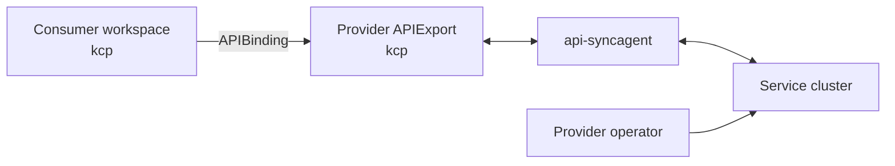
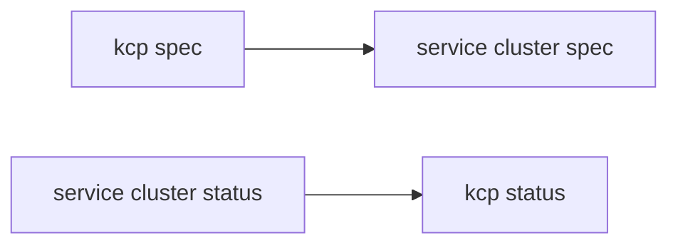

# api-syncagent

api-syncagent is the low-effort integration path for providers that already expose Kubernetes CRDs.

## Platform Mesh role

api-syncagent connects a provider service cluster to kcp. It publishes CRD-based provider APIs through APIExports and synchronizes consumer-created resources to the provider service cluster.

## Data direction

Consumer desired state flows from kcp to the service cluster. Provider status flows from the service cluster back to kcp.

## When to use it

Use api-syncagent when:

- the service already exposes CRDs
- synchronization can follow spec-down/status-up
- the provider wants a configuration-driven integration
- related resources such as Secrets or ConfigMaps need to be synchronized

Use [multi-cluster-runtime](./multi-cluster-runtime.md) when the provider needs full control over synchronization logic.

## Upstream documentation

api-syncagent owns the detailed configuration and object semantics. Use the upstream docs for installation, PublishedResource details, endpoint slices, RBAC, and troubleshooting:

- [api-syncagent documentation](https://docs.kcp.io/api-syncagent/v0.5/)
- [api-syncagent getting started](https://docs.kcp.io/api-syncagent/main/getting-started/)

## Related

- [Integration paths](../integration-paths.md)
- [api-syncagent component reference](/reference/components/api-syncagent.md)
- [API sharing](../api-sharing.md)
