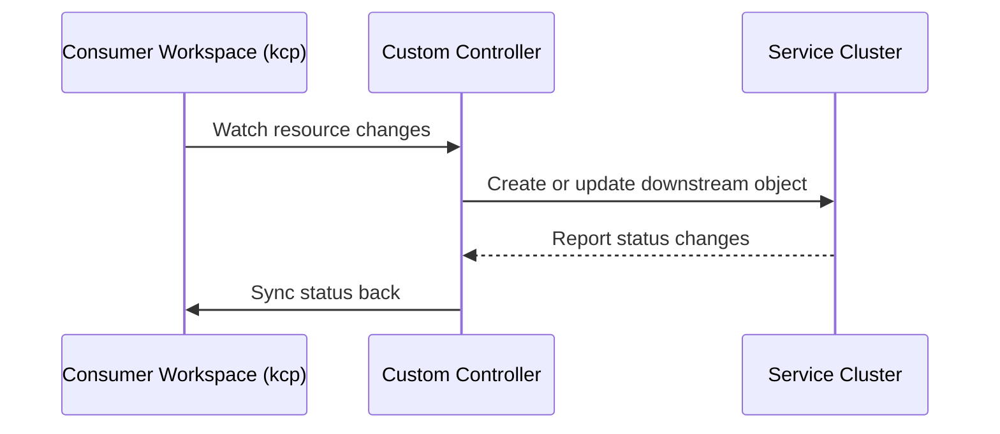

# multi-cluster-runtime

multi-cluster-runtime is the advanced integration path for providers that need custom controller logic across multiple Kubernetes-like clusters.

## Platform Mesh role

In Platform Mesh, a provider controller can use multi-cluster-runtime to watch consumer workspaces through kcp and reconcile requests directly into a provider service runtime.

## When to use it

Use multi-cluster-runtime when:

- the provider needs custom sync logic
- the provider API is not a straightforward CRD sync case
- lifecycle orchestration spans multiple systems
- synchronization should be embedded in the provider controller

Use [api-syncagent](./api-syncagent.md) when the provider has standard CRD-based APIs and can use generic synchronization.

## Upstream documentation

Use upstream docs and repositories for library APIs and provider implementations:

- [kubernetes-sigs/multicluster-runtime](https://github.com/kubernetes-sigs/multicluster-runtime)
- [kcp-dev/multicluster-provider](https://github.com/kcp-dev/multicluster-provider)

## Related

- [Integration paths](../integration-paths.md)
- [multi-cluster-runtime component reference](/reference/components/multi-cluster-runtime.md)
- [API sharing](../api-sharing.md)
