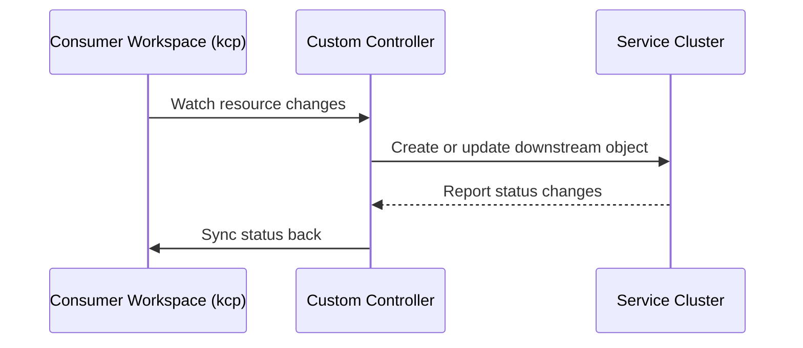
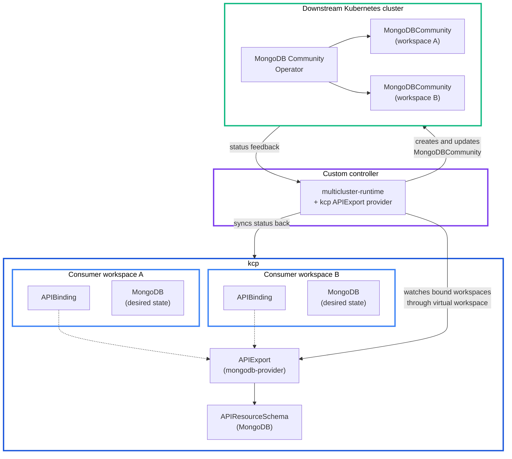

# multicluster-runtime

multicluster-runtime is the advanced integration path for providers that need custom controller logic across multiple Kubernetes-like clusters.

## Platform Mesh role

In Platform Mesh, a provider controller can use multicluster-runtime to watch consumer workspaces through kcp and reconcile requests directly into a provider service runtime.



## When to use it

Use multicluster-runtime when:

- the provider needs custom sync logic
- the provider API is not a straightforward CRD sync case
- lifecycle orchestration spans multiple systems
- synchronization should be embedded in the provider controller
- the downstream operator has lifecycle stages that need custom status mapping
- the consumer-facing API should differ from the downstream CRD
- the provider needs Go code, tests, and compile-time type safety for sync logic

The added effort over a standard `controller-runtime` operator is small — provider authors swap in the `mcr` packages instead of the standard ones and gain multi-cluster awareness without forking the framework.

Use [api-syncagent](./api-syncagent.md) when the provider has standard CRD-based APIs and can use generic synchronization.

## Architecture

The MongoDB worked example below illustrates the full architecture. kcp holds the APIExport, APIResourceSchema, and consumer workspaces. The custom controller uses the kcp APIExport provider to watch all workspaces that bind to the MongoDB export. The downstream cluster runs the operator and the actual workload resources.



## Defining the API in kcp

With api-syncagent, the CRD on the service cluster is converted into kcp schema objects automatically. With multicluster-runtime, the provider defines the kcp API explicitly.

The APIResourceSchema describes the consumer-facing resource:

```yaml
apiVersion: apis.kcp.io/v1alpha1
kind: APIResourceSchema
metadata:
  name: v1.mongodbcommunity.mongodbcommunity.mongodb.com
spec:
  group: mongodbcommunity.mongodb.com
  names:
    kind: MongoDBCommunity
    listKind: MongoDBCommunityList
    plural: mongodbcommunity
    singular: mongodbcommunity
  scope: Namespaced
  versions:
    - name: v1
      served: true
      storage: true
      schema:
        openAPIV3Schema:
          type: object
          properties:
            spec:
              type: object
              properties:
                members:
                  type: integer
                type:
                  type: string
                version:
                  type: string
            status:
              type: object
              properties:
                phase:
                  type: string
                version:
                  type: string
      subresources:
        status: {}
```

The APIExport references that schema. The shape matches what the upstream `sample/mongo-api.yaml` ships today — `apis.kcp.io/v1alpha1` with `spec.latestResourceSchemas`:

```yaml
apiVersion: apis.kcp.io/v1alpha1
kind: APIExport
metadata:
  name: mongodb
spec:
  latestResourceSchemas:
    - v1.mongodbcommunity.mongodbcommunity.mongodb.com
```

Consumers bind to this APIExport (at path `root:mongodb` in the example) and then create MongoDB resources in their own workspaces. The consumer-side `APIBinding` in the example uses `apis.kcp.io/v1alpha2` to take advantage of `selector` and `verbs`. See [API sharing](/reference/components/kcp/api-sharing.md) for the v1alpha1/v1alpha2 differences.

## Controller shape

The controller uses controller-runtime plus multicluster-runtime. The kcp APIExport provider discovers all consumer workspaces that have bound to the MongoDB APIExport.

```go
import (
    "github.com/kcp-dev/multicluster-provider/apiexport"
    "k8s.io/client-go/tools/clientcmd"
    "sigs.k8s.io/controller-runtime/pkg/manager"
    mcmanager "sigs.k8s.io/multicluster-runtime/pkg/manager"
)

func main() {
    kcpConfig, err := clientcmd.BuildConfigFromFlags("", kcpKubeconfig)
    if err != nil {
        log.Fatal(err)
    }

    provider, err := apiexport.New(kcpConfig, apiexport.Options{})
    if err != nil {
        log.Fatal(err)
    }

    mgr, err := mcmanager.New(targetConfig, provider, manager.Options{})
    if err != nil {
        log.Fatal(err)
    }

    ctx := ctrl.SetupSignalHandler()
    go provider.Run(ctx, mgr)
    mgr.Start(ctx)
}
```

Each reconcile request includes a cluster name that identifies the consumer workspace that produced the event. The reconciler retrieves the workspace client by that name and projects desired state onto the downstream cluster, then writes selected status fields back.

The important design choices are explicit: the controller decides how to map spec down, how to handle deletes, and which status fields to report back.

## Compare with api-syncagent

| Aspect | HttpBin with api-syncagent | MongoDB with multicluster-runtime |
| --- | --- | --- |
| Integration mechanism | Generic agent | Custom Go controller |
| Sync logic | Handled by api-syncagent | Written by the provider |
| API definition | Service-cluster CRD converted through PublishedResource | Hand-authored APIResourceSchema and APIExport |
| Code required | YAML configuration | Go code |
| Status sync | Automatic status subresource sync | Provider selects status fields |
| Best for | Standard CRD-based services | Complex lifecycle or custom orchestration |

Both paths give consumers a Kubernetes API in their workspace. The provider chooses the implementation path based on how much control it needs.

## Upstream documentation

Use upstream docs and repositories for library APIs and provider implementations:

- [kubernetes-sigs/multicluster-runtime](https://github.com/kubernetes-sigs/multicluster-runtime)
- [kcp-dev/multicluster-provider](https://github.com/kcp-dev/multicluster-provider)

## Related

- [Build a multicluster-runtime provider](/tutorials/build-multicluster-runtime-provider.md) — runnable tutorial.
- [multicluster-runtime reference](/reference/components/multicluster-runtime.md)
- [api-syncagent](./api-syncagent.md) — the simpler alternative path.
- [Integration paths](../integration-paths.md)
