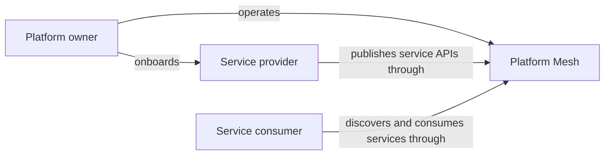
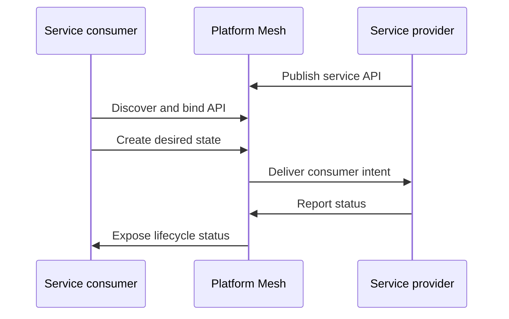

# Personas

Platform Mesh documentation is organized around three main personas: platform owners, service providers, and service consumers.

Use this page to identify which role matches your work, what that role owns, and which documentation path to follow next. It is a role guide, not an installation guide or component reference.

| Persona | Primary goal | Owns | Start with |
| --- | --- | --- | --- |
| Platform owner | Run the mesh as a shared service platform | Platform Mesh runtime, account hierarchy, identity, authorization, policy, provider onboarding, component lifecycle | [Why Platform Mesh?](./why-platform-mesh.md), [Architecture](./architecture.md), [Account model](./account-model.md), [Control planes](./control-planes.md) |
| Service provider | Publish a service capability as a declarative API | API contract, provider automation, service runtime integration, lifecycle status, integration path | [Integration paths](./integration-paths.md), [api-syncagent](./integration/api-syncagent.md), [multi-cluster-runtime](./integration/multi-cluster-runtime.md), [Interaction patterns](./interaction-patterns/provider-to-consumer.md) |
| Service consumer | Discover and consume provider services through a consistent API | Account resources, bound provider APIs, desired-state resources, application service dependencies | [Explore the example MSP](/tutorials/explore-example-msp.md), [Interaction patterns](./interaction-patterns/provider-to-consumer.md), [Account model](./account-model.md), [API sharing](./api-sharing.md) |

## Platform owner

A platform owner operates Platform Mesh as the shared service-management layer for an organization. They make sure providers can publish services, consumers can safely use them, and the platform has a consistent account, identity, and authorization model.

### Goal

Create a secure and operable mesh where service capabilities can be offered and consumed without every team inventing its own integration pattern.

### Responsibilities

- Operate the Platform Mesh runtime and its core components.
- Define the account hierarchy and workspace model used by providers and consumers.
- Configure identity, authorization, and policy boundaries.
- Onboard service providers and make their APIs discoverable.
- Decide which components are installed, upgraded, and exposed to users.

### Common questions

- Which components are part of the Platform Mesh runtime?
- How do accounts, workspaces, and control planes relate?
- How are providers onboarded into the mesh?
- Where are identity and authorization enforced?
- Which operational tasks belong in Platform Mesh and which belong in provider runtimes?

### Recommended reading

Start with [Why Platform Mesh?](./why-platform-mesh.md), then read [Architecture](./architecture.md), [Account model](./account-model.md), and [Control planes](./control-planes.md). Use [Components](/reference/components/) for factual component lookup.

## Service provider

Service providers build and operate services that can be consumed through Platform Mesh. They define the declarative API contract for a capability and own the automation that turns consumer intent into real service instances.

Provider examples include teams offering databases, certificates, CI/CD pipelines, AI infrastructure, or internal platform services.

### Goal

Expose a service capability through a stable API while keeping implementation details, runtime topology, and provider operations behind the provider boundary.

### Responsibilities

- Define the service API consumers use to request and manage capabilities.
- Publish that API through Platform Mesh so consumers can discover and bind it.
- Reconcile consumer desired state into provider-owned runtime resources.
- Report lifecycle status back to consumers.
- Choose the right integration path for the provider's API and controller model.

### Common questions

- Should this provider use api-syncagent or multi-cluster-runtime?
- Which CRDs or APIs should be exposed to consumers?
- How does consumer desired state reach the provider runtime?
- How does provider status flow back to the consumer workspace?
- How can one provider consume another provider's API?

### Recommended reading

Start with [Integration paths](./integration-paths.md), then read [api-syncagent](./integration/api-syncagent.md) or [multi-cluster-runtime](./integration/multi-cluster-runtime.md), depending on the provider model. Use [Interaction patterns](./interaction-patterns/provider-to-consumer.md) to understand provider-to-consumer and provider-to-provider flows.

## Service consumer

Service consumers use Platform Mesh to discover, order, and manage service capabilities. They work with declarative resources in their own account workspaces instead of learning every provider's runtime and operational interface.

### Goal

Consume services through a consistent Kubernetes Resource Model interface, with clear ownership boundaries between consumer intent and provider implementation.

### Responsibilities

- Discover available service APIs.
- Bind provider APIs into the consumer account workspace when required.
- Create and update desired-state resources for service instances.
- Observe lifecycle status and act on failures or required follow-up.
- Integrate consumed services into applications, GitOps flows, or automation.

### Common questions

- Which services are available to my account?
- How do I bind or consume a provider API?
- Which resources do I create to request a service instance?
- Where do I check status and failure information?
- Can I use `kubectl`, GitOps, IaC, or the portal for this workflow?

### Recommended reading

Start with [Explore the example MSP](/tutorials/explore-example-msp.md) for a guided walkthrough. Then read [Interaction patterns](./interaction-patterns/provider-to-consumer.md), [Account model](./account-model.md), and [API sharing](./api-sharing.md).

## How the personas interact

The role relationship is simple: the platform owner operates the mesh, providers publish service APIs through it, and consumers discover and consume those APIs through their account workspaces.

The service flow is also separated from the role model. Consumers express desired state in Platform Mesh. Providers reconcile that intent and report status back.

Platform Mesh mediates the relationship through accounts, workspaces, identity, authorization, and declarative APIs. The consumer does not need direct access to the provider runtime, and the provider keeps ownership of its implementation.

## What belongs elsewhere

Personas explain audience and ownership. Task steps, component facts, and upstream kcp mechanics belong in other documentation sections:

- Use [Tutorials](/tutorials/) for guided learning paths.
- Use [How-to guides](/how-to-guides/) for operational tasks.
- Use [Reference](/reference/) for objects, components, and API facts.
- Use the upstream kcp documentation for general kcp concepts that are not specific to Platform Mesh.

## Related

- [Why Platform Mesh?](./why-platform-mesh.md)
- [Account model](./account-model.md)
- [Integration paths](./integration-paths.md)
- [Provider to consumer](./interaction-patterns/provider-to-consumer.md)
- [Provider to provider](./interaction-patterns/provider-to-provider.md)
- [Cross-consumption](./interaction-patterns/cross-consumption.md)
- [API sharing](./api-sharing.md)
