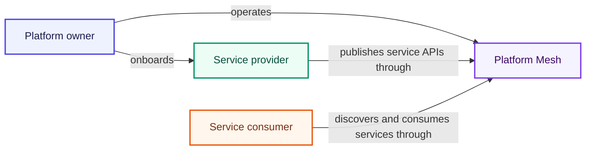
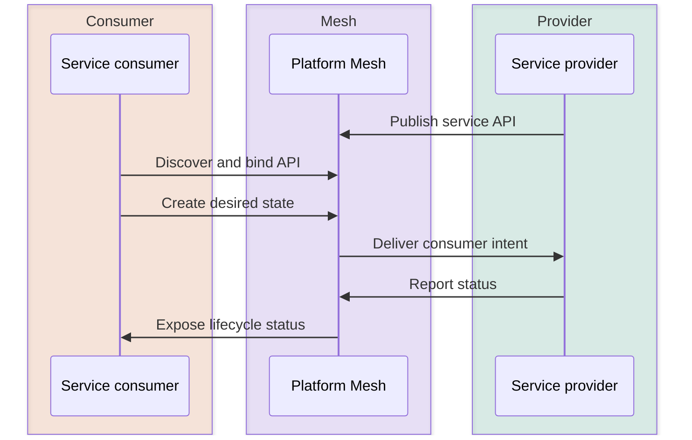

# Personas

Platform Mesh documentation is organized around three personas: platform owners, service providers, and service consumers.

Use this section to identify which role matches your work, what that role owns, and which documentation path to follow next. The persona pages are role guides, not installation guides or component references.

| Persona | Primary goal | Owns | Start with |
| --- | --- | --- | --- |
| [Platform owner](./platform-owner.md) | Run the mesh as a shared service platform | Platform Mesh runtime, account hierarchy, identity, authorization, policy, provider onboarding, component lifecycle | [Why Platform Mesh?](../why-platform-mesh.md), [Architecture](../architecture.md), [Account model](../account-model.md), [Control planes](../control-planes.md) |
| [Service provider](./service-provider.md) | Publish a service capability as a declarative API | API contract, provider automation, service runtime integration, lifecycle status, integration path | [Integration paths](../integration-paths.md), [api-syncagent](../integration/api-syncagent.md), [multicluster-runtime](../integration/multicluster-runtime.md), [Interaction patterns](../interaction-patterns/provider-to-consumer.md) |
| [Service consumer](./service-consumer.md) | Discover and consume provider services through a consistent API | Account resources, bound provider APIs, desired-state resources, application service dependencies | [Explore the example MSP](/tutorials/explore-example-msp.md), [Interaction patterns](../interaction-patterns/provider-to-consumer.md), [Account model](../account-model.md), [API sharing](../api-sharing.md) |

## How the personas interact

The role relationship is simple: the platform owner operates the mesh, providers publish service APIs through it, and consumers discover and consume those APIs through their account workspaces.

The service flow is separated from the role model. Consumers express desired state in Platform Mesh. Providers reconcile that intent and report status back.

Platform Mesh mediates the relationship through accounts, workspaces, identity, authorization, and declarative APIs. The consumer does not need direct access to the provider runtime, and the provider keeps ownership of its implementation.

## What belongs elsewhere

Personas explain audience and ownership. Task steps, component facts, and upstream kcp mechanics belong in other documentation sections:

- Use [Tutorials](/tutorials/) for guided learning paths.
- Use [How-to guides](/how-to-guides/) for operational tasks.
- Use [Reference](/reference/) for objects, components, and API facts.
- Use the upstream kcp documentation for general kcp concepts that are not specific to Platform Mesh.

## Related

- [Why Platform Mesh?](../why-platform-mesh.md)
- [Architecture](../architecture.md)
- [Account model](../account-model.md)
- [Provider to consumer](../interaction-patterns/provider-to-consumer.md)
