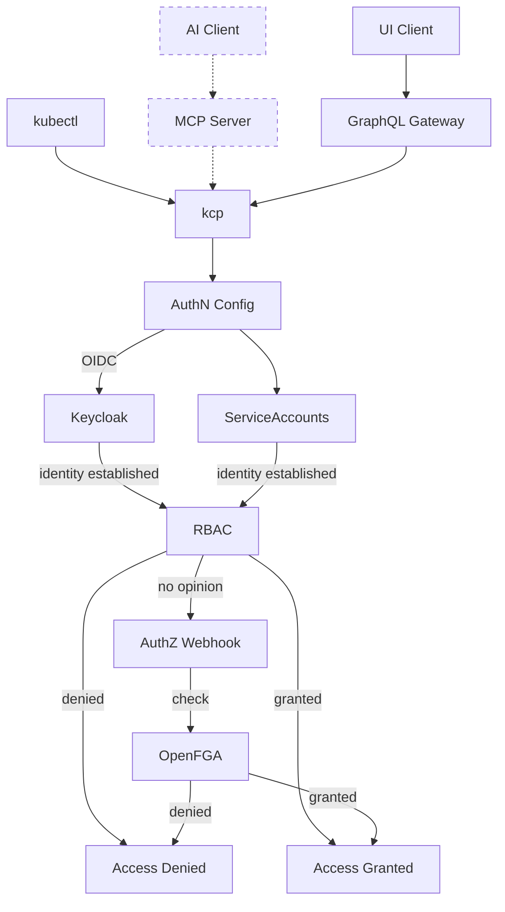

# Security

Securing a distributed, multi-tenant platform that spans organizational boundaries requires a deliberate architectural approach.
Traditional monolithic security models, where authentication and authorization are tightly coupled within a single system, fail to address the dynamic nature of service ecosystems where <Term>service providers</Term>, <Term>service consumers</Term>, and marketplace operators interact across isolated <Term>control planes</Term>.

Platform Mesh addresses this challenge through a clear separation of authentication and authorization as independent architectural concerns, each implemented by purpose-built components that can evolve, scale, and be replaced independently.
This design aligns directly with the [decoupling principle](/concepts/why-platform-mesh.md) that guides the overall architecture: security subsystems, like all other components, should be directly usable without requiring the complete framework.

Platform Mesh is accessed through multiple client types, each with distinct interaction patterns.
UI clients interact through a Kubernetes-GraphQL-Gateway, `kubectl` users communicate directly with <Project>kcp</Project> via the KRM API, and AI agents are expected to interact through a dedicated MCP (Model Context Protocol) server[^1].
Regardless of the client type, all requests ultimately reach <Project>kcp</Project>, where the same authentication and authorization mechanisms apply uniformly.

[^1]: The MCP server for Platform Mesh is a planned future component.

## Separation of Concerns

[Authentication](./authentication.md) and [authorization](./authorization.md) are independent subsystems, reflecting Platform Mesh [guiding principles](/concepts/why-platform-mesh.md).
The two are connected solely through the OIDC token: authentication produces it, authorization consumes the identity claims within it.
While OIDC tokens carry claims such as group memberships that inform RBAC decisions, the token should establish _who_ the caller is, not _what_ they are allowed to do -- encoding permissions as group claims is an anti-pattern that blurs this boundary.
They share no other state, meaning each can evolve, scale, and be replaced independently.
Both are integrated through standard Kubernetes extension points (authentication configurations for identity providers and authorization webhooks for authorizers), enabling alternative implementations that satisfy the same interfaces.

However, Platform Mesh provides specific integration with Keycloak and OpenFGA, such as per-organization realm and store provisioning, identity brokering configuration, and dynamic authorization schema generation.
Replacing either component with an alternative would require reimplementing these integration aspects.

:::info NOTE
Platform Mesh security architecture represents ongoing research in distributed authorization patterns.
The model continues to evolve to support enhanced cross-provider authorization scenarios, relationship-based authorization model management, and advanced authorization propagation across the account hierarchy.
:::

Platform Mesh security architecture builds on <Project>kcp</Project>'s own security foundations, including workspace isolation, APIExport identity, and permission claims.
For a detailed analysis of these foundations, see the [kcp Security Self-Assessment](https://docs.kcp.io/kcp/v0.30/contributing/governance/security-self-assessment/) (particularly the [Security Functions and Features](https://docs.kcp.io/kcp/v0.30/contributing/governance/security-self-assessment/#security-functions-and-features) section) and the [security section of kcp's General Technical Review](https://docs.kcp.io/kcp/v0.30/contributing/governance/general-technical-review/#security).

## Related

- [Authentication](./authentication.md)
- [Authorization](./authorization.md)
- [Account Model](./account-model.md)
