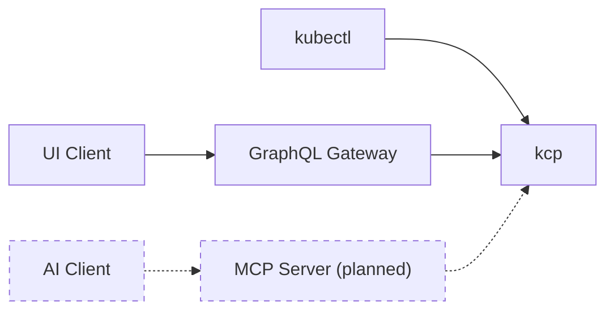
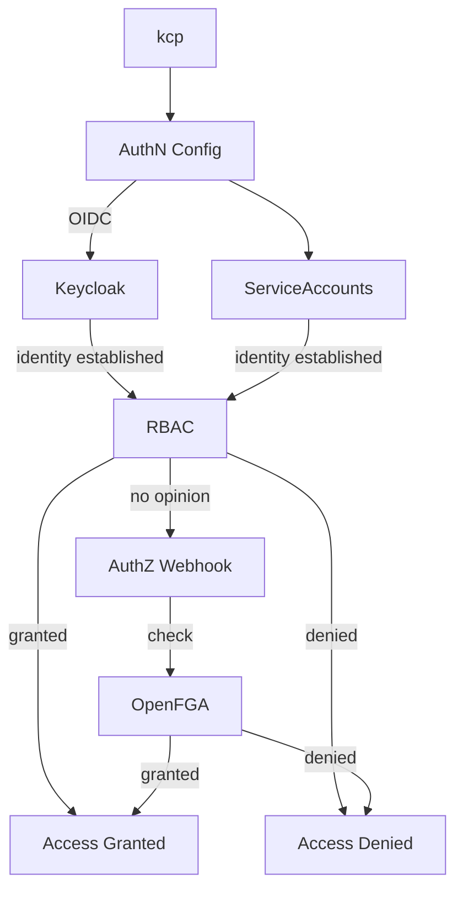

# Security architecture

Securing a distributed, multi-tenant platform that spans organizational boundaries requires a deliberate architectural approach.
Traditional monolithic security models, where authentication and authorization are tightly coupled within a single system, fail to address the dynamic nature of service ecosystems where [service providers](/concepts/personas/service-provider), [service consumers](/concepts/personas/service-consumer), and marketplace operators interact across isolated [control planes](/concepts/control-planes).

Platform Mesh addresses this challenge through a clear separation of authentication and authorization as independent architectural concerns, each implemented by purpose-built components that can evolve, scale, and be replaced independently.
This design aligns directly with the [decoupling principle](/concepts/why-platform-mesh) that guides the overall architecture: security subsystems, like all other components, should be directly usable without requiring the complete framework.

For the runtime view — which component plays which role and how requests pass through the authorizer chain — see [Identity and authorization](/concepts/identity-and-authorization).

## Client entry paths

Platform Mesh is accessed through multiple client types, each with distinct interaction patterns.
UI clients interact through a Kubernetes-GraphQL-Gateway, `kubectl` users communicate directly with [kcp](https://kcp.io) via the KRM API, and AI agents are expected to interact through a dedicated MCP (Model Context Protocol) server[^1].
Regardless of the client type, all requests ultimately reach kcp, where the same authentication and authorization mechanisms apply uniformly.

[^1]: The MCP server for Platform Mesh is a planned future component.

## Authentication and authorization flow

Once a request reaches kcp, the authentication configuration establishes the caller's identity, and a layered authorizer chain decides whether the request is allowed.
RBAC handles structural, resource-type access; the authorization webhook forwards anything RBAC has no opinion on to OpenFGA for relationship-based evaluation.

## Separation of concerns

[Authentication](./authentication) and [authorization](./authorization) are independent subsystems, reflecting Platform Mesh [guiding principles](/concepts/why-platform-mesh).
The two are connected solely through the OIDC token: authentication produces it, authorization consumes the identity claims within it.
While OIDC tokens carry claims such as group memberships that inform RBAC decisions, the token should establish _who_ the caller is, not _what_ they are allowed to do — encoding permissions as group claims is an anti-pattern that blurs this boundary.
They share no other state, meaning each can evolve, scale, and be replaced independently.
Both are integrated through standard Kubernetes extension points (authentication configurations for identity providers and authorization webhooks for authorizers), enabling alternative implementations that satisfy the same interfaces.

However, Platform Mesh provides specific integration with Keycloak and OpenFGA, such as per-organization realm and store provisioning, identity brokering configuration, and dynamic authorization schema generation.
Replacing either component with an alternative would require reimplementing these integration aspects.

:::info NOTE
Platform Mesh security architecture represents ongoing research in distributed authorization patterns.
The model continues to evolve to support enhanced cross-provider authorization scenarios, relationship-based authorization model management, and advanced authorization propagation across the account hierarchy.
:::

Platform Mesh security architecture builds on [kcp](https://kcp.io)'s own security foundations, including workspace isolation, APIExport identity, and permission claims.
For a detailed analysis of these foundations, see the [kcp Security Self-Assessment](https://docs.kcp.io/kcp/v0.30/contributing/governance/security-self-assessment/) (particularly the [Security Functions and Features](https://docs.kcp.io/kcp/v0.30/contributing/governance/security-self-assessment/#security-functions-and-features) section) and the [security section of kcp's General Technical Review](https://docs.kcp.io/kcp/v0.30/contributing/governance/general-technical-review/#security).

## Security and the account model

The security architecture integrates deeply with the Platform Mesh [account model](/concepts/account-model), ensuring that security boundaries align with organizational boundaries throughout the hierarchy.

- **Per-organization identity realm:** Platform Mesh creates a dedicated Keycloak realm for each organization, providing complete isolation of user stores, client configurations, and authentication policies. This realm is configured as an OIDC provider through [kcp](https://kcp.io)'s authentication configuration, tying the organization's identity management directly to its account hierarchy.
- **Per-organization FGA store:** Similarly, each organization receives a dedicated OpenFGA store, isolating authorization state across organizational boundaries. This ensures that relationship tuples and authorization evaluations for one organization cannot interfere with another.
- **Dynamic authorization schema:** Platform Mesh dynamically generates the OpenFGA authorization schema for each organization based on the APIs bound within that organization's accounts. As [service providers](/concepts/personas/service-provider) expose new capabilities and consumers bind to them, the authorization model automatically evolves to include the corresponding types and relations, eliminating the need for manual schema maintenance.
- **Hierarchical inheritance:** OpenFGA relationship tuples can be inherited through the account hierarchy. Permissions defined at a parent account can propagate to child accounts through the relationship graph, simplifying governance while allowing overrides where organizational requirements demand it.
- **Service-relationship authorization:** When [service consumers](/concepts/personas/service-consumer) engage with [service providers](/concepts/personas/service-provider) through the export and bind mechanisms of the account model, the authorization layer automatically reflects these relationships. OpenFGA also controls where in the account hierarchy a provider's service can be bound, ensuring that service consumption is constrained to the appropriate organizational scope.
- **Marketplace integration:** When a provider API is activated through a [marketplace](/reference/components/marketplace), the OpenFGA authorization schema for the organization is extended to include the corresponding resource types and relations, making the new service's resources available for fine-grained authorization decisions.

## Related

- [Authentication](./authentication) — design view of how identity is established
- [Authorization](./authorization) — design view of layered RBAC + ReBAC decisions
- [Identity and authorization](/concepts/identity-and-authorization) — runtime view of the same components
- [Account model](/concepts/account-model) — organizational hierarchy that frames per-org isolation
