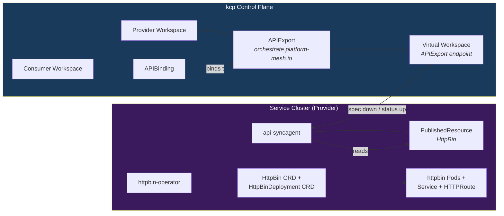
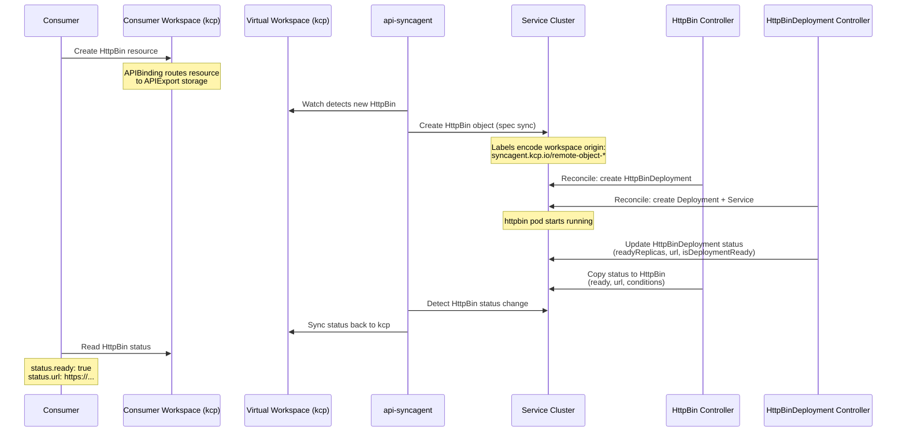

# HttpBin Provider Example

The httpbin provider is a demonstration Managed Service Provider included in the Platform Mesh local setup. This guide examines how it works from the **provider's perspective** -- the CRD design, APIExport configuration, api-syncagent bridge, and full reconciliation flow.

For the consumer-side walkthrough (portal UI, account creation, service provisioning), see [Example MSP](/getting-started/example-msp). For a simpler starting point focused on deploying your own provider, see [Provider Quick Start](/guides/provider-quick-start).

::: info Local Demo vs. Production
In the local demo, all components run on a single Kind cluster. In production, the provider operates on separate infrastructure outside Platform Mesh. The api-syncagent connects outward from the provider's cluster to the kcp API endpoint -- the provider never needs to expose its own infrastructure.
:::

## Architecture Overview

The httpbin provider consists of four components working together across two boundaries -- the kcp control plane and the provider's service cluster:

| Component | Runs On | Purpose |
|-----------|---------|---------|
| **APIExport** | kcp (provider workspace) | Publishes the HttpBin API to the Platform Mesh marketplace |
| **api-syncagent** | Service cluster | Bridges kcp and the service cluster; syncs resources bidirectionally |
| **httpbin-operator** | Service cluster | Reconciles HttpBin and HttpBinDeployment CRs into running httpbin pods |
| **PublishedResource** | Service cluster | Tells the api-syncagent which CRD to publish to kcp |

The consumer workspace is separate from all of this -- connected only through the APIBinding mechanism in kcp.



## The HttpBin CRD

The httpbin operator defines two CustomResourceDefinitions in the `orchestrate.platform-mesh.io` API group:

1. **HttpBin** -- the consumer-facing API. This is what consumers create when they want an httpbin instance. It has a minimal spec and a status that reports readiness and a URL.
2. **HttpBinDeployment** -- an internal resource. The HttpBin controller creates one HttpBinDeployment for each HttpBin. The HttpBinDeployment controller then creates the actual Deployment, Service, and HTTPRoute.

Only the `HttpBin` CRD is published to kcp. The `HttpBinDeployment` is an internal implementation detail that stays on the service cluster.

### HttpBin Schema

```yaml
apiVersion: orchestrate.platform-mesh.io/v1alpha1
kind: HttpBin
metadata:
  name: my-httpbin
  namespace: default
spec:
  # Region can be used to filter which httpbin instance should be served.
  # Optional -- the demo does not use region-based routing.
  region: "eu-west-1"
status:
  # Set by the controller after reconciliation
  ready: true
  url: "https://httpbin.services.portal.localhost"
  conditions:
  - type: Ready
    status: "True"
    reason: DeploymentReady
    message: "HttpBin is deployed and URL is available"
```

The spec is intentionally simple -- a single optional `region` field. This makes the httpbin provider a good starting point for understanding the Platform Mesh integration pattern without getting lost in domain-specific complexity.

### What the Controller Does

When the httpbin-operator sees an `HttpBin` resource, it follows a two-stage reconciliation pattern:

1. **HttpBin controller** -- reads the HttpBin resource, creates a corresponding `HttpBinDeployment` (setting the HttpBin as the owner reference), then watches the HttpBinDeployment status and copies it back to the HttpBin status (`url`, `ready`, `conditions`).

2. **HttpBinDeployment controller** -- creates the actual Kubernetes resources on the service cluster:
   - A **Deployment** running the `ghcr.io/platform-mesh/custom-images/httpbin:dev` container image
   - A **Service** (ClusterIP by default, port 80)
   - Optionally an **Ingress** or **HTTPRoute** for external access (configured via operator flags)
   - Updates the HttpBinDeployment status with `readyReplicas`, `isDeploymentReady`, and the computed `url`

The operator reads api-syncagent labels on the resources (such as `syncagent.kcp.io/remote-object-name` and `syncagent.kcp.io/remote-object-cluster`) to derive unique DNS names and resource names that prevent collisions across consumer workspaces.

## APIExport Configuration

The httpbin API is published to kcp through an APIExport named `orchestrate.platform-mesh.io` in the provider workspace. The api-syncagent creates and manages this export automatically -- the provider does not need to write APIExport YAML by hand.

Here is what the api-syncagent produces in kcp:

### APIResourceSchema

The agent converts the HttpBin CRD into an immutable `APIResourceSchema` object. The schema name is hash-based (e.g., `v250407.httpbins.orchestrate.platform-mesh.io`), which makes versioning safe -- if the CRD changes, a new schema is created, and the old one is preserved.

The APIResourceSchema contains the same OpenAPI v3 schema as the HttpBin CRD, including the `spec.region` field and the full `status` structure with conditions, ready flag, and URL.

### APIExport

The agent bundles the APIResourceSchema into the APIExport:

```yaml
apiVersion: apis.kcp.io/v1alpha1
kind: APIExport
metadata:
  name: orchestrate.platform-mesh.io
spec:
  latestResourceSchemas:
  - v250407.httpbins.orchestrate.platform-mesh.io
  # Permission claims are managed automatically by the agent
  permissionClaims:
  - group: ""
    resource: events
  - group: ""
    resource: namespaces
```

The agent manages the complete permission claims list -- it overwrites the list on each reconciliation. For the httpbin example, the claims are minimal because the HttpBin CRD does not produce related resources (like Secrets or ConfigMaps) that would need to be synced back to the consumer workspace.

### Identity

Each APIExport receives a unique identity (an automatically generated hash). This identity ensures that even if another provider exports a resource with the same group/version/kind, the two exports do not interfere with each other. The identity hash is carried in the APIBinding and used internally by kcp for storage isolation.

## How api-syncagent Bridges kcp and the Service Cluster

The api-syncagent is deployed on the service cluster via Helm chart into the `example-httpbin-provider` namespace. It connects to kcp using a kubeconfig secret (`httpbin-kubeconfig`) and is configured with the APIExport name:

```yaml
# api-syncagent Helm values (from local-setup)
apiExportName: orchestrate.platform-mesh.io
agentName: kcp-api-syncagent
kcpKubeconfig: httpbin-kubeconfig
```

### PublishedResource

The core configuration telling the agent which CRD to publish is the `PublishedResource`:

```yaml
apiVersion: syncagent.kcp.io/v1alpha1
kind: PublishedResource
metadata:
  name: httpbin-local-provider
spec:
  resource:
    kind: HttpBin
    apiGroup: orchestrate.platform-mesh.io
    version: v1alpha1
```

This is the minimal form -- no projections, no mutations, no filtering. The HttpBin CRD is published as-is to kcp. The agent handles everything else:

1. Converts the CRD into an `APIResourceSchema` in kcp
2. Merges the schema into the APIExport
3. Watches the APIExport's virtual workspace for new resources
4. Starts bidirectional sync for any HttpBin objects created by consumers

### RBAC for the Agent

The agent needs permission to manage HttpBin resources on the service cluster. The Helm chart creates a dedicated ClusterRole:

```yaml
apiVersion: rbac.authorization.k8s.io/v1
kind: ClusterRole
metadata:
  name: 'api-syncagent:httpbin-local-provider'
rules:
  - apiGroups:
      - orchestrate.platform-mesh.io
    resources:
      - httpbins
    verbs:
      - get
      - list
      - watch
      - create
      - update
      - delete
```

This ClusterRole is bound to the api-syncagent's ServiceAccount. On the kcp side, the agent needs access to APIExports, APIResourceSchemas, and the virtual workspace endpoint -- these permissions are configured during the agent setup.

### Data Flow

The PublishedResource describes the world from the service owner's perspective (you "publish" resources from your cluster), but the actual data flow is inverted:

- **Spec** flows from kcp to the service cluster. The consumer writes desired state in their workspace; the agent replicates it to the service cluster.
- **Status** flows from the service cluster to kcp. The httpbin-operator updates status as it reconciles; the agent pushes this back to the consumer workspace.

kcp is always the authoritative source of truth for the HttpBin resource's desired state.

## Reconciliation Flow

This is the complete flow from the moment a consumer creates an HttpBin resource to the point where they can access the running service.



### Step by Step

1. **Consumer creates HttpBin** -- The consumer creates an HttpBin resource in their kcp workspace (either through the Portal UI or via `kubectl`). Because the workspace has an APIBinding to the httpbin provider's APIExport, the resource is stored in kcp and becomes visible through the APIExport's virtual workspace.

2. **api-syncagent detects the resource** -- The agent watches the virtual workspace endpoint using the wildcard cluster path (`/clusters/*/`). When a new HttpBin appears, the agent enters its five-phase reconciliation loop.

3. **Spec syncs to the service cluster** -- The agent creates a corresponding HttpBin object on the service cluster. The object carries labels that encode its origin: <code v-pre>syncagent.kcp.io/remote-object-name</code>, <code v-pre>syncagent.kcp.io/remote-object-namespace</code>, and <code v-pre>syncagent.kcp.io/remote-object-cluster</code>. The namespace on the service cluster defaults to a namespace named after the kcp logical cluster ID (per the agent's naming rules: <code v-pre>{{ .ClusterName }}</code>).

4. **HttpBin controller reconciles** -- The httpbin-operator's HttpBin controller detects the new resource, creates an HttpBinDeployment with the HttpBin as owner, and requeues.

5. **HttpBinDeployment controller reconciles** -- Creates the actual Deployment (running the httpbin container image), Service, and optionally an HTTPRoute. It reads the api-syncagent labels to generate unique resource names and DNS names that prevent collisions across workspaces.

6. **Status propagates upward** -- The HttpBinDeployment controller updates its status with `readyReplicas`, `url`, and `isDeploymentReady`. The HttpBin controller copies these into the HttpBin's status fields (`ready`, `url`, `conditions`).

7. **api-syncagent syncs status back** -- The agent detects the HttpBin status change on the service cluster and pushes it back to the consumer's workspace in kcp via the virtual workspace.

8. **Consumer sees the result** -- The consumer's HttpBin resource now shows `status.ready: true` and `status.url` with the service endpoint. In the Portal UI, this is displayed as a ready service with a clickable link.

## Production Considerations

The local demo is deliberately simplified -- everything runs on one Kind cluster so you can explore the full flow without managing multiple environments. Production deployments differ in several important ways.

### Separate Infrastructure

In production, the provider's service cluster is entirely separate from the Platform Mesh control plane. The httpbin-operator, the HttpBin and HttpBinDeployment CRDs, and the actual httpbin pods all run on the provider's own infrastructure. The provider team manages this infrastructure independently.

### api-syncagent Connectivity

The api-syncagent runs on the provider's cluster and connects **outward** to the kcp API endpoint. This means:

- The provider's cluster needs **outbound HTTPS access** to the kcp API server
- The provider does **not** need to expose any endpoints to kcp or to consumers
- The agent authenticates to kcp using credentials stored in a kubeconfig Secret on the service cluster

This "pull" model is a deliberate security choice -- the provider initiates all connections, and kcp never needs to reach into the provider's infrastructure.

### Scaling

Each api-syncagent instance handles one APIExport. If a provider offers multiple APIs (for example, HttpBin and a second service), they deploy multiple agents on the same cluster, each with its own `PublishedResource` set and `APIExport` target. Leader election supports running multiple replicas for high availability.

### Namespace Isolation

By default, the api-syncagent creates one namespace per consumer workspace on the service cluster (named after the kcp logical cluster ID). This provides natural isolation between consumers at the Kubernetes namespace level. The httpbin-operator then creates its Deployments and Services within these namespaces.

## Extending the Example

The httpbin provider is designed to be a starting point. Here are common ways to extend it.

### Adding New Spec Fields

Add fields to the HttpBin CRD on the service cluster (for example, a `replicas` field). After updating the CRD, the api-syncagent automatically detects the schema change, creates a new APIResourceSchema in kcp, and propagates it to all consumer workspaces. No agent restart or reconfiguration is needed.

### Adding Projections

Use the `.spec.projection` field on the PublishedResource to change how the CRD appears in kcp. For example, you could rename the resource or change its API group:

```yaml
apiVersion: syncagent.kcp.io/v1alpha1
kind: PublishedResource
metadata:
  name: httpbin-projected
spec:
  resource:
    kind: HttpBin
    apiGroup: orchestrate.platform-mesh.io
    version: v1alpha1
  projection:
    kind: WebService
    plural: webservices
    apiGroup: services.example.io
```

### Adding Mutations

Use `.spec.mutation` to transform resource contents during sync. For example, to inject a default region on the way down to the service cluster:

```yaml
spec:
  mutation:
    spec:
      goTemplates:
      - condition: "object.spec.region == ''"
        template: |
          spec:
            region: "eu-central-1"
```

### Syncing Related Resources

If your extended httpbin produces Secrets or ConfigMaps that consumers need (for example, TLS certificates or access credentials), configure them as related resources in the PublishedResource. Each related resource automatically becomes a permission claim in the APIExport:

```yaml
spec:
  related:
  - kind: Secret
    apiGroup: ""
    origin: service
    references:
    - path: "metadata.name"
      target: "status.secretName"
```

See [api-syncagent](/overview/api-syncagent) for the full PublishedResource documentation, including all available projection, mutation, and related resource options.

## What's Next

- [Provider Quick Start](/guides/provider-quick-start) -- step-by-step guide to deploying your own service provider from scratch
- [MongoDB Provider Example](/guides/mongodb-example) -- advanced example using multi-cluster-runtime instead of api-syncagent, with a custom Go controller
- [api-syncagent](/overview/api-syncagent) -- full reference for PublishedResource configuration, the five-phase sync loop, and operational details
- [APIExport and APIBinding](/overview/api-export-binding) -- the cross-workspace service sharing mechanism that underpins the entire provider integration
- [Example MSP](/getting-started/example-msp) -- the consumer perspective: provisioning an httpbin instance through the Portal UI
