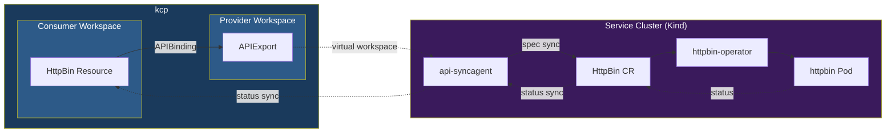
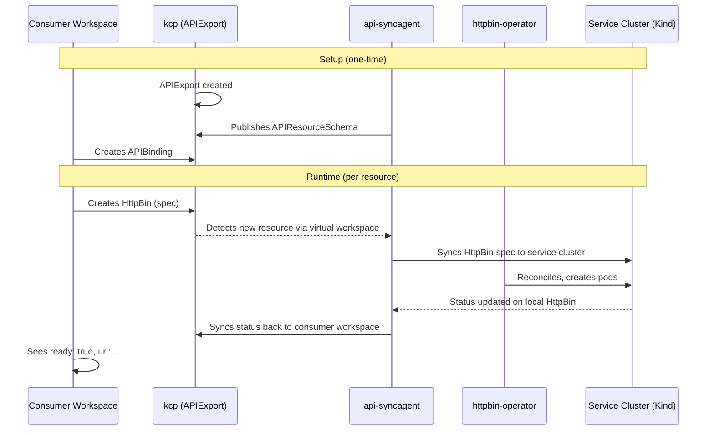

# Provider Quick Start

This guide walks you through building your first service provider in Platform Mesh using the **api-syncagent**. You will publish a CRD-based service -- the httpbin operator -- from a Kubernetes service cluster into kcp, and verify that consumers can use it from their own workspaces with full bidirectional synchronization.

By the end of this guide, you will have:

- A **provider workspace** in kcp with an APIExport advertising the httpbin API
- The **httpbin operator** running on your service cluster, managing HttpBin resources
- The **api-syncagent** bridging kcp and the service cluster
- A **PublishedResource** that tells the agent which CRD to expose
- A working **consumer flow** where creating an HttpBin resource in a kcp workspace results in a running httpbin pod on the service cluster, with status syncing back

## Prerequisites

Before you begin, make sure you have:

- A **running Platform Mesh local setup** without example data -- follow the [Quick Start](/getting-started/quick-start) to clone the helm-charts repo, check out **v0.2.0**, and run the setup
- **kubectl** with the **kubectl-kcp plugin** installed -- get it from the [kcp releases page](https://github.com/kcp-dev/kcp/releases)
- **Helm** v3 installed
- Basic familiarity with Kubernetes CRDs and operators

If you haven't run the Quick Start yet:

```bash
git clone https://github.com/platform-mesh/helm-charts.git
cd helm-charts
git checkout v0.2.0
cd local-setup
task local-setup
```

::: warning Do not use --example-data
If you ran `task local-setup:example-data`, the httpbin provider is already deployed automatically. This guide assumes you start from a clean setup so you can build everything yourself. Run `task local-setup` (without `--example-data`) to get a fresh environment.
:::

## What You'll Build

The httpbin provider is a simple service that lets consumers create `HttpBin` resources in their kcp workspace. Each HttpBin resource results in a running httpbin pod on the service cluster, accessible via a URL. The api-syncagent handles all the synchronization -- spec flows down from kcp to the service cluster, and status flows back up.



The consumer never interacts with the service cluster directly. From their perspective, HttpBin is just another Kubernetes resource type available in their workspace.

## Environment Setup

In the local development setup, a single Kind cluster named `platform-mesh` serves as both the Platform Mesh host and the service cluster. kcp runs inside this cluster as a pod, but exposes its own API server on `https://localhost:8443`.

You will work with **two kubeconfigs** throughout this guide:

| Target | Kubeconfig | What it connects to |
|--------|-----------|---------------------|
| **kcp** | `.secret/kcp/admin.kubeconfig` | The kcp API server (workspaces, APIExports, APIBindings) |
| **Kind cluster** | Default Kind kubeconfig | The Kubernetes cluster (operators, pods, CRDs) |

Set up both now from the `helm-charts/local-setup` directory (where you ran the setup):

```bash
# Export the kcp admin kubeconfig (generated by task local-setup)
# Run this from the helm-charts/local-setup directory
export KCP_KUBECONFIG=$(pwd)/.secret/kcp/admin.kubeconfig

# Export the Kind cluster kubeconfig
kind export kubeconfig --name platform-mesh
export KIND_KUBECONFIG=$HOME/.kube/config
```

::: tip Switching contexts
Throughout this guide, commands targeting kcp use `KUBECONFIG=$KCP_KUBECONFIG` as an environment variable prefix, and commands targeting the Kind cluster use `--kubeconfig $KIND_KUBECONFIG` as a flag. The kcp plugin commands (`kubectl kcp`, `kubectl create-workspace`) do not accept `--kubeconfig` as a flag — you must set the `KUBECONFIG` environment variable instead.
:::

Verify both connections work:

```bash
# Test kcp access
KUBECONFIG=$KCP_KUBECONFIG kubectl kcp workspace use :root
# Expected: Current workspace is "root" (type root).

# Test Kind cluster access
kubectl --kubeconfig $KIND_KUBECONFIG get nodes
# Expected: One or more nodes in Ready state
```

## Step 1: Create the Provider Workspace

Provider workspaces in kcp are organized under `root:providers`. You need to create the `providers` container workspace first, then the `httpbin-provider` workspace inside it.

```bash
# Create the providers workspace under root
KUBECONFIG=$KCP_KUBECONFIG kubectl create-workspace providers \
  --type=root:providers \
  --ignore-existing \
  --server="https://localhost:8443/clusters/root"

# Create the httpbin-provider workspace under providers
KUBECONFIG=$KCP_KUBECONFIG kubectl create-workspace httpbin-provider \
  --type=root:provider \
  --ignore-existing \
  --server="https://localhost:8443/clusters/root:providers"
```

Verify the workspace exists:

```bash
KUBECONFIG=$KCP_KUBECONFIG kubectl kcp workspace use :root:providers:httpbin-provider
```

Expected output:

```
Current workspace is "root:providers:httpbin-provider" (type root:provider).
```

::: info Workspace types
The workspace types `root:providers` and `root:provider` are created by the Platform Mesh operator during setup. `root:providers` is a container for all provider workspaces, while `root:provider` is the type for an individual provider workspace with the correct RBAC and initialization.
:::

## Step 2: Create an APIExport in kcp

The APIExport is how your service becomes visible to consumers. Create it in the provider workspace. The api-syncagent will populate its schema automatically later -- you just need the empty shell.

First, make sure you are in the provider workspace:

```bash
KUBECONFIG=$KCP_KUBECONFIG kubectl kcp workspace use :root:providers:httpbin-provider
```

Create the APIExport:

```bash
KUBECONFIG=$KCP_KUBECONFIG kubectl apply -f - <<EOF
apiVersion: apis.kcp.io/v1alpha1
kind: APIExport
metadata:
  name: orchestrate.platform-mesh.io
spec: {}
EOF
```

The APIExport name (`orchestrate.platform-mesh.io`) matches the API group of the httpbin CRD. This is a convention -- the api-syncagent uses this name to locate the APIExport.

You also need to grant bind permissions so that consumer workspaces can create APIBindings to this export:

```bash
KUBECONFIG=$KCP_KUBECONFIG kubectl apply -f - <<EOF
apiVersion: rbac.authorization.k8s.io/v1
kind: ClusterRole
metadata:
  name: apiexport-bind
rules:
  - apiGroups: ["apis.kcp.io"]
    resources: ["apiexports"]
    verbs: ["bind"]
---
apiVersion: rbac.authorization.k8s.io/v1
kind: ClusterRoleBinding
metadata:
  name: anonymous-view
subjects:
  - kind: User
    name: system:anonymous
    apiGroup: rbac.authorization.k8s.io
roleRef:
  kind: ClusterRole
  name: apiexport-bind
  apiGroup: rbac.authorization.k8s.io
EOF
```

Verify the APIExport was created:

```bash
KUBECONFIG=$KCP_KUBECONFIG kubectl get apiexports
```

Expected output:

```
NAME                             AGE
orchestrate.platform-mesh.io     5s
```

## Step 3: Deploy the httpbin Operator

The httpbin operator is a standard Kubernetes operator that manages HttpBin resources. It runs on the Kind cluster (the service cluster) and knows nothing about kcp -- the api-syncagent handles all the integration.

Install it using the Helm chart from the helm-charts repository (run from the `helm-charts` root, not `local-setup`):

```bash
# Go to the helm-charts repo root
cd ..

helm install example-httpbin-operator \
  ./charts/example-httpbin-operator \
  --kubeconfig $KIND_KUBECONFIG \
  -n example-httpbin-provider \
  --create-namespace
```

Verify the operator is running:

```bash
kubectl --kubeconfig $KIND_KUBECONFIG \
  get pods -n example-httpbin-provider
```

Expected output:

```
NAME                                                         READY   STATUS    RESTARTS   AGE
example-httpbin-operator-controller-manager-xxxxx-xxxxx      1/1     Running   0          30s
```

Verify the CRD was installed:

```bash
kubectl --kubeconfig $KIND_KUBECONFIG \
  get crd httpbins.orchestrate.platform-mesh.io
```

```
NAME                                    CREATED AT
httpbins.orchestrate.platform-mesh.io   2026-04-07T10:00:00Z
```

### The HttpBin CRD

The CRD defines an HttpBin resource with a `spec.region` field and a status subresource:

```yaml
apiVersion: orchestrate.platform-mesh.io/v1alpha1
kind: HttpBin
metadata:
  name: my-httpbin
spec:
  region: eu-west-1    # optional: filter which httpbin instance to serve
status:
  ready: false         # set by the operator when the pod is running
  url: ""              # the HTTPS URL for accessing the httpbin service
  conditions: []       # standard Kubernetes conditions
```

The **status subresource** is critical -- the api-syncagent uses it to sync status back from the service cluster to kcp. Without it, consumers would never see the `ready` or `url` fields update.

## Step 4: Deploy api-syncagent

The api-syncagent runs on the Kind cluster and connects it to kcp. It needs a kubeconfig Secret to authenticate with kcp.

### Create the kcp Kubeconfig Secret

The api-syncagent needs credentials to access the kcp API server. Create a Secret from the admin kubeconfig:

```bash
kubectl --kubeconfig $KIND_KUBECONFIG \
  create secret generic httpbin-kubeconfig \
  -n example-httpbin-provider \
  --from-file=kubeconfig=$KCP_KUBECONFIG
```

### Install the api-syncagent Helm chart

The admin kubeconfig uses `https://localhost:8443`, but from inside a pod `localhost` is the pod itself. kcp also returns virtual workspace URLs with `localhost:8443`. The api-syncagent chart supports `hostAliases` to solve this — mapping `localhost` to Traefik's in-cluster IP so all kcp URLs work from inside the pod.

First, look up the Traefik service ClusterIP:

```bash
TRAEFIK_IP=$(kubectl --kubeconfig $KIND_KUBECONFIG \
  get svc traefik -n default -o jsonpath='{.spec.clusterIP}')
echo "Traefik ClusterIP: $TRAEFIK_IP"
```

Now install the agent:

```bash
helm repo add kcp https://kcp-dev.github.io/helm-charts
helm repo update

helm install api-syncagent kcp/api-syncagent \
  --kubeconfig $KIND_KUBECONFIG \
  -n example-httpbin-provider \
  --set apiExportEndpointSliceName=orchestrate.platform-mesh.io \
  --set agentName=kcp-api-syncagent \
  --set kcpKubeconfig=httpbin-kubeconfig \
  --set hostAliases.enabled=true \
  --set "hostAliases.values[0].ip=$TRAEFIK_IP" \
  --set "hostAliases.values[0].hostnames[0]=localhost"
```

::: info Why hostAliases?
In the local Kind setup, kcp is exposed via Traefik on `localhost:8443`. Pods cannot reach `localhost` on the host, but `hostAliases` adds an entry to the pod's `/etc/hosts` that maps `localhost` to Traefik's ClusterIP. This makes both the kubeconfig connection and the virtual workspace URLs (returned by kcp in APIExportEndpointSlices) work correctly from inside the pod.
:::

### Grant RBAC for the api-syncagent

The api-syncagent service account needs permissions to list, watch, and manage httpbin resources on the Kind cluster:

```bash
kubectl --kubeconfig $KIND_KUBECONFIG apply -f - <<EOF
apiVersion: rbac.authorization.k8s.io/v1
kind: ClusterRole
metadata:
  name: api-syncagent-httpbin
rules:
  - apiGroups: ["orchestrate.platform-mesh.io"]
    resources: ["httpbins", "httpbins/status"]
    verbs: ["*"]
  - apiGroups: [""]
    resources: ["namespaces"]
    verbs: ["*"]
---
apiVersion: rbac.authorization.k8s.io/v1
kind: ClusterRoleBinding
metadata:
  name: api-syncagent-httpbin
subjects:
  - kind: ServiceAccount
    name: api-syncagent
    namespace: example-httpbin-provider
roleRef:
  kind: ClusterRole
  name: api-syncagent-httpbin
  apiGroup: rbac.authorization.k8s.io
EOF
```

Verify the agent is running:

```bash
kubectl --kubeconfig $KIND_KUBECONFIG \
  get pods -n example-httpbin-provider -l app.kubernetes.io/name=kcp-api-syncagent
```

Expected output:

```
NAME                              READY   STATUS    RESTARTS   AGE
api-syncagent-xxxxx-xxxxx         1/1     Running   0          30s
```

### Key Configuration Options

| Option | Description |
|--------|-------------|
| `apiExportEndpointSliceName` | Name of the APIExportEndpointSlice in kcp that this agent manages. Must match the APIExport name exactly. |
| `agentName` | Unique identifier for this agent instance. Combined with the API group to form the FQDN. |
| `kcpKubeconfig` | Name of the Secret containing the kubeconfig for kcp access. |

## Step 5: Create a PublishedResource

The `PublishedResource` tells the api-syncagent which CRD to publish into kcp. It is a cluster-scoped resource created on the **Kind cluster** (the service cluster).

```bash
kubectl --kubeconfig $KIND_KUBECONFIG apply -f - <<EOF
apiVersion: syncagent.kcp.io/v1alpha1
kind: PublishedResource
metadata:
  name: httpbin-local-provider
spec:
  resource:
    kind: HttpBin
    apiGroup: orchestrate.platform-mesh.io
    version: v1alpha1
EOF
```

This tells the agent: "Take the `HttpBin` CRD from API group `orchestrate.platform-mesh.io`, version `v1alpha1`, and publish it as an APIResourceSchema in the kcp APIExport."

### Key Fields

| Field | Purpose |
|-------|---------|
| `spec.resource.apiGroup` | The API group of the CRD on the service cluster |
| `spec.resource.kind` | The Kind to publish |
| `spec.resource.version` | Which version to make available in kcp |

::: info Naming and namespace isolation
By default, the api-syncagent creates a namespace per kcp workspace on the service cluster (using the workspace's cluster name). This prevents collisions when multiple consumers create resources with the same name. You can customize this with `spec.naming` in the PublishedResource.
:::

## Step 6: Verify the Setup

Within a few seconds of creating the PublishedResource, the api-syncagent creates an APIResourceSchema in kcp and updates the APIExport. Verify each piece.

### Check the APIResourceSchema in kcp

```bash
KUBECONFIG=$KCP_KUBECONFIG kubectl kcp workspace use :root:providers:httpbin-provider
KUBECONFIG=$KCP_KUBECONFIG kubectl get apiresourceschemas
```

You should see a schema with a hash-based name:

```
NAME                                                           AGE
v1alpha1.httpbins.orchestrate.platform-mesh.io.xxxxxxx         15s
```

The hash-based name makes schemas immutable and revertible -- if the CRD changes on the service cluster, the agent creates a new schema rather than modifying the existing one.

### Check the APIExport

```bash
KUBECONFIG=$KCP_KUBECONFIG kubectl get apiexport orchestrate.platform-mesh.io -o yaml
```

Look for the `spec.resources` section -- it should now reference the schema:

```yaml
spec:
  resources:
  - group: orchestrate.platform-mesh.io
    name: httpbins
    schema: v1alpha1.httpbins.orchestrate.platform-mesh.io.xxxxxxx
    storage:
      crd: {}
```

### Check the agent logs

```bash
kubectl --kubeconfig $KIND_KUBECONFIG \
  logs -n example-httpbin-provider -l app.kubernetes.io/name=kcp-api-syncagent --tail=20
```

Look for log lines confirming the agent resolved the APIExport and started syncing:

```json
{"level":"info","msg":"Resolved APIExport","name":"orchestrate.platform-mesh.io","workspace":"root:providers:httpbin-provider"}
{"level":"info","msg":"Starting kcp Sync Agent…"}
```

If you see these messages, your provider is connected and ready for consumers.

## Step 7: Test the Consumer Flow

Now test the full flow from the consumer side. There are two ways to do this:

- **Option A: Portal UI** -- register a user, create an organization, and create an account through the web portal at `https://portal.localhost:8443`. The account workspace automatically gets an APIBinding to your provider. This is the intended production workflow.
- **Option B: kubectl** -- create a consumer workspace and APIBinding directly. This is faster for testing.

This guide covers Option B. For the Portal UI approach, see [Example MSP](/getting-started/example-msp).

### Create a consumer workspace

```bash
# Create a test consumer workspace under root
KUBECONFIG=$KCP_KUBECONFIG kubectl create-workspace test-consumer \
  --server="https://localhost:8443/clusters/root"
```

Switch to the consumer workspace:

```bash
KUBECONFIG=$KCP_KUBECONFIG kubectl kcp workspace use :root:test-consumer
```

### Create an APIBinding

The APIBinding imports the httpbin API into the consumer workspace:

```bash
KUBECONFIG=$KCP_KUBECONFIG kubectl apply -f - <<EOF
apiVersion: apis.kcp.io/v1alpha1
kind: APIBinding
metadata:
  name: orchestrate.platform-mesh.io
spec:
  reference:
    export:
      name: orchestrate.platform-mesh.io
      path: "root:providers:httpbin-provider"
  permissionClaims:
  - resource: namespaces
    state: Accepted
    all: true
  - resource: events
    state: Accepted
    all: true
EOF
```

::: tip Permission claims
The api-syncagent requires `namespaces` and `events` permission claims at minimum. Rejecting the namespace claim will prevent the agent from creating the workspace-specific namespace on the service cluster, breaking synchronization entirely.
:::

Verify the binding is active:

```bash
KUBECONFIG=$KCP_KUBECONFIG kubectl get apibindings
```

Expected output:

```
NAME                             APIEXPORT                        READY   AGE
orchestrate.platform-mesh.io     orchestrate.platform-mesh.io     True    10s
```

### Create an HttpBin resource

The httpbin API is now available in the consumer workspace. Verify:

```bash
KUBECONFIG=$KCP_KUBECONFIG kubectl api-resources | grep httpbin
```

```
httpbins   orchestrate.platform-mesh.io/v1alpha1   true   HttpBin
```

Create an HttpBin instance:

```bash
KUBECONFIG=$KCP_KUBECONFIG kubectl apply -f - <<EOF
apiVersion: orchestrate.platform-mesh.io/v1alpha1
kind: HttpBin
metadata:
  name: my-httpbin
  namespace: default
spec:
  region: eu-west-1
EOF
```

### Verify the resource on the service cluster

The api-syncagent syncs the resource to the Kind cluster, where the httpbin operator picks it up and creates a pod. Check the service cluster:

```bash
kubectl --kubeconfig $KIND_KUBECONFIG get httpbins --all-namespaces
```

You should see the synced resource in a namespace named after the consumer workspace's cluster ID:

```
NAMESPACE                  NAME         AGE
2a7f3b4c5d6e7f8a9b0c1d2e  my-httpbin   15s
```

Check that the operator created the pod:

```bash
kubectl --kubeconfig $KIND_KUBECONFIG get pods --all-namespaces | grep httpbin
```

### Verify status syncs back to kcp

Once the operator reconciles the httpbin pod, the api-syncagent syncs status back to the consumer workspace:

```bash
KUBECONFIG=$KCP_KUBECONFIG kubectl kcp workspace use :root:test-consumer
KUBECONFIG=$KCP_KUBECONFIG kubectl get httpbin my-httpbin -n default -o yaml
```

Look for the `status` section. The httpbin operator populates status fields like `ready`, `url`, and `conditions` as the pod starts up. If the status section is empty, wait a few seconds and check again — the sync loop runs continuously.

::: info Status sync timing
Status sync depends on the httpbin operator updating the status subresource on the Kind cluster, and the api-syncagent picking up that change. If `status` remains empty, check that the httpbin pods are running on the Kind cluster and that the operator logs show successful reconciliation.
:::

## What You Just Built

Here is the complete data flow you set up:



| Component | Role |
|-----------|------|
| **Provider workspace** | Hosts the APIExport in kcp at `root:providers:httpbin-provider` |
| **APIExport** | Advertises the `orchestrate.platform-mesh.io` API to consumers |
| **httpbin-operator** | Standard Kubernetes operator that reconciles HttpBin resources into pods |
| **api-syncagent** | Bridges kcp and the service cluster with bidirectional sync |
| **PublishedResource** | Declares which CRD the agent should publish and how |
| **APIBinding** | Imports the httpbin API into a consumer workspace |

The httpbin operator required **zero modifications** to work with Platform Mesh. The api-syncagent handles all the integration, making this the lowest-effort path for bringing existing Kubernetes operators into the mesh.

## Next Steps

- **Add provider metadata for the Portal UI** -- register display name, contacts, and icon so consumers can discover your service in the marketplace
- **Customize with projections and mutations** -- rename kinds, transform fields, filter namespaces: [api-syncagent](/overview/api-syncagent)
- **Deep dive into the httpbin provider** -- full architecture, CRD design, and reconciliation flow: [HttpBin Example](/guides/httpbin-example)
- **Understand the API mechanism** -- identity hashing, permission claims, virtual workspaces: [APIExport and APIBinding](/overview/api-export-binding)
