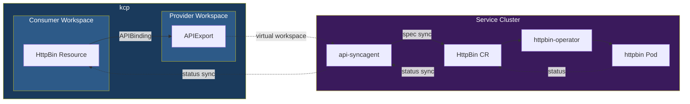
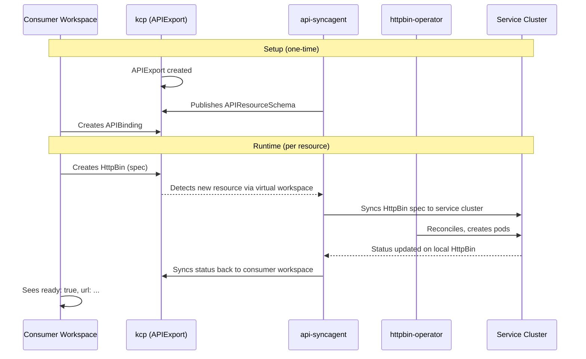

# Provider Quick Start

This guide walks you through building your first service provider in Platform Mesh using the **api-syncagent**. You will publish a CRD-based service -- the httpbin operator -- from a Kubernetes service cluster into kcp, and verify that consumers can use it from their own workspaces with full bidirectional synchronization.

By the end of this guide, you will have:

- An **APIExport** in kcp that advertises the httpbin API
- The **api-syncagent** running on your service cluster, connecting it to kcp
- A **PublishedResource** that tells the agent exactly which CRD to publish
- A working **consumer flow** where creating an HttpBin resource in a kcp workspace results in a running httpbin pod on the service cluster, with status syncing back to the consumer

## Prerequisites

Before you begin, make sure you have:

- A **running Platform Mesh instance** -- follow the [Quick Start](/getting-started/quick-start) if you haven't set one up yet
- **kubectl** configured to access both the kcp API and the service cluster (you will switch contexts throughout this guide)
- The **kubectl-kcp plugin** for workspace management -- install it from the [kcp releases page](https://github.com/kcp-dev/kcp/releases)
- **Helm** installed for deploying the api-syncagent chart
- Basic familiarity with Kubernetes CRDs and operators

::: tip Two kubeconfigs
Throughout this guide, you will work with two different API servers. We will use `KUBECONFIG` environment variables to make it clear which one each command targets:
- `kcp.kubeconfig` -- your kcp instance
- `service-cluster.kubeconfig` -- the Kubernetes cluster running the httpbin operator
:::

## What You'll Build

The httpbin provider is a simple service that lets consumers create `HttpBin` resources in their kcp workspace. Each HttpBin resource results in a running httpbin pod on the service cluster, accessible via a service endpoint. The api-syncagent handles all the synchronization -- spec flows down from kcp to the service cluster, and status flows back up.



The consumer never interacts with the service cluster directly. From their perspective, HttpBin is just another Kubernetes resource type available in their workspace.

## Step 1: Understand the Service CRD

The httpbin operator runs on the service cluster and defines a `HttpBin` CustomResourceDefinition. When a user creates an HttpBin resource, the operator reconciles it by deploying an httpbin pod and service. This is a standard Kubernetes operator pattern -- nothing Platform Mesh-specific yet.

Here is the CRD that the operator installs on the service cluster:

```yaml
apiVersion: apiextensions.k8s.io/v1
kind: CustomResourceDefinition
metadata:
  name: httpbins.httpbin.io
spec:
  group: httpbin.io
  names:
    kind: HttpBin
    listKind: HttpBinList
    plural: httpbins
    singular: httpbin
  scope: Namespaced
  versions:
  - name: v1alpha1
    served: true
    storage: true
    schema:
      openAPIV3Schema:
        type: object
        properties:
          spec:
            type: object
            properties:
              replicas:
                type: integer
                description: "Number of httpbin replicas to run"
                default: 1
          status:
            type: object
            properties:
              ready:
                type: boolean
              url:
                type: string
                description: "URL where the httpbin service is accessible"
    subresources:
      status: {}
```

The key detail here: the CRD defines a **status subresource**. This is important because the api-syncagent uses the status subresource to sync status back from the service cluster to kcp. Without it, status synchronization would not work.

For this guide, we assume the httpbin operator and its CRD are already installed on your service cluster. You can verify this:

```bash
export KUBECONFIG=service-cluster.kubeconfig

kubectl get crd httpbins.httpbin.io
```

Expected output:

```
NAME                 CREATED AT
httpbins.httpbin.io  2026-04-01T10:00:00Z
```

## Step 2: Create an APIExport in kcp

The APIExport is how your service becomes visible to the Platform Mesh. It will be created in your **provider workspace** in kcp and will eventually hold the httpbin API schema. The api-syncagent populates the schema automatically -- you just need to create the empty shell.

First, switch to your provider workspace in kcp:

```bash
export KUBECONFIG=kcp.kubeconfig

kubectl kcp workspace use root:providers:httpbin-provider
```

Now create the APIExport:

```yaml
# apiexport.yaml
apiVersion: apis.kcp.io/v1alpha2
kind: APIExport
metadata:
  name: httpbin.io
spec: {}
```

Apply it:

```bash
kubectl apply -f apiexport.yaml
```

The APIExport starts empty -- no schemas, no resources. The api-syncagent will fill it in once it discovers the PublishedResource on the service cluster.

Verify the APIExport was created:

```bash
kubectl get apiexports
```

Expected output:

```
NAME         AGE
httpbin.io   5s
```

### Create the kcp Kubeconfig Secret

The api-syncagent needs credentials to access kcp from the service cluster. Create a kubeconfig that points to the provider workspace and store it as a Secret on the service cluster:

```bash
export KUBECONFIG=service-cluster.kubeconfig

kubectl create namespace kcp-system --dry-run=client -o yaml | kubectl apply -f -

kubectl create secret generic kcp-kubeconfig \
  --namespace kcp-system \
  --from-file "kubeconfig=kcp.kubeconfig"
```

::: warning Kubeconfig scope
The kubeconfig must point to the **provider workspace** where the APIExport lives. The server URL in the kubeconfig should include the workspace path (e.g., `https://kcp.example.com/clusters/root:providers:httpbin-provider`). The api-syncagent uses this to locate the APIExport and manage APIResourceSchemas.
:::

## Step 3: Deploy api-syncagent

The api-syncagent runs on the service cluster and connects it to kcp. Deploy it using the Helm chart.

Create a values file for the Helm deployment:

```yaml
# syncagent-values.yaml
agentName: httpbin
apiExportName: httpbin.io
kcpKubeconfigSecretName: kcp-kubeconfig
kcpKubeconfigSecretKey: kubeconfig
```

Install the agent:

::: code-group

```bash [Helm]
helm repo add kcp https://kcp-dev.github.io/helm-charts
helm repo update

helm install httpbin-syncagent kcp/api-syncagent \
  --values syncagent-values.yaml \
  --namespace kcp-system
```

```bash [Task (if available)]
task deploy-syncagent -- \
  --agent-name httpbin \
  --api-export httpbin.io
```

:::

Verify the agent is running:

```bash
kubectl get pods -n kcp-system -l app.kubernetes.io/name=api-syncagent
```

Expected output:

```
NAME                                  READY   STATUS    RESTARTS   AGE
httpbin-syncagent-6f8d4b7c9a-x2k4m   1/1     Running   0          30s
```

### Key Configuration Options

| Option | Description |
|--------|-------------|
| `agentName` | Unique name for this agent. Combined with the API group to form the FQDN (`httpbin.httpbin.io`). Must follow Kubernetes label syntax. |
| `apiExportName` | Name of the APIExport in kcp that this agent manages. One APIExport per agent. |
| `kcpKubeconfigSecretName` | The Secret containing the kubeconfig for kcp access. |
| `publishedResourceSelector` | Optional label selector to scope this agent to specific PublishedResources (useful when running multiple agents on one cluster). |

## Step 4: Create a PublishedResource

The `PublishedResource` tells the api-syncagent which CRD to publish into kcp. It is a cluster-scoped resource that you create on the **service cluster**.

```yaml
# published-resource.yaml
apiVersion: syncagent.kcp.io/v1alpha1
kind: PublishedResource
metadata:
  name: httpbins
spec:
  resource:
    apiGroup: httpbin.io
    kind: HttpBin
    versions:
    - name: v1alpha1
  naming:
    namespace:
      template: "{{ .ClusterName }}"
  synchronization:
    enabled: true
```

Apply it on the service cluster:

```bash
export KUBECONFIG=service-cluster.kubeconfig

kubectl apply -f published-resource.yaml
```

### Key Fields

| Field | Purpose |
|-------|---------|
| `spec.resource.apiGroup` | The API group of the CRD on the service cluster |
| `spec.resource.kind` | The Kind to publish |
| `spec.resource.versions` | Which versions to make available in kcp |
| `spec.naming.namespace.template` | Controls where objects land on the service cluster. <code v-pre>{{ .ClusterName }}</code> gives each kcp workspace its own namespace, preventing collisions. |
| `spec.synchronization.enabled` | Activates bidirectional sync. Without this, the schema is published but no data flows. |

::: info Immutability
PublishedResources are **immutable** after creation. This prevents cascading schema changes across all consumer workspaces that have already bound to the APIExport. If you need to change the published schema, delete the PublishedResource and create a new one.
:::

For advanced features like resource projection (renaming kinds, changing scope), filtering (syncing only specific namespaces), and mutations (transforming fields during sync), see the [api-syncagent documentation](/overview/api-syncagent).

## Step 5: Verify the Setup

Within a few seconds of creating the PublishedResource, the api-syncagent will create an APIResourceSchema in kcp and update the APIExport. Let's verify each piece.

### Check the APIResourceSchema in kcp

```bash
export KUBECONFIG=kcp.kubeconfig

kubectl kcp workspace use root:providers:httpbin-provider
kubectl get apiresourceschemas
```

You should see a schema with a hash-based name:

```
NAME                                   AGE
v1alpha1-a3b2c1.httpbins.httpbin.io    15s
```

The hash-based name makes schemas immutable and revertible -- if the CRD changes on the service cluster, the agent creates a new schema rather than modifying the existing one.

### Check the APIExport

```bash
kubectl get apiexport httpbin.io -o yaml
```

Look for the `spec.resources` section -- it should now reference the schema:

```yaml
spec:
  resources:
  - group: httpbin.io
    name: httpbins
    schema: v1alpha1-a3b2c1.httpbins.httpbin.io
    storage:
      crd: {}
```

The APIExport status should also show a virtual workspace URL:

```yaml
status:
  virtualWorkspaces:
  - url: https://kcp.example.com/services/apiexport/root:providers:httpbin-provider/httpbin.io
```

### Check the agent logs

```bash
export KUBECONFIG=service-cluster.kubeconfig

kubectl logs -n kcp-system -l app.kubernetes.io/name=api-syncagent --tail=20
```

Look for log lines confirming successful schema creation and sync readiness:

```
INFO  Created APIResourceSchema  {"name": "v1alpha1-a3b2c1.httpbins.httpbin.io"}
INFO  Updated APIExport          {"name": "httpbin.io", "schemas": 1}
INFO  Virtual workspace ready    {"url": "https://kcp.example.com/services/apiexport/..."}
INFO  Starting sync controller   {"resource": "httpbins.httpbin.io"}
```

If you see these messages, your provider is connected and ready for consumers.

## Step 6: Test the Consumer Flow

Now switch to a consumer role. In a separate kcp workspace, bind to the httpbin APIExport and create a resource.

### Create an APIBinding

Switch to the consumer workspace:

```bash
export KUBECONFIG=kcp.kubeconfig

kubectl kcp workspace use root:consumers:my-team
```

Create an APIBinding to import the httpbin API:

```yaml
# apibinding.yaml
apiVersion: apis.kcp.io/v1alpha2
kind: APIBinding
metadata:
  name: httpbin.io
spec:
  reference:
    export:
      name: httpbin.io
      path: "root:providers:httpbin-provider"
  permissionClaims:
  - resource: namespaces
    state: Accepted
    selector:
      matchAll: true
  - resource: events
    state: Accepted
    selector:
      matchAll: true
```

Apply it:

```bash
kubectl apply -f apibinding.yaml
```

::: tip Permission claims
The api-syncagent requires `namespaces` and `events` permission claims at minimum. Rejecting the namespace claim will prevent the agent from creating the workspace-specific namespace on the service cluster, breaking synchronization entirely. If your provider uses related resources (e.g., Secrets), you will see additional claims to accept.
:::

Alternatively, use the kubectl-kcp plugin to bind with a single command:

```bash
kubectl kcp bind apiexport root:providers:httpbin-provider:httpbin.io
```

Verify the binding is active:

```bash
kubectl get apibindings
```

Expected output:

```
NAME         APIEXPORT    READY   AGE
httpbin.io   httpbin.io   True    10s
```

### Create an HttpBin resource

The httpbin API is now available in the consumer workspace. Verify it shows up as a known resource type:

```bash
kubectl api-resources | grep httpbin
```

```
httpbins   httpbin.io/v1alpha1   true   HttpBin
```

Now create an HttpBin instance:

```yaml
# my-httpbin.yaml
apiVersion: httpbin.io/v1alpha1
kind: HttpBin
metadata:
  name: my-httpbin
  namespace: default
spec:
  replicas: 2
```

Apply it:

```bash
kubectl apply -f my-httpbin.yaml
```

### Verify the pod on the service cluster

The api-syncagent syncs the resource to the service cluster, where the httpbin operator picks it up and creates the pod. Check the service cluster:

```bash
export KUBECONFIG=service-cluster.kubeconfig

# The namespace corresponds to the consumer's kcp workspace cluster name
kubectl get httpbins --all-namespaces
```

You should see the synced resource:

```
NAMESPACE                  NAME        AGE
2a7f3b4c5d6e7f8a9b0c1d2e  my-httpbin  15s
```

The namespace name is derived from the consumer workspace's cluster name (the <code v-pre>{{ .ClusterName }}</code> naming template). Check that the operator created the pods:

```bash
kubectl get pods -n 2a7f3b4c5d6e7f8a9b0c1d2e
```

```
NAME                          READY   STATUS    RESTARTS   AGE
my-httpbin-6f8d4b7c9a-x2k4m  1/1     Running   0          10s
my-httpbin-6f8d4b7c9a-r7p3n  1/1     Running   0          10s
```

Two replicas, as specified in the consumer's resource.

## Step 7: Verify Bidirectional Sync

The sync loop runs continuously. Let's confirm both directions work.

### Status sync: service cluster to kcp

Once the operator reconciles the httpbin pods, it writes status back to the local HttpBin resource. The api-syncagent picks this up and syncs it to kcp.

Check the resource status in the consumer workspace:

```bash
export KUBECONFIG=kcp.kubeconfig

kubectl kcp workspace use root:consumers:my-team
kubectl get httpbin my-httpbin -o yaml
```

Look for the status section:

```yaml
status:
  ready: true
  url: "http://my-httpbin.2a7f3b4c5d6e7f8a9b0c1d2e.svc.cluster.local:80"
```

The consumer can see the service is ready and what URL it is accessible at -- all without direct access to the service cluster.

### Spec sync: kcp to service cluster

Update the replica count in the consumer workspace:

```bash
kubectl patch httpbin my-httpbin --type merge -p '{"spec":{"replicas":3}}'
```

Then verify the change propagated to the service cluster:

```bash
export KUBECONFIG=service-cluster.kubeconfig

kubectl get httpbin my-httpbin -n 2a7f3b4c5d6e7f8a9b0c1d2e -o jsonpath='{.spec.replicas}'
```

```
3
```

The operator will reconcile the change and scale to three replicas:

```bash
kubectl get pods -n 2a7f3b4c5d6e7f8a9b0c1d2e
```

```
NAME                          READY   STATUS    RESTARTS   AGE
my-httpbin-6f8d4b7c9a-x2k4m  1/1     Running   0          2m
my-httpbin-6f8d4b7c9a-r7p3n  1/1     Running   0          2m
my-httpbin-6f8d4b7c9a-k8j5v  1/1     Running   0          5s
```

The full loop works: consumer writes spec in kcp, the agent syncs it down, the operator acts on it, and the resulting status flows back up to the consumer's workspace.

## What You Just Built

You have a working service provider in the Platform Mesh. Here is the complete architecture:



To summarize what each component does:

| Component | Role |
|-----------|------|
| **APIExport** | Advertises the httpbin API from the provider workspace in kcp |
| **api-syncagent** | Bridges kcp and the service cluster with bidirectional sync |
| **PublishedResource** | Declares which CRD the agent should publish and how |
| **APIBinding** | Imports the httpbin API into the consumer workspace |
| **httpbin-operator** | Reconciles HttpBin resources into running pods (standard Kubernetes operator) |

The httpbin operator required **zero modifications** to work with Platform Mesh. The api-syncagent handles all the integration, making this the lowest-effort path for bringing existing Kubernetes operators into the mesh.

## Next Steps

- **Customize with projections and mutations** -- rename kinds, transform fields, filter namespaces: [api-syncagent](/overview/api-syncagent)
- **Deep dive into the httpbin provider** -- full architecture, CRD design, and reconciliation flow: [HttpBin Provider Example](/guides/httpbin-example)
- **Try the advanced multi-cluster-runtime approach** -- build a custom Go controller for MongoDB: [MongoDB Example](/guides/mongodb-example)
- **Understand the API mechanism** -- identity hashing, permission claims, virtual workspaces: [APIExport & APIBinding](/overview/api-export-binding)
