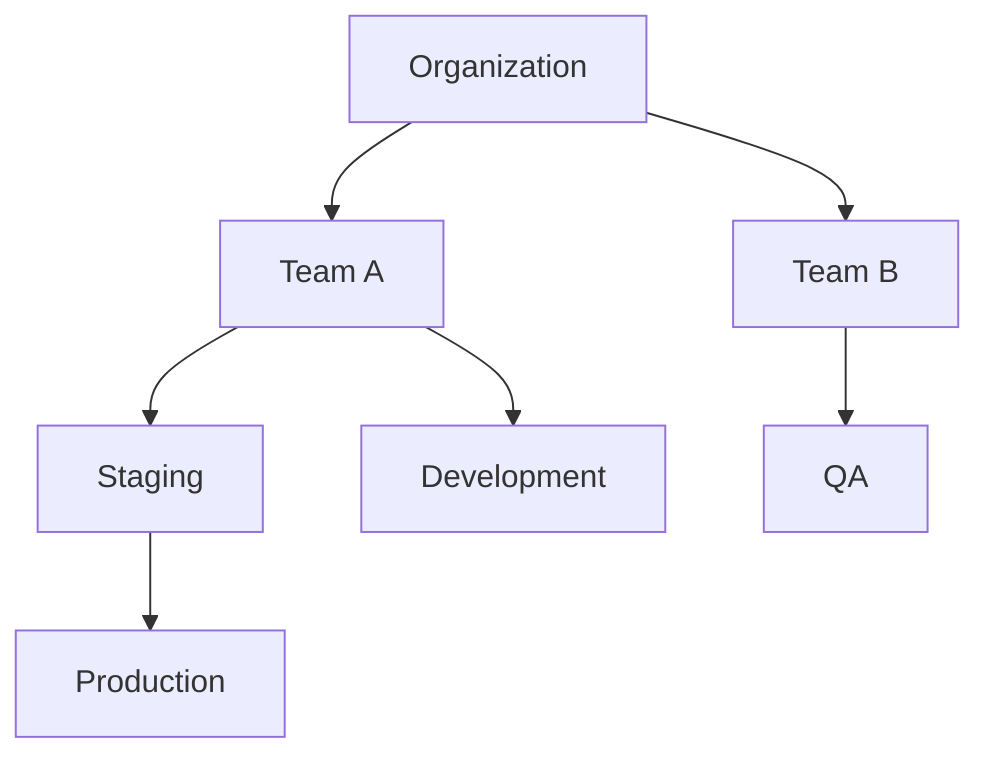

## Overview

The Account Model, powered by <Project>kcp</Project>, serves as the foundational fabric for managing interactions across a distributed cloud-edge continuum, enabling seamless collaboration between <Term>service providers</Term> and <Term>service consumers</Term> within the Platform Mesh architecture.
Built on <Project>kcp</Project>'s hierarchical organization concept and the <Term>Kubernetes Resource Model</Term>, it introduces a sophisticated structure where each account functions as an isolated <Term>control plane</Term>, transcending traditional approaches to service management.
Through its export and bind mechanisms, isolated environments, and multi-tenancy support, it creates an environment that elegantly handles the complexities of modern service ecosystems while ensuring clear organizational boundaries and precise operational control across diverse cloud and edge environments.

## Components

### Account Structure

At its core, the Platform Mesh implements a hierarchical account model that naturally mirrors how organizations operate.
This innovative approach provides isolated environments where companies can seamlessly map their business units, teams, and projects while maintaining clear ownership and access patterns.

The account structure offers several key capabilities:
- Deep nesting support that allows organizations to create structures matching their operational needs without artificial constraints
- Logical isolation ensuring secure multi-tenancy, where different roles like service consumers, providers, and marketplace functionality can operate independently
- Built-in support for defining different account types, each tailored to specific organizational needs
- Natural flow of policies and configurations through the hierarchy, simplifying governance
- Robust service integration mechanisms enabling providers to expose services and consumers to discover and utilize them within their isolated environments

This comprehensive set of features enables the implementation of governance models that align perfectly with specific requirements and compliance needs, while ensuring secure and scalable service management across the platform.

### Service Management Integration

The account model significantly enhances service interactions through automated relationship management between <Term>service consumers</Term> and <Term>service providers</Term>. When an organization engages with a provider, the platform automatically establishes necessary connections, creating dedicated shadow accounts and tenant spaces, ensuring secure and isolated service management while maintaining operational consistency.

Key aspects of Service Management Integration within the account model:
- **Automated Relationship Management:** The platform automates the establishment of connections between service consumers and providers. This includes creating dedicated shadow accounts and tenant spaces, streamlining the onboarding process and reducing manual configuration.
- **Declarative Service Consumption:** Leveraging the <Term>Kubernetes Resource Model</Term> (KRM), the platform enables declarative service consumption. Service consumers can define the desired state of their services through resources, and the platform ensures the actual state aligns with the desired state.
- **Managed Service Provider Pattern:** The integration leverages the Managed Service Provider pattern, where <Term>service providers</Term> are responsible for automating the lifecycle of <Term>capabilities</Term>. This pattern promotes scalability and regional distribution by enabling service providers to manage multiple <Term>service runtimes</Term> and deploy capabilities close to the consumer's application.
- **Service Catalog and Marketplace:** The platform facilitates a marketplace-like experience where service consumers can discover and select services offered by providers. This is enabled through export and bind mechanisms that allow providers to define service offerings and consumers to bind to these services.
- **Consumer Experience driven by KRM:** The consumer experience is driven by the Kubernetes Resource Model, providing a unified API surface for declarative service consumption across different providers. Consumers can interact with the platform through tools like `kubectl`, IaC, or GitOps approaches.

This integration expertly balances clear boundaries between different <Term>services</Term> with seamless integration across the service portfolio. It supports complex multi-tenant scenarios without compromising security and provides a foundation for a scalable and regionally distributed service ecosystem.

## Key Features

### Identity Management

Identity management within the account model delivers consistent authentication across the platform while preserving organizational control over user management.
Organizations can implement centralized identity strategies with sophisticated delegation capabilities.
The system seamlessly integrates with existing identity providers while upholding rigorous security standards and access controls,
enabling organizations to maintain their established identity practices while leveraging the platform's advanced security features.

### Service Orchestration

Service orchestration within the account model achieves new levels of efficiency by employing dedicated orchestration contexts that intelligently group related <Term>services</Term>. This sophisticated approach enables complex service compositions while preserving clear organizational boundaries. Unlike traditional orchestration, which relies on a central component to manage interactions, the Platform Mesh leverages a choreography-based approach, inspired by Kubernetes, for service orchestration.

Key aspects of Service Orchestration within the account model:
- **Choreography over Orchestration:** The platform adopts a choreography-based model for service orchestration, where services manage their functions autonomously, contributing to the overall system behavior without a central orchestrator. This decentralized approach enhances resilience and flexibility.
- **Decentralized Control:** In contrast to orchestration with a central control component, choreography distributes control among services. This reduces tight coupling and single points of failure, making the system more robust and adaptable to changes.
- **Emergent Behavior:** The desired system behavior emerges from the collaboration of individual services, each managed by its own controller with a reconciling control loop. This approach, similar to the "invisible hand" concept, allows for coordinated behavior without central command.
- **Dedicated Orchestration Contexts:** While leveraging choreography, the account model also introduces dedicated orchestration contexts. These contexts intelligently group related <Term>services</Term>, enabling complex service compositions while maintaining clear organizational boundaries. Services can be seamlessly grouped and managed regardless of their account location, supporting sophisticated cross-service scenarios.
- **Flexibility and Adaptability:** Choreography allows for a loosely coupled architecture where services can be easily added, removed, or exchanged. This enhances the platform's flexibility and adaptability to evolving service ecosystems and changing requirements.

By employing a choreography-based approach with dedicated orchestration contexts, the account model achieves efficient service orchestration, enabling complex compositions and cross-service scenarios while maintaining resilience, flexibility, and clear organizational boundaries. The system accommodates both <Term>managed</Term> and <Term>unmanaged services</Term>, providing ultimate flexibility in service deployment and management approaches.

## Implementation Benefits

### For Organizations

The account model provides organizations with unprecedented control and visibility over their service ecosystem through a unified management framework that spans cloud and edge environments.
The hierarchical structure ensures that policies, permissions, and configurations flow naturally through the organization, significantly reducing administrative overhead while enhancing security through consistent policy enforcement.
Organizations can implement sophisticated governance models that align precisely with their compliance requirements, while maintaining control over service deployments across distributed environments.

### For Service Providers

Recognizing the crucial role of Managed Service Providers (MSPs) in modern cloud-edge environments, the account model is specifically designed to empower <Term>service providers</Term> with elegant integration patterns that streamline customer engagement while preserving operational independence. The account model, through its native support for the Managed Service Provider pattern, automates complex aspects of multi-tenancy, authentication, and authorization, allowing providers to focus on their core service capabilities.

Key benefits for Service Providers within the account model:
- **Streamlined Customer Engagement:** The account model simplifies customer engagement by automating the establishment of connections and dedicated environments (shadow accounts, tenant spaces). This reduces friction in onboarding new customers and managing existing relationships.
- **Operational Independence:** Service providers retain operational independence while seamlessly integrating with the platform mesh. The account model handles cross-cutting concerns like multi-tenancy and authorization, allowing providers to focus on their core service logic and innovation.
- **Managed Service Provider (MSP) Pattern Adoption:** The platform encourages and supports the Managed Service Provider pattern. This pattern enables service providers to build scalable and regionally distributed services by managing multiple <Term>service runtimes</Term> and leveraging components like the <Term>service coordinator</Term> and <Term>servicelet</Term> for automated capability lifecycle management.
- **Focus on Core Service Capabilities:** By abstracting away complexities related to multi-tenancy, authentication, and authorization, the account model allows service providers to concentrate on enhancing their core <Term>service</Term> offerings and delivering value to consumers.

In essence, the account model, by promoting the Managed Service Provider pattern and automating key operational complexities, empowers service providers to efficiently offer and manage their services within the Platform Mesh, fostering innovation and streamlining customer interactions.

## Technical Foundation

The account model implements sophisticated integration with <Term>service providers</Term> for deployment operations, while providing comprehensive support for <Term>digital twins</Term> in service management. Leveraging <Project>kcp</Project>, the account model benefits from logical isolation and multi-tenancy features that enable secure and scalable service management across diverse cloud and edge environments.
Built on standardized API interfaces based on the <Term>Kubernetes Resource Model</Term>, the implementation ensures consistency and interoperability across distributed infrastructure.
Through advanced capability management supporting both deployment and tenant-based services, the platform enables complex service scenarios while maintaining operational simplicity in a multi-provider cloud-edge continuum.

The Platform Mesh account model, built on kcp technology, creates a flexible framework connecting service providers and consumers through standardized interfaces. At its core, providers expose their services as resources that consumers can discover and bind to within their isolated workspaces. This architecture maintains clear boundaries between different accounts while enabling seamless service consumption across the mesh.

The system organizes resources hierarchically, with parent-child account relationships that reflect organizational structures. Each workspace functions as an independent control plane where users can manage services through a consistent Kubernetes-compatible interface. This approach allows service providers to maintain control over their implementations while giving consumers a unified experience for discovering and managing services from multiple providers.

This architecture supports the Platform Mesh vision by creating an interoperable ecosystem where services can be easily discovered, consumed, and orchestrated across organizational boundaries, all while maintaining appropriate isolation and access controls.

:::info NOTE
The Platform Mesh Account Model represents ongoing research in service management patterns.
The model continues to evolve to support enhanced service contracts, advanced security models, and improved cross-provider orchestration capabilities.
:::
