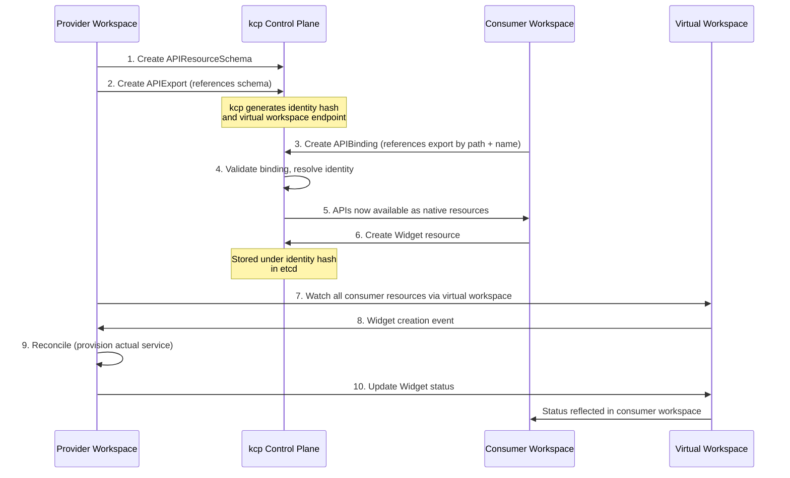

# APIExport & APIBinding

The APIExport/APIBinding mechanism is the fundamental composition primitive in kcp and the core of how Platform Mesh connects service providers with service consumers. Providers publish APIs from their workspace using an APIExport, and consumers bind to those APIs using an APIBinding, making the resources available in their own workspace as if they were native Kubernetes types. With a small number of exceptions, everything in kcp is implemented using this pattern.

This page explains the three resource types involved, how the binding flow works, how permissions are negotiated between provider and consumer, and how providers access consumer resources after binding.

## The Three Resource Types

The APIExport/APIBinding system is built on three Kubernetes custom resources, each with a distinct role.

### APIResourceSchema

An APIResourceSchema defines a single custom API type. It is structurally similar to a CustomResourceDefinition (CRD), but with one critical difference: creating an APIResourceSchema does **not** automatically serve the API. This intentional decoupling gives API owners explicit control over which schemas are active and how they evolve.

Key properties:

- Specifies the resource group, names (kind, plural, singular), scope (Cluster or Namespaced), and version schemas
- **The spec is immutable** -- if you need to change your API schema, you create a new APIResourceSchema instance
- Naming convention: `<prefix>.<plural>.<group>` (e.g., `v220801.widgets.example.kcp.io`)
- Must reside in the **same workspace** as the APIExport that references it

```yaml
apiVersion: apis.kcp.io/v1alpha1
kind: APIResourceSchema
metadata:
  name: v220801.widgets.example.kcp.io
spec:
  group: example.kcp.io
  names:
    kind: Widget
    listKind: WidgetList
    plural: widgets
    singular: widget
  scope: Cluster
  versions:
  - name: v1alpha1
    served: true
    storage: true
    schema:
      type: object
      properties:
        spec:
          type: object
          properties:
            size:
              type: string
```

Because the spec is immutable, schema evolution creates a chain of APIResourceSchema instances rather than in-place mutations. This makes versioning explicit and rollbacks straightforward -- you can revert by pointing the APIExport back to a previous schema.

### APIExport

An APIExport makes one or more APIs available to other workspaces. It lives in the provider's workspace and references the APIResourceSchema instances that define the exported types.

```yaml
apiVersion: apis.kcp.io/v1alpha2
kind: APIExport
metadata:
  name: example.kcp.io
spec:
  resources:
    - group: example.kcp.io
      name: widgets
      schema: v220801.widgets.example.kcp.io
      storage:
        crd: {}
```

Each APIExport gets a **unique identity** -- a cryptographic key pair where the public key is hashed (SHA-256) and published in the APIExport's status:

```yaml
status:
  identityHash: a6a0cc778bec8c4b844e6326965fbb740b6a9590963578afe07276e6a0d41e20
```

This identity hash serves a critical purpose: it allows multiple providers to export the same `(group, resource, version)` combination without interference. The hash becomes part of the etcd storage key, so resources from different providers are physically separated even if they share the same API shape. The identity is automatically generated and stored in a Secret.

### APIBinding

An APIBinding is created in a consumer's workspace and references an APIExport by its name and the workspace path where it lives.

```yaml
apiVersion: apis.kcp.io/v1alpha2
kind: APIBinding
metadata:
  name: example.kcp.io
spec:
  reference:
    export:
      name: example.kcp.io
      path: "root:api-provider"
```

Once bound, the exported APIs appear as normal Kubernetes resources in the consumer's workspace. They show up in `kubectl api-resources`, they can be created with `kubectl apply`, and they work with any standard Kubernetes tooling. However, **no CRDs are created in the consumer workspace** -- kcp uses internal binding mechanisms behind the scenes. The APIExport's identity hash is embedded in the storage path to keep resources from different providers isolated.

## Binding Flow

The following diagram shows the complete lifecycle from API definition to resource reconciliation:



Steps 1-2 happen once during provider setup. Step 3 happens once per consumer. Steps 6-10 repeat for every resource lifecycle event.

## Permission Claims

By default, a provider has access only to the resources defined in their own APIExport. But providers often need access to additional resources in consumer workspaces -- for example, a certificate provider might need to read Secrets, or a database provider might need to create ConfigMaps with connection details.

### How Claims Work

The provider requests access by adding `permissionClaims` to their APIExport:

```yaml
apiVersion: apis.kcp.io/v1alpha2
kind: APIExport
metadata:
  name: example.kcp.io
spec:
  resources:
    - group: example.kcp.io
      name: widgets
      schema: v220801.widgets.example.kcp.io
      storage:
        crd: {}
  permissionClaims:
  - group: ""
    resource: configmaps
    verbs: ["get", "list", "create"]
  - group: somegroup.kcp.io
    resource: things
    identityHash: 5fdf7c7aaf407fd1594566869803f565bb84d22156cef5c445d2ee13ac2cfca6
    verbs: ["*"]
```

Each claim specifies the resource group and name, the required API verbs, and -- for resources from other APIExports -- the identity hash of that export.

### Consumer Acceptance

Consumers must **explicitly accept** each permission claim in their APIBinding. Claims are not auto-accepted, and new claims added to an existing APIExport do not retroactively apply to existing bindings.

```yaml
apiVersion: apis.kcp.io/v1alpha2
kind: APIBinding
metadata:
  name: example.kcp.io
spec:
  reference:
    export:
      name: example.kcp.io
      path: "root:api-provider"
  permissionClaims:
  - resource: configmaps
    verbs: ["get", "list", "create"]
    state: Accepted
    selector:
      matchAll: true
  - resource: things
    group: somegroup.kcp.io
    identityHash: 5fdf7c7aaf407fd1594566869803f565bb84d22156cef5c445d2ee13ac2cfca6
    verbs: ["*"]
    state: Accepted
    selector:
      matchLabels:
        env: prod
```

### Verb Intersection

The final set of operations the provider can perform is the **intersection** of the verbs in the APIExport and the verbs accepted in the APIBinding. Neither side can unilaterally escalate access: if the provider requests `["*"]` but the consumer accepts only `["get", "list"]`, the provider gets read-only access.

### Selectors

Consumers can further restrict which objects a provider can see by using selectors on accepted claims:

| Selector | Effect |
|----------|--------|
| `matchAll: true` | Provider can access all objects of the claimed resource |
| `matchLabels` | Provider can only access objects matching **all** specified labels. Labels are auto-applied to objects created by the provider. |
| `matchExpressions` | Provider can only access objects satisfying the label expressions. The provider must explicitly set matching labels. |

This design ensures that consumers retain full control over what data providers can access in their workspace.

## Maximal Permission Policy

Beyond permission claims, APIExport owners can set an upper bound on what consumers are allowed to do with the exported APIs. This is done through standard Kubernetes RBAC -- `ClusterRoles` and `ClusterRoleBindings` -- where the subjects are prefixed with `apis.kcp.io:binding:`.

For example, a provider could create a `ClusterRole` that restricts consumers to only creating and reading widgets, but not deleting them. When the Maximal Permission Policy Authorizer runs (as part of kcp's [authorization chain](/overview/control-planes)), it checks every consumer request against these upper bounds.

## Virtual Workspace Access

After binding, providers need a way to see and reconcile resources that consumers create across potentially many workspaces. kcp solves this with the **APIExport virtual workspace** -- a proxy API server endpoint that aggregates all instances of the exported resource types across all bound consumer workspaces.

The virtual workspace URL is published in the APIExport's status and follows this pattern:

```
/services/apiexport/<workspace-path>/<export-name>/clusters/<consumer-path>/apis/...
```

Providers use the **wildcard cluster** (`*`) to watch all consumer workspaces at once:

```
/services/apiexport/<workspace-path>/<export-name>/clusters/*/apis/...
```

This is how controllers -- including [api-syncagent](/overview/api-syncagent) and custom syncers built with [multi-cluster-runtime](/overview/multi-cluster-runtime) -- discover and reconcile resources. The virtual workspace handles identity hash resolution transparently; the provider does not need to pass the hash when accessing resources through this endpoint.

The virtual workspace supports full CRUD operations. A controller can read a Widget created by a consumer, reconcile it (e.g., provision the actual backing service), and write back status updates -- all through the virtual workspace endpoint. The status update then appears in the consumer's workspace as if it were a local update.

In a sharded kcp deployment, each shard runs its own virtual workspace API server. Controllers must handle multiple virtual workspace URLs from the `APIExportEndpointSlice` -- one per shard that hosts relevant consumer workspaces.

## Cross-Workspace Admission

kcp extends Kubernetes admission webhooks to work across the APIExport/APIBinding boundary. When a resource in a consumer workspace comes from an APIBinding, kcp dispatches admission checks to webhook configurations and policies defined in the **provider's workspace**, not the consumer's.

This means providers can enforce validation and mutation rules on their exported resources across all consumer workspaces from a single location:

- **MutatingWebhookConfiguration** and **ValidatingWebhookConfiguration** in the APIExport workspace apply to bound resources in all consumer workspaces
- **ValidatingAdmissionPolicy** has full cross-workspace support -- policies and their bindings defined in the APIExport workspace automatically apply everywhere
- Admission review objects carry a `kcp.io/cluster` annotation identifying which consumer workspace the resource belongs to

Two limitations apply: conversion webhooks are not supported, and webhook configurations must use URL-based `clientConfigs` (service-based references are not supported).

## What's Next

- **[api-syncagent](/overview/api-syncagent)** -- The primary tool for publishing CRDs from a Kubernetes service cluster as APIExports in kcp, with bidirectional sync and related resource handling
- **[multi-cluster-runtime](/overview/multi-cluster-runtime)** -- A Go library for building custom controllers that reconcile across consumer workspaces using the APIExport virtual workspace
- **[Control Planes](/overview/control-planes)** -- How kcp workspaces provide the hierarchical isolation that APIExport/APIBinding builds on
- **[Account Model](/overview/account-model)** -- How organizational hierarchy maps to the workspace tree where providers and consumers operate
