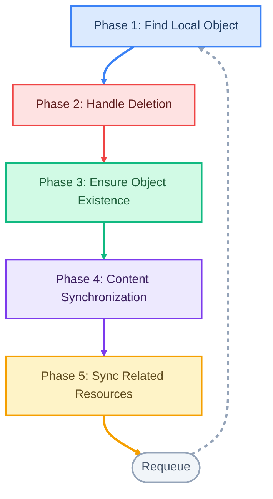
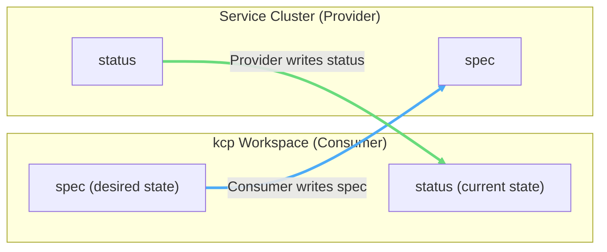

# api-syncagent

The **api-syncagent** is a Kubernetes controller that publishes CRDs from a service cluster as [APIExports](/overview/api-export-binding) in kcp, enabling bidirectional synchronization between many kcp workspaces and a single service cluster.
It is the **primary, lowest-effort integration path** for bringing existing Kubernetes operators and CRD-based services into the Platform Mesh.
If you already run an operator on a Kubernetes cluster (Crossplane, cert-manager, a custom controller), the api-syncagent lets you expose its APIs to Platform Mesh consumers without modifying the operator itself.
For non-CRD APIs or scenarios requiring full control over sync logic, see [multi-cluster-runtime](/overview/multi-cluster-runtime) as the alternative approach.

## How It Works

Integrating a CRD-based service into the Platform Mesh through the api-syncagent follows six steps:

1. **kcp admin creates an APIExport** in a provider workspace, along with credentials (a kubeconfig Secret) for the Sync Agent.
2. **Service owner configures the agent** with the APIExport name and the API group to publish.
3. **Agent is deployed via Helm chart** on the service cluster, into the `kcp-system` namespace.
4. **Service owner creates PublishedResource objects** on the service cluster, declaring which CRDs to expose.
5. **Agent converts PublishedResources into APIResourceSchemas** in kcp. Schema names are hash-based and immutable, making changes safe to revert.
6. **Agent bundles schemas into the APIExport.** kcp provides a virtual workspace endpoint for the export; the agent begins watching for resources across all consumer workspaces that bind to this APIExport. **Bidirectional synchronization starts.**

From this point on, consumers bind to the APIExport from their own workspaces. Bound APIs appear as normal Kubernetes resources (visible via `kubectl api-resources`) and can be consumed with standard tooling -- `kubectl`, Helm, GitOps, or any Kubernetes client.

## PublishedResource CRD

The `PublishedResource` (`syncagent.kcp.io/v1alpha1`) is the core configuration primitive. It is **cluster-scoped** and **immutable** -- once created, its spec cannot be changed. Immutability prevents cascading disruptions across consumer workspaces that depend on the published schema.

A minimal PublishedResource requires only the resource `kind`, `apiGroup`, and at least one served version:

```yaml
apiVersion: syncagent.kcp.io/v1alpha1
kind: PublishedResource
spec:
  resource:
    apiGroup: cert-manager.io
    kind: Certificate
    versions:
    - name: v1
  synchronization:
    enabled: true
```

### Resource Projection

The `.spec.projection` field allows you to change how the CRD appears in kcp. You can modify:

- **Kind, plural name, short names, categories** -- rename the resource for consumer clarity
- **API group and version** -- publish under a different group or version
- **Scope** -- publish a cluster-scoped CRD as namespace-scoped in kcp, or vice versa

This is useful when the CRD's internal naming does not match the API contract you want to present to consumers.

### Filtering

The `.spec.filter` field restricts which resources are synchronized:

- **Namespace filter** -- sync only resources in specific namespaces on the service cluster
- **Label selector** -- sync only resources matching a label expression

### Naming Rules

The `.spec.naming` field uses **Go template expressions** to control how objects are named on the service cluster. This prevents collisions when multiple consumer workspaces create resources with the same name.

- Default namespace: <code v-pre>{{ .ClusterName }}</code> (each kcp workspace gets its own namespace)
- Default name: SHA3-based hash of the original name

Available template variables: `Object`, `ClusterName`, `ClusterPath`.

### Mutations

The `.spec.mutation` field transforms resource contents during synchronization. Separate rules can be defined for spec (kcp-to-cluster direction) and status (cluster-to-kcp direction). Supported mutation types:

| Type | Description |
|------|-------------|
| **CEL expressions** | Evaluate Common Expression Language rules against the object |
| **Regex patterns** | Pattern-based string replacement on field values |
| **Go templates** | Template-based transformation with full sprig/v3 function support |
| **Field deletion** | Remove specific fields during sync |

## The Sync Loop

The agent performs a **five-phase reconciliation loop** for each synchronized resource. In each cycle, the "remote" object (in kcp) is the source and the "local" object (on the service cluster) is the destination.



### Phase 1 -- Find Local Object

The agent searches the service cluster using **label selectors** that encode the remote cluster name, namespace, and object name. All sync metadata is stored on the service cluster side only, keeping kcp objects clean of implementation details.

### Phase 2 -- Handle Deletion

A **finalizer** on the kcp object prevents orphaned resources. When the source object is deleted in kcp, the agent removes the corresponding local object on the service cluster first, then cleans up the finalizer. This guarantees that service-cluster resources are not left behind.

### Phase 3 -- Ensure Object Existence

If no local object exists, the agent creates one by applying **projection** rules (scope, naming, group transformations), validating the target namespace, and creating the object. If a label conflict arises with an existing object, the agent adopts it by correcting labels rather than failing.

### Phase 4 -- Content Synchronization

The agent patches the local object's spec from the kcp source. It tracks **prior state** to generate correct patches (avoiding unintended overwrites of fields set by the local operator). If the CRD defines a **status subresource**, the agent syncs status back from the service cluster to kcp.

### Phase 5 -- Sync Related Resources

Any **related resources** (Secrets, ConfigMaps, or other auxiliary objects) are synchronized using the same reconciliation logic. Their state is stored in a single Secret on the service cluster rather than in kcp.

## Data Flow Direction

Despite the PublishedResource CRD describing the world from the **service owner's perspective** (you "publish" resources from your cluster), the actual data flow is intentionally inverted:



- **Spec** flows from kcp to the service cluster. The consumer writes the desired state in their kcp workspace; the agent replicates it to the service cluster where the operator acts on it.
- **Status** flows from the service cluster to kcp. The operator on the service cluster updates status as it reconciles; the agent pushes this back to the consumer's workspace in kcp.
- **Related objects** can originate from either side, depending on configuration.

kcp is always the **authoritative source of truth** for the primary resource's desired state.

## Related Resources

In practice, most services produce auxiliary Kubernetes objects alongside the primary resource. For example, cert-manager Certificates generate TLS Secrets, and Crossplane creates connection-detail Secrets. The api-syncagent handles these through the **Related Resources** mechanism.

### Categories

Related resources fall into three categories:

| Category | Description | Example |
|----------|-------------|---------|
| **Core** | Built-in Kubernetes objects | Secrets, ConfigMaps |
| **Owned** | Resources defined in the same APIExport | CRDs managed by the same agent |
| **Foreign** | Resources from other APIExports | Requires configuring the identity hash of the foreign APIExport |

### Object Selection

Three methods identify which objects are related to a primary resource:

1. **References** -- JSONPath-like expressions evaluated against both the origin and destination objects, accounting for mutations applied during sync.
2. **Templates** -- Go template expressions with context variables (`Side`, `Object`, `ClusterName`, `ClusterPath`).
3. **Label selectors** -- for cases without direct references. Requires careful naming rules to prevent cross-workspace information leakage.

### Permission Claims

Each related resource **automatically becomes a permission claim** on the APIExport. When a consumer creates an APIBinding, they must explicitly accept these claims. For example, if a published Certificate resource generates Secrets, the APIExport will include a permission claim for `secrets`. Rejecting namespace access will typically break the service.

## Operational Details

### Agent Identity and Naming

Each Sync Agent has a unique name (for example, "nora" or "oskar"). Its **fully qualified domain name** is `<agentname>.<apigroup>` -- for instance, `nora.cert-manager.io`. One APIExport must be managed by exactly one Sync Agent.

### High Availability

Leader election is supported. Multiple replicas of the same agent can run for HA deployments; only the leader actively reconciles.

### Multiple Agents on One Cluster

Multiple agents can coexist on the same service cluster, provided their PublishedResources are **partitioned by API group**. Use the `--published-resource-selector` flag or `publishedResourceSelector` in the Helm values to scope each agent to its designated resources.

### Deployment

The agent is installed via a **Helm chart** into the `kcp-system` namespace. It requires:

- A **kubeconfig Secret** for connecting to kcp
- **RBAC** on the service cluster for the managed resource types
- **RBAC** in kcp for APIExports, APIResourceSchemas, and virtual workspace access

### Permission Claims Management

The agent manages the **complete permission claims list** on its APIExport and overwrites it on each reconciliation. This means custom permission claims cannot coexist with agent-managed claims on the same APIExport. Standard claims always include:

- `events` (for surfacing Kubernetes events)
- `namespaces` (for workspace-to-namespace mapping)
- `core.kcp.io/logicalclusters` (when workspace path features are enabled)
- Any resources configured as related resources

## When to Use api-syncagent

The api-syncagent is the right choice when:

- You have an **existing Kubernetes operator** with CRDs that you want to expose in the Platform Mesh
- You want the **lowest integration effort** -- no custom controller code required
- You need **standard bidirectional sync** (spec down, status up) with optional mutations
- Your service produces **related resources** (Secrets, ConfigMaps) that consumers need access to

Consider [multi-cluster-runtime](/overview/multi-cluster-runtime) instead when:

- Your service exposes **non-CRD APIs** (aggregated API servers, custom API servers)
- You need **full control** over sync logic, conflict resolution, or multi-step orchestration
- Your controller needs to **coordinate state across multiple clusters** rather than mirroring resources

## What's Next

- [APIExport and APIBinding](/overview/api-export-binding) -- understand the cross-workspace service sharing mechanism that the api-syncagent builds on
- [multi-cluster-runtime](/overview/multi-cluster-runtime) -- the alternative integration path for non-CRD APIs and custom sync logic
- [Provider Quick Start](/guides/provider-quick-start) -- step-by-step guide to deploying your first service provider
- [HttpBin Provider Example](/guides/httpbin-example) -- a hands-on tutorial walking through a complete api-syncagent integration
