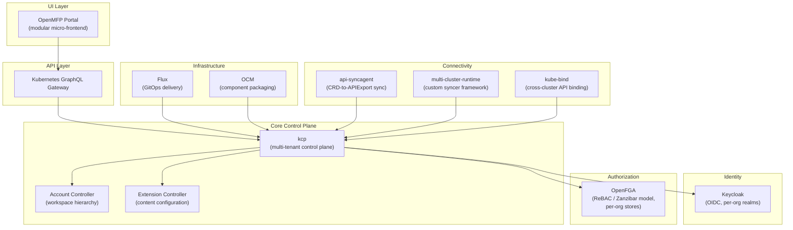

# Architecture Overview

Platform Mesh is a composable platform built on the [Kubernetes Resource Model (KRM)](/overview/principles). Rather than enforcing rigid IaaS/PaaS/SaaS layers, it provides a single mechanism for offering, discovering, and managing services of any kind. This page shows how the major components fit together.

## Full Stack Diagram

The following diagram shows the complete Platform Mesh stack, organized from the user-facing layers at the top down to the infrastructure and connectivity layers at the bottom.

## Component Descriptions

### UI Layer

**OpenMFP Portal** is a micro-frontend platform built on the Luigi framework. It composes technology-agnostic frontend modules into a unified portal at runtime. Extensions register themselves declaratively through Kubernetes-native ContentConfiguration CRDs, so adding a new UI module requires no redeployment of the portal itself. The portal communicates with the control plane through the GraphQL gateway.

**Kubernetes GraphQL Gateway** exposes kcp's KRM resources through a GraphQL interface. It supports single-cluster, kcp, and multi-cluster modes, giving the portal (and other clients) a typed, queryable API surface over the same resources accessible via `kubectl`.

### Core Control Plane

**kcp** is the heart of Platform Mesh. It extracts the Kubernetes declarative API server and strips away container orchestration, repurposing it for service management. kcp provides hierarchical [workspaces](/overview/control-planes) (each behaving like an independent Kubernetes API endpoint), the [APIExport/APIBinding](/overview/api-export-binding) mechanism for cross-workspace service sharing, and horizontal scaling through sharding. A key property is that kcp workspaces are cheap -- multiple logical clusters share a single process and etcd instance, isolated by storage prefix rather than separate infrastructure.

**Account Controller** manages the [Account Model](/overview/account-model), which maps organizational structure (organizations, teams, environments) into kcp's workspace hierarchy. Each account node is an isolated control plane with its own API surface, identity realm, and authorization store. Policies flow downward through the hierarchy.

**Extension Controller** processes ContentConfiguration CRDs that register micro-frontend extensions with the OpenMFP portal. It validates configurations asynchronously and stores the result so the portal can serve them at request time.

### Identity

**Keycloak** provides OpenID Connect (OIDC) authentication for the platform. Each organization gets its own Keycloak realm, supporting federation so organizations can bring their own identity provider. kcp's front proxy terminates authentication and forwards identity via mTLS headers to backend shards.

### Authorization

**OpenFGA** implements Relationship-Based Access Control (ReBAC), modeled after Google's Zanzibar system. Authorization state is expressed as relationship tuples (user, relation, object), and permissions propagate through a graph. Each organization gets an isolated OpenFGA store, and the authorization schema updates dynamically as new API bindings are activated. Kubernetes RBAC evaluates first; when RBAC has no opinion, the request is forwarded to OpenFGA via kcp's authorization webhook.

### Infrastructure

**Flux** provides GitOps-based continuous delivery, reconciling desired state from Git repositories into the platform.

**OCM (Open Component Model)** handles component packaging and versioning, providing a supply chain for delivering platform components and extensions.

### Connectivity

Three mechanisms bridge the gap between service provider clusters and the Platform Mesh control plane. Each serves a different use case:

**[api-syncagent](/overview/api-syncagent)** is the primary integration path for standard CRD-based services. It runs on a service provider's Kubernetes cluster and publishes that cluster's CRDs as APIExports in kcp. Synchronization is bidirectional: spec flows from kcp to the service cluster, status flows back. Configuration is driven by PublishedResource CRDs. This is the recommended starting point for most providers.

**[multi-cluster-runtime](/overview/multi-cluster-runtime)** is a Go library extending `controller-runtime` for building custom syncers. Use it when providers need full control over sync logic or work with non-CRD APIs (aggregated API servers, custom API servers). It requires more development effort but offers complete flexibility.

**kube-bind** extends the mesh to vanilla Kubernetes clusters that are not running kcp. It uses a konnector agent on the consumer side to synchronize API resources between clusters, with three isolation strategies (namespace, cluster, or CRD-level). This is the path for direct cluster-to-cluster API sharing.

## How Components Interact

A typical request flows through the stack as follows. A developer opens the OpenMFP portal, which loads micro-frontend modules registered through ContentConfiguration CRDs. The portal calls the Kubernetes GraphQL Gateway, which translates the request into standard KRM operations against a kcp workspace. kcp authenticates the request via Keycloak (OIDC token validation) and authorizes it through the two-tier chain: Kubernetes RBAC first, then OpenFGA's relationship graph for fine-grained decisions.

When a consumer creates a resource in their workspace -- for example, a `DatabaseClaim` -- that resource exists in kcp's declarative API surface via an [APIBinding](/overview/api-export-binding). The corresponding service provider has published a matching APIExport, and one of the three connectivity mechanisms (typically api-syncagent) synchronizes the resource down to the provider's service cluster. The provider's operator reconciles the resource, provisions the actual database, and writes status back through the same sync path. The consumer sees the updated status in their workspace, whether they check via `kubectl`, the GraphQL gateway, or the portal UI.

This architecture means that providers and consumers never interact directly. The control plane mediates all communication, providing isolation, authorization, and a uniform declarative interface regardless of what the underlying service actually is.

## What's Next

- [Account Model](/overview/account-model) -- how organizational hierarchy maps to workspaces
- [Control Planes](/overview/control-planes) -- kcp workspaces and the control plane concept
- [APIExport and APIBinding](/overview/api-export-binding) -- the service sharing mechanism
- [api-syncagent](/overview/api-syncagent) -- publishing CRDs into the mesh
- [multi-cluster-runtime](/overview/multi-cluster-runtime) -- building custom syncers
- [Guiding Principles](/overview/principles) -- the design philosophy behind Platform Mesh
