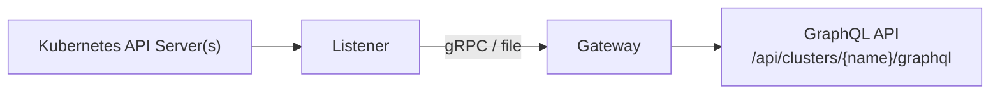

# GraphQL Gateway

The **GraphQL Gateway** exposes Kubernetes resources as a [GraphQL](https://graphql.org/) API. It enables UIs and tools to query, mutate, and subscribe to cluster resources in a developer-friendly way using the GraphQL ecosystem.

Within the Platform Mesh, the gateway serves as the **primary interface layer** between <Term>service consumers</Term> and the <Term>Kubernetes Resource Model</Term> (KRM). Instead of requiring direct interaction with Kubernetes API servers and `kubectl`, consumers can leverage GraphQL's typed, self-documenting query language to discover and manage resources across clusters.

## Architecture

The gateway consists of two cooperating components:



- **Listener** — Connects to one or more Kubernetes clusters, extracts their OpenAPI v3 specifications, and converts them into GraphQL schemas. It continuously watches for API changes and regenerates schemas as the cluster's API surface evolves.
- **Gateway** — Receives schemas from the listener, builds per-cluster GraphQL endpoints, and serves them over HTTP. It handles authentication, query validation, complexity analysis, and real-time subscriptions.

### Schema Transport

The listener and gateway communicate via a configurable schema transport (`--schema-handler`), which both components must agree on:

| Mode | Description |
|---|---|
| `grpc` | The listener runs a gRPC server and the gateway connects as a client. Schemas are streamed in real-time. This is the **recommended mode**. |
| `file` | The listener writes schema JSON files to a shared directory. The gateway watches the directory for changes. Useful for debugging or when the two components cannot connect directly. |

## Key Concepts

### Dynamic Schema Generation

Unlike static GraphQL APIs, the gateway **dynamically generates** its entire schema from the Kubernetes OpenAPI v3 specification. Every resource type discovered on a cluster — including Custom Resource Definitions (CRDs) — automatically becomes available as typed GraphQL operations. When a new CRD is installed on a cluster, the gateway picks it up without any reconfiguration.

### Per-Cluster Endpoints

Each connected cluster gets its own GraphQL endpoint at `/api/clusters/{name}/graphql`. This allows consumers to target specific clusters while the gateway manages the connections centrally. A built-in GraphQL playground can be enabled for interactive exploration.

### ClusterAccess CRD

The `ClusterAccess` custom resource enables the gateway to connect to **remote clusters** beyond the local kubeconfig. It is part of the `gateway.platform-mesh.io` API group and defines connection details and authentication credentials for target clusters.

```yaml
apiVersion: gateway.platform-mesh.io/v1alpha1
kind: ClusterAccess
metadata:
  name: my-cluster
spec:
  host: https://<cluster-api-server>
  auth:
    serviceAccountRef:
      name: graphql-gateway
      namespace: graphql-gateway
```

The `ClusterAccess` CRD supports four mutually exclusive authentication methods:

| Method | Field | Description |
|---|---|---|
| Service Account | `auth.serviceAccountRef` | Generates tokens from a service account on the management cluster |
| Bearer Token | `auth.tokenSecretRef` | References a secret containing a bearer token |
| Kubeconfig | `auth.kubeconfigSecretRef` | References a secret containing a full kubeconfig |
| Client Certificate | `auth.clientCertificateRef` | References a TLS secret for mTLS authentication |

A custom CA certificate can be provided via `ca.secretRef`.

## GraphQL API

For every Kubernetes resource discovered on a cluster, the gateway generates typed GraphQL operations covering queries, mutations, and subscriptions.

### Queries

| Operation | Description | Key Arguments |
|---|---|---|
| `{pluralName}` | List resources | `namespace`, `labelselector`, `limit`, `continue`, `sortBy` |
| `{singularName}` | Get a single resource | `name`, `namespace` |
| `{singularName}Yaml` | Get a single resource as YAML string | `name`, `namespace` |

### Mutations

| Operation | Description | Key Arguments |
|---|---|---|
| `create{Name}` | Create a resource | `namespace`, `object`, `dryRun` |
| `update{Name}` | Patch a resource (merge patch) | `name`, `namespace`, `object`, `dryRun` |
| `delete{Name}` | Delete a resource | `name`, `namespace`, `dryRun` |
| `applyYaml` | Create-or-update from a YAML string | `yaml` |

### Subscriptions

Real-time updates are delivered via Server-Sent Events (SSE):

| Operation | Description | Key Arguments |
|---|---|---|
| `{group}_{version}_{singularName}` | Watch a single resource | `name`, `namespace`, `resourceVersion` |
| `{group}_{version}_{pluralName}` | Watch a list of resources | `namespace`, `labelselector`, `subscribeToAll`, `resourceVersion` |

Each subscription event is an envelope with a `type` (`ADDED`, `MODIFIED`, `DELETED`) and the full `object`. By default, `MODIFIED` events are only sent when the fields selected in the subscription query actually change. Set `subscribeToAll: true` to receive all modification events.

::: tip
The field-level change detection means clients can subscribe to exactly the data they need and only receive updates when that data actually changes — reducing noise and bandwidth.
:::

## Multi-Cluster Support

The listener supports three provider modes, allowing the gateway to serve resources from different cluster topologies:

| Mode | Description |
|---|---|
| **Single** (default) | Watches the local cluster from the current kubeconfig |
| **KCP** | Connects to <Project>kcp</Project> workspaces via APIExport virtual workspaces |
| **Multi** | Combines KCP and standard clusters, using separate kubeconfigs for each |

In any mode, the `ClusterAccess` CRD controller can be enabled to additionally manage remote clusters declaratively.

### Integration with Platform Mesh Control Planes

When running in **KCP mode**, the gateway integrates directly with the Platform Mesh [control plane](../control-planes) infrastructure. It discovers <Project>kcp</Project> workspaces and their APIs, making the resources offered by <Term>service providers</Term> through `APIExports` queryable via GraphQL. This enables <Term>service consumers</Term> to interact with provisioned <Term>capabilities</Term> through a unified, typed API surface rather than requiring direct `kubectl` access or workspace-aware tooling.

## Configuration

### Gateway

| Flag | Default | Description |
|---|---|---|
| `--schema-handler` | `file` | How to receive schema updates: `file` or `grpc` |
| `--grpc-listener-address` | `localhost:50051` | gRPC listener address |
| `--gateway-port` | `8080` | Port for the GraphQL server |
| `--gateway-address` | `0.0.0.0` | Bind address for the GraphQL server |
| `--enable-playground` | `false` | Enable the GraphQL playground UI |
| `--cors-allowed-origins` | — | Allowed origins for CORS |
| `--endpoint-suffix` | `/graphql` | Suffix appended to cluster endpoint paths |
| `--request-timeout` | `60s` | Max duration for GraphQL requests |
| `--subscription-timeout` | `30m` | Max duration for SSE subscriptions |
| `--max-query-depth` | `10` | Max query nesting depth |
| `--max-query-complexity` | `1000` | Max query complexity score |
| `--max-query-batch-size` | `10` | Max queries per batch request |
| `--max-inflight-requests` | `400` | Max concurrent requests |
| `--max-inflight-subscriptions` | `50` | Max concurrent SSE subscriptions |
| `--token-review-cache-ttl` | `30s` | Cache TTL for Kubernetes TokenReview results |

### Listener

| Flag | Default | Description |
|---|---|---|
| `--kubeconfig` | (auto-detected) | Path to kubeconfig |
| `--multicluster-runtime-provider` | `single` | Provider mode: `single`, `kcp`, or `multi` |
| `--schema-handler` | `file` | Schema transport: `file` or `grpc` |
| `--grpc-listen-addr` | `:50051` | gRPC server address |
| `--reconciler-gvr` | `namespaces.v1` | GroupVersionResource the reconciler watches |
| `--anchor-resource` | `object.metadata.name == 'default'` | CEL expression to match the anchor resource |
| `--enable-clusteraccess-controller` | `false` | Enable the ClusterAccess CRD controller |

::: info
Set any limit flag to `0` to disable that limit. Refer to the [component repository](https://github.com/platform-mesh/kubernetes-graphql-gateway) for the full configuration reference.
:::

## Links

- [Component Repository](https://github.com/platform-mesh/kubernetes-graphql-gateway)
- [ClusterAccess CRD Definition](https://github.com/platform-mesh/kubernetes-graphql-gateway/blob/main/config/crd/gateway.platform-mesh.io_clusteraccesses.yaml)
