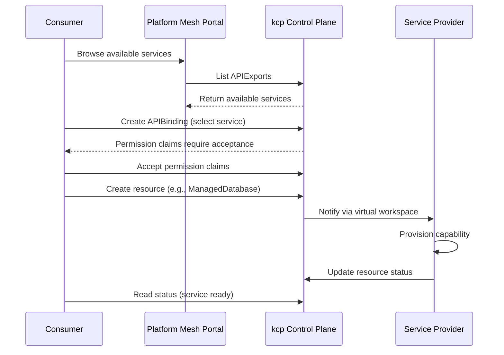

# Service Consumers

Service consumers are the developers, data scientists, and application owners who discover and use services through Platform Mesh. They are one of the three [platform personas](/overview/personas), alongside [service providers](/overview/providers) and [platform owners](/overview/platform-owner). Whether using the Platform Mesh Portal, `kubectl`, or GitOps workflows, consumers interact with services through a uniform Kubernetes-native API -- the same declarative model regardless of what the service is, who provides it, or where it runs.

Platform Mesh gives consumers a single mechanism for ordering and managing capabilities across providers, environments, and service tiers. From a managed database to a Kubernetes cluster to an AI inference endpoint, the consumer experience is always: declare what you want, and the platform makes it so.

## Consumer Workflow

Every consumer journey follows the same five steps, regardless of the target environment or the services involved.

### 1. Identify Environment

The consumer determines where their workloads and services will run. Platform Mesh supports diverse deployment targets -- public cloud, air-gapped data centers, edge locations -- and the same consumer workflow applies to all of them. The [cloud-edge continuum](/overview/principles) is a core design principle: consumers should not need to learn different tools or APIs depending on where their services are deployed.

### 2. Create Account

The consumer receives credentials for a service orchestration environment. Each account is an isolated kcp workspace with its own identity realm (Keycloak) and authorization store (OpenFGA). This means every consumer operates in a fully isolated control plane -- their resources, policies, and permissions are separate from every other consumer.

The [Account Model](/overview/account-model) supports deep nesting, so organizations can mirror their internal structure (teams, projects, environments) directly in the workspace hierarchy.

### 3. Find Services

Consumers browse available services through a marketplace or by listing APIExports directly. The service catalog may be exposed through the Platform Mesh Portal, through `kubectl` commands, or through programmatic API queries. Each service listing includes its API schema -- the contract that defines what resources the consumer can create and what fields they can configure.

Multiple marketplaces can coexist, and a single orchestration environment can connect to several of them. Consumers are not locked into a single service catalog.

### 4. Order Capabilities

To consume a service, the consumer creates a resource document -- a digital twin -- that declaratively describes the desired state of the capability. For example, a consumer ordering a database might create a resource specifying the database engine, region, storage size, and backup policy. The act of writing this resource into the consumer's workspace triggers the provider's controller to begin provisioning.

```yaml
apiVersion: example.provider.io/v1alpha1
kind: ManagedDatabase
metadata:
  name: my-app-db
  namespace: default
spec:
  engine: postgres
  version: "16"
  region: eu-west-1
  storage:
    size: 100Gi
  backup:
    enabled: true
    retentionDays: 30
```

This resource lives in the consumer's workspace. The consumer owns it, can modify it (triggering reconciliation by the provider), and can delete it (triggering decommissioning). The provider never directly accesses the consumer's workspace beyond what was explicitly granted through permission claims.

### 5. Run Application

Once the provider has provisioned the capability, its status is updated with connection information -- endpoints, credentials references, readiness conditions. The consumer's application connects to the provisioned service using this information. Deployment depends on the chosen runtime and services; Platform Mesh does not prescribe how applications are built or deployed.

## Consumer Journey

The following diagram shows the complete flow from service discovery through provisioning, illustrating how the consumer, portal, kcp control plane, and provider interact.



The key insight is that the consumer never communicates directly with the provider's infrastructure. All interaction flows through the kcp control plane, with the digital twin resource as the shared contract. The consumer writes spec, the provider writes status -- the same reconciliation pattern that Kubernetes uses for everything from Pods to PersistentVolumes.

## Interaction Modes

Platform Mesh supports multiple ways for consumers to interact with their workspace and services.

### Platform Mesh Portal

The web-based portal provides a graphical interface for service discovery, account management, and resource provisioning. Built on [OpenMFP](https://openmfp.io) and the Luigi micro-frontend framework, it serves as the reference implementation of a consumer-facing portal. Providers can extend the portal with custom UIs for their services, and consumers can use the provided UI libraries to build a fully customized portal. The portal is the most accessible entry point for consumers who are new to the ecosystem or who prefer visual browsing over command-line workflows.

Best for: exploring available services, initial setup, monitoring resource status.

### kubectl

Since every consumer workspace is a standard Kubernetes API endpoint, `kubectl` works out of the box. Resources bound via APIBinding appear as normal API resources -- `kubectl api-resources` lists them, `kubectl get` retrieves them, `kubectl apply` creates or updates them. Consumers who are fluent in Kubernetes tooling can manage their entire service portfolio from the command line.

```bash
# Point kubectl at your workspace
export KUBECONFIG=~/.kube/platform-mesh.kubeconfig

# List available API resources (including bound services)
kubectl api-resources

# Create a capability
kubectl apply -f my-database.yaml

# Check provisioning status
kubectl get manageddatabases my-app-db -o yaml
```

Best for: developers comfortable with Kubernetes, scripting, CI/CD integration.

### Infrastructure as Code / GitOps

Consumers can manage their workspace declaratively using tools like Flux, Argo CD, or Terraform. Resource definitions are stored in Git, and a reconciliation loop ensures the workspace state matches the repository. This approach provides full reproducibility, audit trails, and the ability to manage service portfolios across multiple environments (development, staging, production) using standard GitOps practices.

Best for: production environments, team collaboration, compliance-sensitive workloads.

## Discovery and Binding

The technical mechanism behind service discovery and consumption is the [APIExport/APIBinding](/overview/api-export-binding) pattern.

**APIExports** are published by service providers in their workspaces. Each export defines a set of API types (via APIResourceSchemas) that represent the capabilities the provider offers. Consumers can discover these exports through workspace navigation, marketplace UIs, or direct API queries.

**APIBindings** are created by consumers to import a provider's APIs into their own workspace. The binding references the provider's APIExport by name and workspace path. Once the binding is active, the exported API types appear in the consumer's workspace as if they were native resources -- queryable with `kubectl api-resources`, manageable with standard Kubernetes tooling.

**Permission claims** are the consent mechanism. When a provider's APIExport includes permission claims (requests to access specific resources in the consumer's workspace, such as Secrets for storing credentials), the consumer must explicitly accept each claim. New claims added after the initial binding do not auto-accept -- the consumer always retains control over what the provider can access. Consumers can further restrict provider access using label selectors, limiting which objects the provider can see within the claimed resource types.

Once bound, there is no visible difference between a "native" resource and a "bound" resource from the consumer's perspective. Standard Kubernetes RBAC, admission webhooks, and tooling all work as expected.

## Extending to Your Own Clusters

Consumers who operate their own Kubernetes workload clusters can extend Platform Mesh APIs to those clusters using [kube-bind](/overview/multi-cluster-runtime). This creates a bridge between the Platform Mesh kcp workspace and the consumer's cluster, enabling a fully local development and deployment experience.

With kube-bind:

- **Resources created on the consumer cluster sync to kcp**, triggering the same provider workflow as if the resource had been created directly in the workspace. Spec flows from the consumer cluster to the provider; status flows back.
- **The konnector** -- a single, vendor-neutral sync agent -- runs on the consumer cluster and handles all bidirectional synchronization. Providers never inject controllers or operators into the consumer's cluster.
- **Consumer clusters can remain firewalled.** Only the kcp control plane needs to be reachable; the consumer initiates the connection.
- **Standard Kubernetes tooling works unchanged.** CRDs are installed on the consumer cluster, so `kubectl`, Helm, Flux, and any other Kubernetes-native tool can manage Platform Mesh resources without knowing they are being synced to a remote control plane.

This model is particularly valuable for consumers who want to use GitOps workflows against their own clusters while still benefiting from the Platform Mesh service catalog and provider ecosystem.

## What's Next

- [Service Providers](/overview/providers) -- understand the other side of the equation: how providers publish and fulfill services
- [APIExport & APIBinding](/overview/api-export-binding) -- deep dive into the binding mechanism that connects consumers to providers
- [Account Model](/overview/account-model) -- how workspaces, identity, and authorization are structured for consumers
- [Hands-On Walkthrough](/getting-started/example-msp) -- follow a complete consumer journey from account creation through service provisioning
