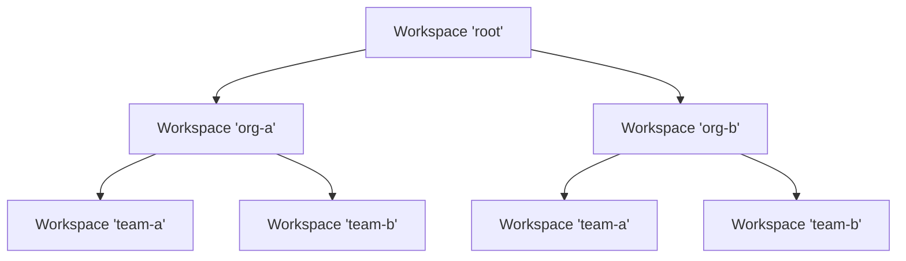
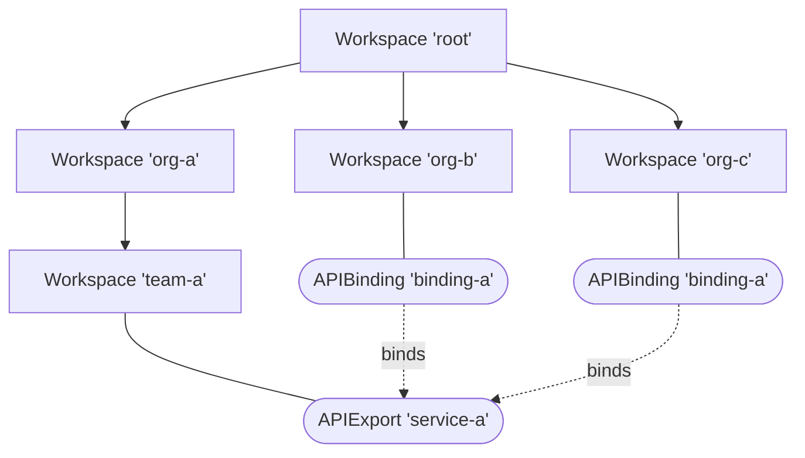

The Platform Mesh leverages <Project>kcp</Project> as a foundational technology that provides the essential capabilities for connecting <Term>service providers</Term>
and <Term>service consumers</Term> through standardized APIs and management interfaces.

## Core KRM-based API Management

kcp serves as the foundation for service management through:

- Acting as the declarative API layer between providers and consumers
- Providing a consistent control plane for service management
- Enabling standardized service definitions and consumption patterns

It achieves these goals by building on top of Kubernetes' existing extensibility model for the <Term>Kubernetes Resource Model</Term> (the KRM; making it a "lingua franca" for declarative service management) while removing container orchestration functionality that is inherent to Kubernetes. Instead, it offers API orchestration functionality that is targetted towards providing declarative APIs via the KRM to users.

In essence, kcp extracts the declarative API control plane of Kubernetes and makes it a standalone project usable to orchestrate any kind of digital services.

## Hierarchical Workspaces for Account Model

To overcome limitations imposed by the KRM kcp provides a higher-level isolation concept known as <Term>Workspaces</Term>. Workspaces provide their own sets of available API resources and a distinct list of objects created for those resources. Because of that, Workspaces basically function as isolated Kubernetes-like control planes. Existing Kubernetes API clients are capable of interacting with specific Workspaces just as they would interact with a Kubernetes cluster.

Workspaces in kcp are hierarchical by nature. This means that they are a good fit for directly mapping to the Platform Mesh [account model](account-model) as they:

- Provide natural separation between the following:
  - service consumer workspaces for binding services
  - service provider workspaces for service management
  - marketplace/registry functionality
- Enable hierarchical organization of services and resources
- Support multi-tenancy and isolation requirements

Since workspaces are hierarchical, they feel like a "tree" (or a filesystem) and can be navigated as such with tooling provided by kcp. A simple workspace tree could look like this:

As workspaces have fully-qualified paths (in the tree structure above the bottom-left node would be addressed as `:root:org-a:team-a`, for example), their names do not conflict in different branches of the tree.

Workspace management allows to define _Workspace Types_, which are helpful in providing the right set of default APIs to new APIs and restrict parts of the Workspace "tree" to specific aspects. They provide the ability to project organisational structure into the control plane provided by kcp.

## Service Provider Integration

kcp facilitates seamless provider integration by providing integration points between workspaces of service providers and service consumers. It does so by providing the `APIExport` / `APIBinding` pattern, which allows service providers to define a schema of API resources they want to offer and service consumers to "bind" to these offerings and make the API in question available in their own workspace.

Through special endpoints that follow KRM semantics, service providers get access to all objects created from their APIExport across a kcp instance. These can then be reconciled (a common pattern in the Kubernetes ecosystem) to fulfil the order associated with the object. Crucially, service provider access to other workspaces is limited to the APIs that they provide.

All interactions in this process (which is deliberately able to cross workspace boundaries, after all) is guarded by authorization checks (implemented with Kubernetes RBAC by default).

## Marketplace Support

The pattern described above (`APIExports` and `APIBindings`) create a marketplace-like experience on kcp where service consumers are capable of browsing the available APIs (by listing `APIExport` objects, assuming they have read access to the provider workspaces) and selecting the services they would like to consume from this marketplace.

As the primary interface between a provider and a consumer is the API resource shared through this pattern a strong contract between both parties is maintained. The API schema provides clear instructions for usage of services offered through it. Independent quality certification can be conducted as a consumer of those APIs to check them against standards and verify their promised service quality.

## Consumer Experience

The consumer experience on kcp is highly driven by the Kubernetes Resource Model. It allows kcp to expose a unified API surface for declarative service consumption that is consistent across different providers. The "lingua franca" of KRM allows providers to create seamless integrations across provider boundaries (e.g. by exchanging `Secret` objects to pass credentials from one provider to the other), which in turn allows consumers to create cross-provider service compositions.

Through these capabilities, kcp provides the essential foundation for the Platform Mesh, enabling standardized service management and consumption across the provider-consumer ecosystem.
