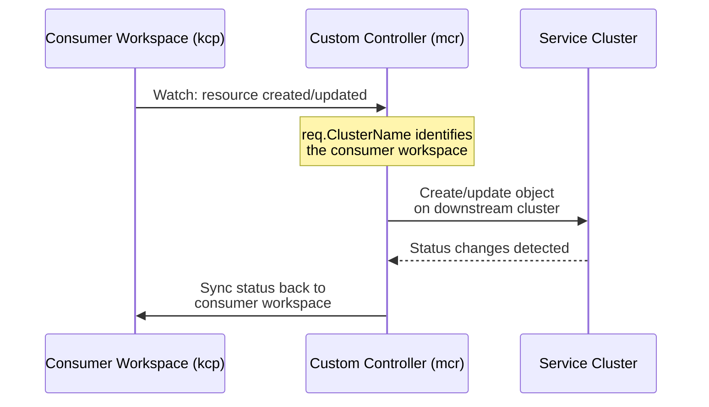
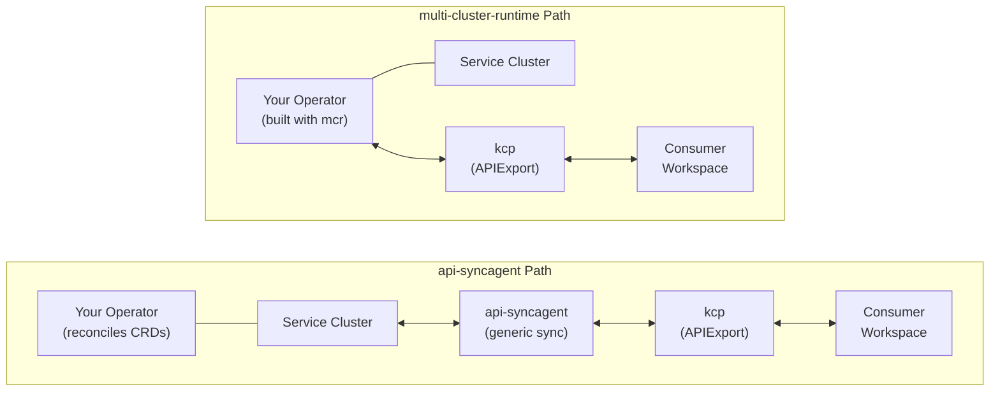

# multi-cluster-runtime

multi-cluster-runtime ([`kubernetes-sigs/multicluster-runtime`](https://github.com/kubernetes-sigs/multicluster-runtime)) is a Go library that extends `controller-runtime` to build Kubernetes controllers capable of reconciling across a dynamic fleet of Kubernetes-like clusters. It is a clean extension of the standard framework -- no forks, no `go mod replace` directives -- that adds multi-cluster awareness on top of familiar controller-runtime patterns. In Platform Mesh, it serves as the advanced integration path for service providers who need full control over synchronization logic or who work with API types that [api-syncagent](/overview/api-syncagent) cannot handle.

## When to Use multi-cluster-runtime

Most providers should start with [api-syncagent](/overview/api-syncagent), which handles synchronization through YAML configuration alone. Reach for multi-cluster-runtime when you need one or more of the following:

- **Non-CRD API extensions** -- the service cluster exposes APIs through aggregated or custom API servers rather than CRDs. While not a fundamental limitation, the api-syncagent's publishing pipeline currently discovers and extracts schemas from CRD objects specifically, so non-CRD API types require a custom controller.
- **Fine-grained sync control** -- custom transformation logic, multi-step orchestration, or conditional sync behavior that goes beyond api-syncagent's projection and mutation capabilities.
- **Complex lifecycle management** -- handling object collisions, coordinating related resources across boundaries, or implementing domain-specific reconciliation sequences.
- **Multi-cluster-aware coordination** -- the controller needs to watch and coordinate state across multiple clusters simultaneously, rather than mirroring resources between two fixed endpoints.

## Core Architecture

multi-cluster-runtime is built around a pluggable **provider** abstraction for dynamic cluster discovery. The library ships a reference provider for kind clusters; production providers live in their own repositories and can discover clusters from any source.

### Key Packages

| Package | Purpose |
|---------|---------|
| `pkg/manager` | Multi-cluster manager wrapping standard controller-runtime. Adds `GetCluster(ctx, clusterName)` for accessing individual cluster clients. |
| `pkg/builder` | Controller builder following the `ControllerManagedBy(mgr)` pattern, extended for multi-cluster registration. |
| `pkg/reconcile` | Enhanced reconcile request (`mcreconcile.Request`) with a `ClusterName` field, so the reconciler always knows which cluster triggered the event. |

The key design property is that **controller code stays the same regardless of which provider is used**. Swap out the provider, and the same reconciler discovers a completely different set of clusters.

### Minimal Example

```go
provider := kind.New()
mgr, err := mcmanager.New(ctrl.GetConfigOrDie(), provider, manager.Options{})

err = mcbuilder.ControllerManagedBy(mgr).
    Named("multicluster-configmaps").
    For(&corev1.ConfigMap{}).
    Complete(mcreconcile.Func(
        func(ctx context.Context, req mcreconcile.Request) (ctrl.Result, error) {
            // req.ClusterName identifies the source cluster
            cl, err := mgr.GetCluster(ctx, req.ClusterName)
            if err != nil {
                return ctrl.Result{}, err
            }
            // cl provides a client scoped to that cluster
            _ = cl
            return ctrl.Result{}, nil
        }))

go provider.Run(ctx, mgr)
mgr.Start(ctx)
```

The structure mirrors standard controller-runtime code. The differences are the `mcmanager`, `mcbuilder`, and `mcreconcile` packages, plus the provider lifecycle.

## Reconciliation Patterns

### Uniform Reconcilers

The same logic runs independently against each discovered cluster. The reconciler reads from and writes to the same cluster. No cross-cluster awareness is needed -- useful for applying policies, collecting metrics, or enforcing configuration uniformly across a fleet.

### Multi-Cluster-Aware Reconcilers

The reconciler watches events in one cluster and acts on another. This is the **Platform Mesh syncer pattern**: watch kcp workspaces for spec changes via the [APIExport/APIBinding](/overview/api-export-binding) virtual workspace endpoint, sync desired state to a downstream service cluster, and report status back to kcp.



## Available Providers

Providers implement cluster discovery. Each returns a stream of cluster add/remove events that the manager uses to start and stop per-cluster watches.

### kind (Reference Implementation)

**Repository:** `kubernetes-sigs/multicluster-runtime`

Discovers local kind clusters. Useful for development and testing.

### kcp Providers

**Repository:** [`kcp-dev/multicluster-provider`](https://github.com/kcp-dev/multicluster-provider)

Three variants tailored to different kcp integration scenarios:

| Provider | Discovers | Platform Mesh Use Case |
|----------|-----------|----------------------|
| `apiexport` | All consumer workspaces that have created an [APIBinding](/overview/api-export-binding) to a given APIExport | **Primary provider.** The controller watches all consumers of its service across the entire kcp instance. |
| `path-aware` | Same as `apiexport`, plus workspace path awareness | Controllers that need to reason about workspace hierarchy (e.g., applying inherited policies). |
| `initializingworkspaces` | Workspaces during initialization (before initializers complete) | Controllers that set up workspace contents as part of provisioning (e.g., seeding default resources). |

The `apiexport` provider is the one most Platform Mesh custom syncers will use. It connects to the APIExport's virtual workspace endpoint, which aggregates all consumer workspaces into a single API view. Each event carries the logical cluster name, which the reconciler uses to scope operations to the correct workspace.

### Gardener Provider

**Repository:** [`gardener/multicluster-provider`](https://github.com/gardener/multicluster-provider)

Discovers Gardener shoot clusters. Enables controllers that need to reconcile across managed Kubernetes clusters provisioned through Gardener's Garden/Seed/Shoot architecture.

## How a Platform Mesh Custom Syncer Works

A provider building a custom syncer with multi-cluster-runtime follows this workflow:

1. **Define an APIExport** in a kcp workspace with `APIResourceSchema` objects describing the APIs to serve.
2. **Configure the `apiexport` provider** pointing to the APIExport, so the controller discovers all consumer workspaces that bind to it.
3. **Watch kcp** -- the controller receives events for resources created across all bound consumer workspaces via the APIExport virtual workspace.
4. **Sync downstream** -- when objects appear or change in kcp, the reconciler propagates them to the appropriate service cluster.
5. **Report status** -- the controller watches the service cluster for status changes and syncs them back to the consumer workspace in kcp.
6. **Handle deletion** -- when objects are removed in kcp, the controller cleans up corresponding objects on the service cluster.

This is the same conceptual loop that api-syncagent performs, but with the developer writing every step of the reconciliation logic.

## Comparison with api-syncagent

The two integration mechanisms serve different points on the effort-vs-flexibility spectrum.

| Aspect | api-syncagent | multi-cluster-runtime |
|--------|--------------|----------------------|
| **What you build** | Kubernetes operator + deploy and configure the sync agent | Kubernetes operator (using mcr instead of standard controller-runtime) |
| **Sync logic** | Handled by the agent automatically | Built into the operator -- no separate sync layer needed |
| **API type** | CRDs via `PublishedResource` | Developer defines `APIResourceSchema` directly |
| **Code required** | Operator code + agent YAML configuration | Operator code (Go) |
| **Flexibility** | Moderate (projection, mutation, filtering) | Full control over every aspect |
| **Added effort over standard operator** | Deploy, configure, and maintain the sync agent alongside your operator | Minimal -- use mcr packages instead of standard controller-runtime |
| **Best for** | Standard CRD-based services where sync logic is straightforward | Non-CRD APIs, complex lifecycle, custom orchestration |

### Architecture Comparison



In both paths, you need a Kubernetes operator that reconciles your service's CRDs. The key difference is where sync happens: with api-syncagent, the agent runs as a **separate component** alongside your operator and handles all sync mechanics via `PublishedResource` configuration. With multi-cluster-runtime, sync logic is **built directly into your operator** -- the operator itself watches kcp and manages the service cluster, eliminating the need for a separate sync layer.

## What's Next

- **[api-syncagent](/overview/api-syncagent)** -- the simpler, configuration-driven integration path (start here if you are unsure)
- **[APIExport and APIBinding](/overview/api-export-binding)** -- the cross-workspace sharing mechanism that both integration paths build on
- **[MongoDB Provider Example](/guides/mongodb-example)** -- hands-on walkthrough of a minimal custom syncer using multi-cluster-runtime
- **[`kubernetes-sigs/multicluster-runtime`](https://github.com/kubernetes-sigs/multicluster-runtime)** -- upstream library repository
- **[`kcp-dev/multicluster-provider`](https://github.com/kcp-dev/multicluster-provider)** -- kcp-specific providers (apiexport, path-aware, initializingworkspaces)
