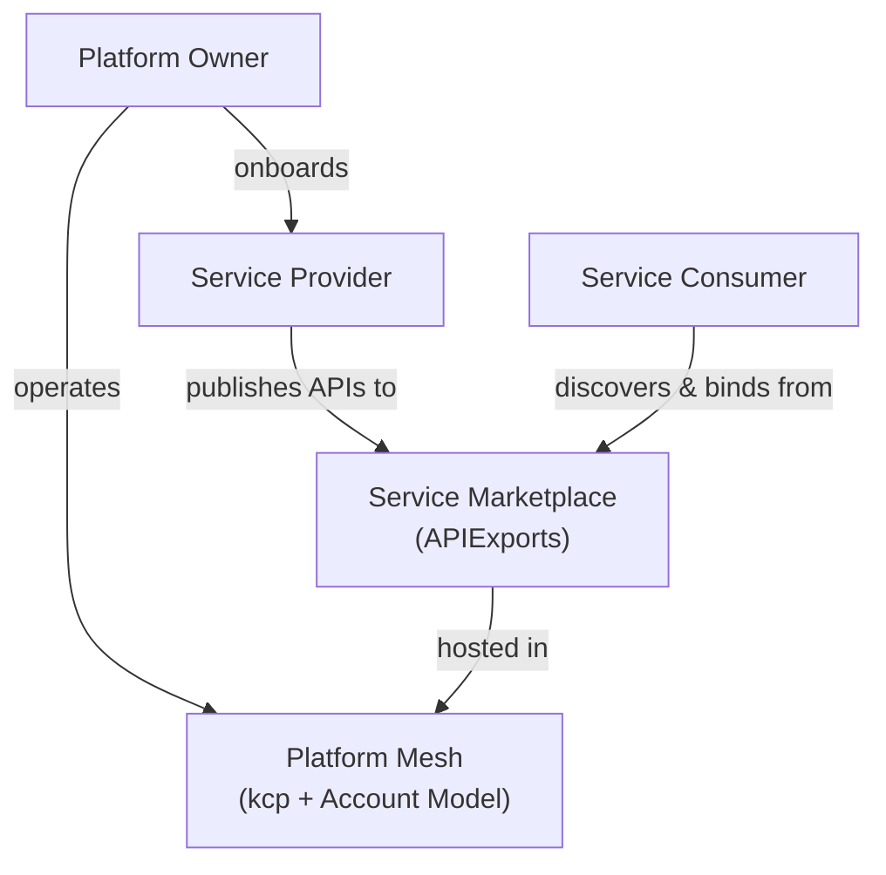

# Personas Overview

Platform Mesh recognizes three distinct personas that together form the ecosystem. Most platform discussions focus on two roles -- the platform team and the developers who use it. Platform Mesh introduces a third persona, the service provider, that is just as important. Each persona has a dedicated page with detailed workflows and guidance; this page introduces all three and shows how they relate.

## Platform Owner

The platform owner operates the Platform Mesh infrastructure itself -- kcp, identity (Keycloak), authorization (OpenFGA), and the service marketplace. They onboard service providers, manage the [account hierarchy](/overview/account-model), and define the organizational policies that govern the ecosystem. Think of them as the operator of the marketplace.

[Read more: Platform Owner →](/overview/platform-owner)

## Service Provider

Service providers build and operate services within the ecosystem. They define **what** can be ordered (the API schema) and **how** it gets fulfilled (the controller logic). Any team that runs a service -- databases, certificates, CI/CD pipelines, AI/ML infrastructure, or anything else -- can become a provider by exposing a KRM API for that service. Providers are first-class participants with their own workspaces, API definitions, and lifecycle management.

[Read more: Service Providers →](/overview/providers)

## Service Consumer

Developers, data scientists, and application owners who discover services through the marketplace, order capabilities by creating resource documents, and manage their lifecycle through KRM. Consumers interact with every provider through the same tools and patterns -- `kubectl`, GitOps, IaC, or the [Platform Mesh Portal](/overview/architecture#ui-layer) -- regardless of what the service is, who provides it, or where it runs.

[Read more: Service Consumers →](/overview/consumers)

## How Personas Interact

The platform owner sets up the infrastructure and onboards providers. Providers publish their service APIs as [APIExports](/overview/api-export-binding). Consumers discover these services and bind to them, creating a self-service ecosystem where the control plane mediates all interactions.

## What's Next

- [Platform Owner](/overview/platform-owner) -- deploying, governing, and operating the mesh
- [Service Providers](/overview/providers) -- how providers publish and fulfill services
- [Service Consumers](/overview/consumers) -- how consumers discover and use services
- [Integration Paths](/overview/integration-paths) -- technical options for bringing services into the mesh
- [Account Model](/overview/account-model) -- how organizational structure maps to workspaces
