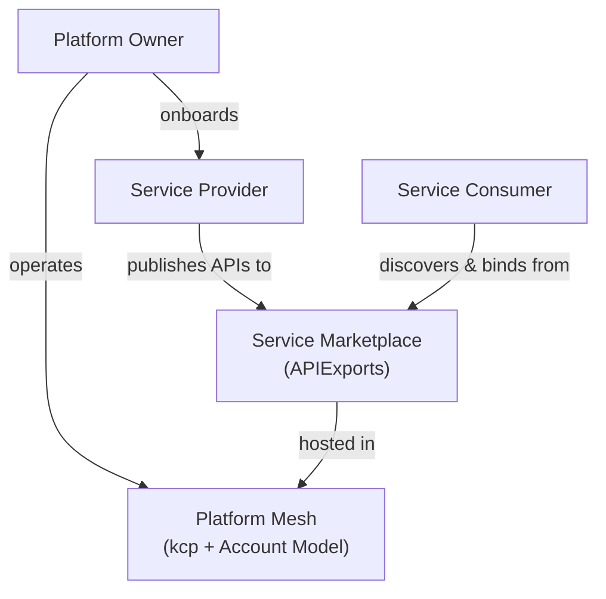

# Platform Personas

Platform Mesh recognizes three distinct personas that together form the ecosystem. Most platform discussions focus on two roles -- the platform team and the developers who use it. Platform Mesh introduces a third persona, the service provider, that is just as important.

## Platform Owner

The platform owner operates the Platform Mesh infrastructure: kcp, the [account model](/overview/account-model), identity (Keycloak), and authorization (OpenFGA). They connect service providers to the mesh, manage the marketplace of available services, and establish the organizational policies that govern who can provide and consume services. Think of them as the operator of the marketplace itself.

Platform owners are responsible for:

- Deploying and operating the core [control plane](/overview/control-planes) (kcp, sharding, high availability)
- Managing the [account hierarchy](/overview/account-model) (organizations, teams, environments)
- Configuring identity realms and authorization policies
- Onboarding service providers and granting them provider workspaces
- Defining platform-wide policies that flow through the workspace hierarchy

## Service Provider

Service providers are the teams that build and operate services within the ecosystem. They define **what** can be ordered (the API schema) and **how** it gets fulfilled (the controller logic). Any team that operates a service can become a provider by exposing a Kubernetes Resource Model (KRM) API for that service.

Examples include:

- **Database teams** managing PostgreSQL, MongoDB, or Redis offerings
- **AI/ML teams** providing model training, inference, and data pipeline services
- **PKI teams** offering certificate management and key rotation
- **CI/CD teams** running build pipelines and deployment automation
- **Infrastructure teams** providing Kubernetes clusters, VMs, or networking
- **Third-party vendors** integrating external SaaS products into the mesh

Platform Mesh treats all of these as first-class participants with their own workspaces, their own API definitions, and their own lifecycle management. Providers are not second-class citizens behind an internal platform team -- they are independent operators with full control over how their services are built, deployed, and evolved.

For details on how providers publish APIs, integrate with the mesh, and fulfill orders, see [Service Providers](/overview/providers).

## Service Consumer

Developers, data scientists, and application owners who discover services through the marketplace, order capabilities by creating resource documents, and manage their lifecycle through KRM. Consumers interact with every provider through the same tools and patterns: `kubectl`, GitOps, IaC, or the [Platform Mesh Portal](/overview/architecture#ui-layer).

The consumer experience is always the same regardless of the service: declare what you want, and the platform makes it so. Whether ordering a managed database, a Kubernetes cluster, or an AI inference endpoint, consumers write a resource document describing the desired state and the provider's controller reconciles it.

For details on the consumer workflow, interaction modes, and service discovery, see [Service Consumers](/overview/consumers).

## How Personas Interact

The platform owner sets up the infrastructure and onboards providers. Providers publish their service APIs as [APIExports](/overview/api-export-binding). Consumers discover these services and bind to them, creating a self-service ecosystem where the control plane mediates all interactions.

## What's Next

- [Service Providers](/overview/providers) -- how providers publish and fulfill services
- [Service Consumers](/overview/consumers) -- how consumers discover and use services
- [Integration Paths](/overview/integration-paths) -- technical options for bringing services into the mesh
- [Account Model](/overview/account-model) -- how organizational structure maps to workspaces
