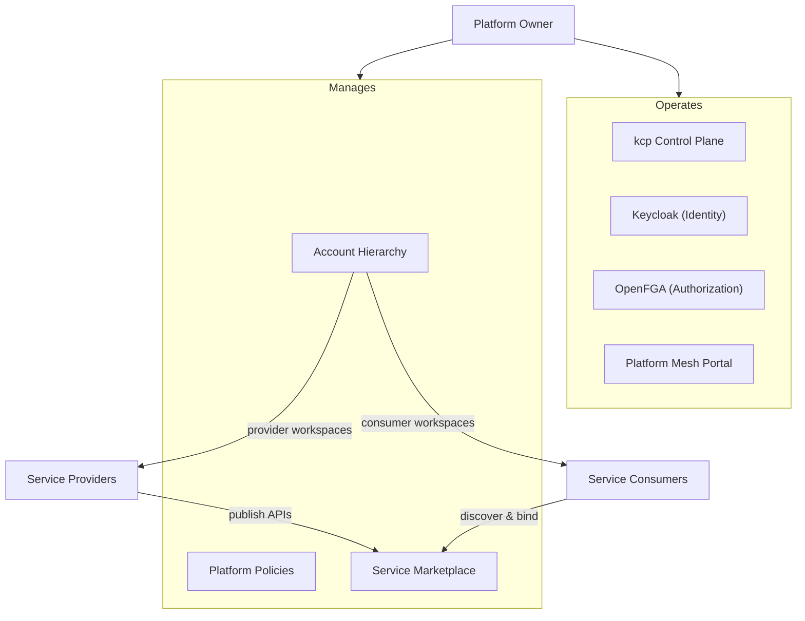

# Platform Owner

The platform owner operates the Platform Mesh infrastructure itself -- the control plane, identity and authorization systems, and the marketplace that providers and consumers depend on. While [service providers](/overview/providers) define what can be ordered and [service consumers](/overview/consumers) use those services, the platform owner is responsible for making the ecosystem work: deploying the core components, onboarding providers, structuring the organizational hierarchy, and defining the policies that govern the entire mesh.

## Deployment Topology

The platform owner deploys and operates the core Platform Mesh stack:

- **kcp** -- the central control plane, providing workspaces, APIExport/APIBinding, and the virtual workspace API. For production deployments, kcp supports horizontal scaling through sharding, where multiple shards share the load of hosting workspaces.
- **Keycloak** -- OIDC-based identity management. Each organization gets its own Keycloak realm, and organizations can federate their existing identity provider.
- **OpenFGA** -- relationship-based access control, connected to kcp via its authorizer chain. Each organization gets an isolated authorization store.
- **Platform Mesh Portal** -- the reference consumer-facing portal, built on OpenMFP and Luigi. The owner configures which micro-frontend modules are available and how the portal presents the service catalog.
- **GitOps and delivery** -- Flux for continuous delivery of platform components, OCM for component packaging and versioning.

The platform owner decides which components to deploy based on scale and requirements. A minimal setup might be a single kcp instance with Keycloak; a production deployment adds sharding, high availability, and the full portal stack.

## Account Hierarchy Management

The platform owner structures the [account model](/concepts/account-model) to mirror organizational boundaries. Each node in the hierarchy is a kcp workspace with its own API surface, identity realm, and authorization store.

Typical hierarchy patterns include:

- **Organizations** at the top level, each representing a tenant or business unit
- **Teams** or **projects** nested within organizations
- **Environments** (development, staging, production) as leaf workspaces

Policies defined at higher levels of the hierarchy propagate downward, so the platform owner can set organization-wide security baselines, resource quotas, or allowed API versions at the root and have them apply to all child workspaces automatically.

The platform owner also designates **provider workspaces** where service providers publish their APIExports, and **marketplace workspaces** where consumers discover available services.

## Provider Onboarding

Bringing a new service provider into the mesh is a platform owner responsibility. The workflow involves:

1. **Create a provider workspace** -- allocate a workspace where the provider will publish their APIExports and APIResourceSchemas.
2. **Grant credentials** -- provide the service provider with a kubeconfig for their workspace, scoped to the permissions they need (managing APIExports, APIResourceSchemas, and related resources).
3. **Scope permissions** -- define what the provider is allowed to export and which consumer workspaces can discover their services.
4. **Make services discoverable** -- configure the marketplace so that the provider's APIExports appear in the service catalog for eligible consumers.

Once onboarded, the provider follows their own [workflow](/overview/providers#provider-workflow) to publish APIs and fulfill orders. The platform owner monitors the health of the integration but does not need to be involved in day-to-day service operations.

## Policy and Governance

The platform owner defines platform-wide policies that establish the rules of the ecosystem:

- **Resource quotas** -- limits on how many workspaces, bindings, or resources a consumer or provider can create
- **API version policies** -- which API versions are allowed or deprecated across the platform
- **Security baselines** -- minimum authentication requirements, session policies, and access control defaults
- **Audit and compliance** -- logging and monitoring configurations that apply across the workspace hierarchy

These policies are expressed as Kubernetes resources in the hierarchy and propagate through the workspace tree. Child workspaces can tighten policies but cannot relax constraints set by their parent.

## Identity and Authorization

The platform owner configures the identity and authorization infrastructure that secures all interactions in the mesh.

**Identity (Keycloak):** Each organization gets its own Keycloak realm. The platform owner configures realm settings, enables identity federation (so organizations can bring their own identity provider), and manages the OIDC integration with kcp. Authentication decisions happen at the kcp front proxy, which validates OIDC tokens before requests reach any workspace.

**Authorization (OpenFGA):** Each organization gets an isolated OpenFGA store. The authorization schema updates dynamically as new APIBindings are activated -- when a consumer binds to a provider's service, the relationship tuples that govern access are created automatically. The platform owner defines the base authorization model and can customize how permissions propagate through the workspace hierarchy.

Together, these systems ensure that every API request in the mesh is authenticated and authorized before it reaches any workspace, provider, or consumer resource.

## What's Next

- [Personas Overview](/overview/personas) -- all three personas and how they interact
- [Account Model](/concepts/account-model) -- detailed look at the workspace hierarchy
- [Control Planes](/concepts/control-planes) -- how kcp workspaces provide isolation and multi-tenancy
- [Service Providers](/overview/providers) -- how providers publish and fulfill services
- [Service Consumers](/overview/consumers) -- how consumers discover and use services
