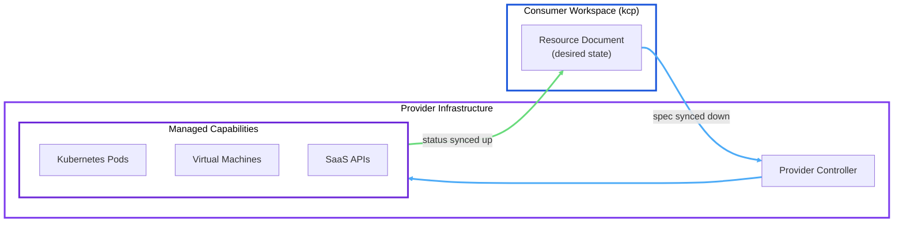
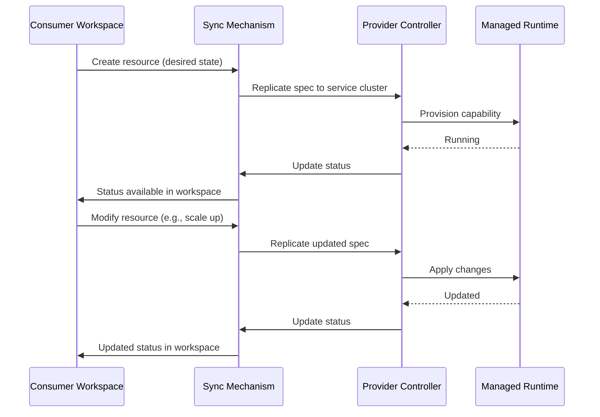

# Service Providers

The service provider is one of three [personas](/overview/personas). In Platform Mesh, a **Managed Service Provider (MSP)** is a service capable of managing the lifecycles of capabilities on demand through a standardized declarative API.
The provider model is what makes Platform Mesh more than just a control plane -- it creates an ecosystem where services can be discovered, ordered, and managed through a unified mechanism.
Any team that operates a service -- databases, certificates, CI/CD pipelines, AI/ML infrastructure, or anything else -- can become a provider by exposing a Kubernetes Resource Model (KRM) API for that service.

## The Provider Model

The provider model rests on a single architectural insight: **separate the lifecycle API from the managed capabilities**.

- The **lifecycle API** is how consumers order and configure a service. It is always a set of Kubernetes CRDs running on a control plane. The consumer writes a resource document describing the desired state ("give me a PostgreSQL database with 100 GB of storage"), and the provider's controller reconciles it.
- The **managed capabilities** are the actual service instances that the provider provisions. These can run anywhere -- Kubernetes clusters, virtual machines, web services, SaaS platforms, or any combination.

A provider defines **what** can be ordered (the API schema) and **how** it gets fulfilled (the controller logic). The consumer never needs to know where or how the capability is running. They interact with it through the same KRM interface regardless of the underlying implementation.

This separation means that the lifecycle API surface stays consistent even when the underlying implementation changes. A provider can migrate from self-hosted infrastructure to a managed cloud service without breaking the consumer's workflow.

## Provider Workflow

::: tip Choosing an integration path
There are three ways to bring a service into the Platform Mesh -- api-syncagent, multi-cluster-runtime, and kube-bind. See [Integration Paths](/overview/integration-paths) for a decision flowchart and detailed comparison.
:::

Regardless of the integration path, every provider follows the same high-level workflow.

### Step 1: Build Your Lifecycle API

Define your service's API as Kubernetes CRDs on your own cluster. Each CRD represents a type of capability that consumers can order. For example, a database provider might define a `Database` CRD with fields for engine type, storage size, region, and backup schedule.

### Step 2: Build or Deploy a Controller

Deploy a Kubernetes operator on your service cluster that watches for instances of your CRDs and reconciles them into real capabilities. This is standard Kubernetes controller development -- use Kubebuilder, Operator SDK, Crossplane Compositions, or any framework you prefer. The controller creates, updates, and deletes the underlying resources (pods, VMs, SaaS API calls) and writes status back to the CRD.

### Step 3: Choose an Integration Mechanism

Select the path that matches your situation using the [Integration Paths](/overview/integration-paths) decision flowchart. For most providers, this means deploying the api-syncagent via Helm chart on the service cluster and creating `PublishedResource` objects that declare which CRDs to expose.

### Step 4: Register in the Marketplace

Once your CRDs are published as an [APIExport](/concepts/api-export-binding), they become discoverable in the Platform Mesh. Consumers can browse available APIExports, review the API schema (which serves as the service contract), and bind to the ones they need. When a consumer creates an APIBinding, your controller starts seeing their resources through the APIExport's virtual workspace endpoint.

### Step 5: Fulfill Orders

From this point on, the flow is fully declarative and automated. When a consumer creates a resource document in their workspace, the sync mechanism replicates it to your service cluster. Your controller reconciles the desired state into a real capability. Status updates flow back to the consumer's workspace. Changes to the resource document (scale up storage, change region) are detected and applied. Deletion triggers decommissioning.

## Examples

Platform Mesh provides hands-on examples for both integration paths:

- **HttpBin provider (api-syncagent path)** -- A complete walkthrough of publishing a simple HTTP service as a Platform Mesh provider. Start with the [Provider Quick Start](/guides/provider-quick-start), then follow the [HttpBin Example](/guides/httpbin-example) for the full integration.

- **MongoDB provider (multi-cluster-runtime path)** -- Demonstrates building a custom syncer using the multi-cluster-runtime library to expose MongoDB as a Platform Mesh service with full control over sync logic. See the [MongoDB Example](/guides/mongodb-example).

## What's Next

- [Personas Overview](/overview/personas) -- all three personas and how they interact
- [Integration Paths](/overview/integration-paths) -- decision flowchart for choosing your integration mechanism
- [Service Consumers](/overview/consumers) -- understand the other side of the marketplace
- [APIExport and APIBinding](/concepts/api-export-binding) -- the cross-workspace sharing mechanism that powers the marketplace
- [Provider Quick Start](/guides/provider-quick-start) -- step-by-step guide to deploying your first service provider
