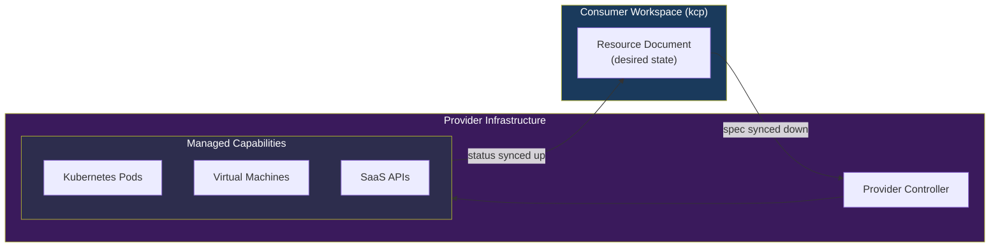
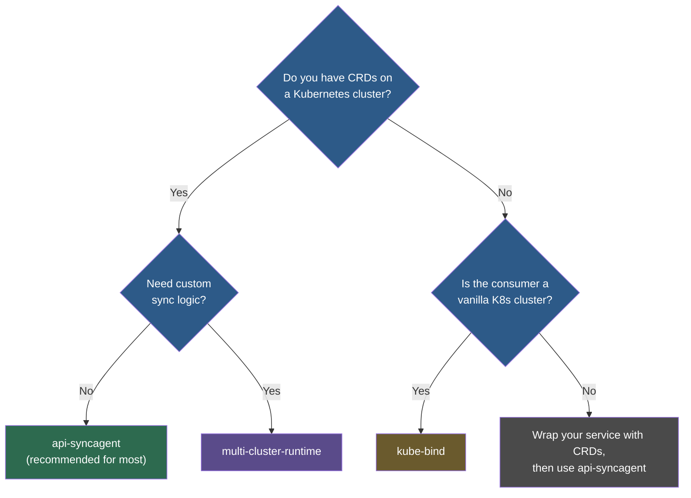
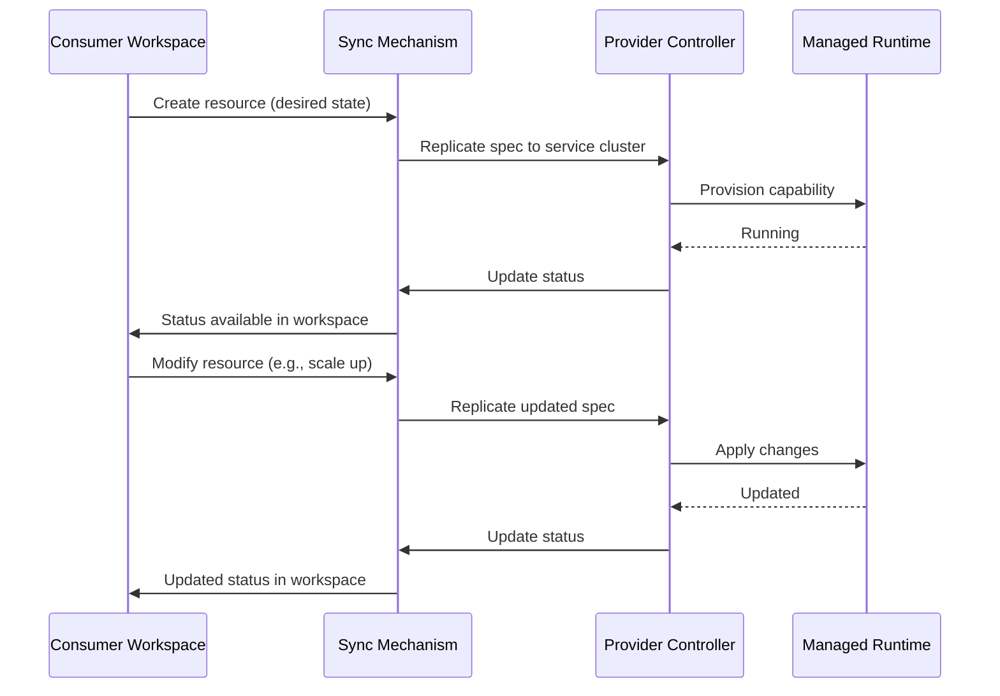

# Service Providers

In Platform Mesh, a **Managed Service Provider (MSP)** is a service capable of managing the lifecycles of capabilities on demand through a standardized declarative API.
The provider model is what makes Platform Mesh more than just a control plane -- it creates an ecosystem where services can be discovered, ordered, and managed through a unified mechanism.
Any team that operates a service -- databases, certificates, CI/CD pipelines, AI/ML infrastructure, or anything else -- can become a provider by exposing a Kubernetes Resource Model (KRM) API for that service.

## The Provider Model

The provider model rests on a single architectural insight: **separate the lifecycle API from the managed capabilities**.

- The **lifecycle API** is how consumers order and configure a service. It is always a set of Kubernetes CRDs running on a control plane. The consumer writes a resource document describing the desired state ("give me a PostgreSQL database with 100 GB of storage"), and the provider's controller reconciles it.
- The **managed capabilities** are the actual service instances that the provider provisions. These can run anywhere -- Kubernetes clusters, virtual machines, web services, SaaS platforms, or any combination.

A provider defines **what** can be ordered (the API schema) and **how** it gets fulfilled (the controller logic). The consumer never needs to know where or how the capability is running. They interact with it through the same KRM interface regardless of the underlying implementation.

This separation means that the lifecycle API surface stays consistent even when the underlying implementation changes. A provider can migrate from self-hosted infrastructure to a managed cloud service without breaking the consumer's workflow.

## Three Platform Personas

Most platform discussions focus on two roles: the platform team and the developers who use it. Platform Mesh recognizes a third persona that is just as important.

### Platform Owner

The platform owner holds the keys. They operate the Platform Mesh infrastructure (kcp, the account model, security), connect providers to the mesh, and establish the organizational policies that govern who can provide and consume services. Think of them as the operator of the marketplace itself.

### Service Provider

This is the persona that most platform thinking overlooks, yet it is the one that makes the ecosystem work. Service providers are the teams that actually build and operate services:

- **Database teams** managing PostgreSQL, MongoDB, or Redis offerings
- **AI/ML teams** providing model training, inference, and data pipeline services
- **PKI teams** offering certificate management and key rotation
- **CI/CD teams** running build pipelines and deployment automation
- **Infrastructure teams** providing Kubernetes clusters, VMs, or networking
- **Third-party vendors** integrating external SaaS products into the mesh

Platform Mesh treats all of these as first-class participants with their own workspaces, their own API definitions, and their own lifecycle management. Providers are not second-class citizens behind an internal platform team -- they are independent operators with full control over how their services are built, deployed, and evolved.

### Service Consumer

Developers, data scientists, and application owners who discover services through the marketplace, order capabilities by creating resource documents, and manage their lifecycle through KRM. Consumers interact with every provider through the same tools and patterns: `kubectl`, GitOps, IaC, or the [OpenMFP](https://openmfp.io) UI. For more on the consumer experience, see [Service Consumers](/overview/consumers).

## Integration Paths

There are three ways to bring a service into the Platform Mesh. The right choice depends on what you have today and how much control you need.

### Decision Flowchart

### Comparison

| Path | Tool | Use Case | Effort |
|------|------|----------|--------|
| 1 | [api-syncagent](/overview/api-syncagent) | Standard CRD-based services (Crossplane, cert-manager, any operator) | Low-medium |
| 2 | kube-bind | Direct Kubernetes-to-Kubernetes binding without kcp | Low |
| 3 | [multi-cluster-runtime](/overview/multi-cluster-runtime) | Custom or non-CRD APIs, complex sync logic, multi-step orchestration | High |

**Path 1: api-syncagent** is the primary integration mechanism and the right choice for most providers. If you already have a Kubernetes operator with CRDs, the api-syncagent publishes those CRDs as [APIExports](/overview/api-export-binding) in kcp with zero custom controller code. It handles bidirectional sync (spec flows down from kcp, status flows back up), related resource synchronization, and schema evolution automatically. See [api-syncagent](/overview/api-syncagent) for full details.

**Path 2: kube-bind** is the lightweight option for direct Kubernetes-to-Kubernetes service binding. It does not require kcp -- the provider and consumer connect their clusters directly through OIDC authentication and a sync agent called the konnector. This path works well when both sides are vanilla Kubernetes clusters and the provider wants a simple plug-and-play integration. The trade-off is less flexibility: kube-bind uses generic sync logic and does not support the full APIExport marketplace model.

**Path 3: multi-cluster-runtime** gives the provider full control. It is a Go library extending `controller-runtime` for writing controllers that reconcile across a dynamic fleet of clusters. Use it when your service exposes non-CRD APIs (aggregated or custom API servers), when you need custom transformation logic during sync, or when the controller must coordinate state across multiple clusters. The effort is significantly higher -- you are writing a custom syncer -- but the flexibility is unlimited. See [multi-cluster-runtime](/overview/multi-cluster-runtime) for architecture details.

## Provider Workflow

Regardless of the integration path, every provider follows the same high-level workflow.

### Step 1: Build Your Lifecycle API

Define your service's API as Kubernetes CRDs on your own cluster. Each CRD represents a type of capability that consumers can order. For example, a database provider might define a `Database` CRD with fields for engine type, storage size, region, and backup schedule.

### Step 2: Build or Deploy a Controller

Deploy a Kubernetes operator on your service cluster that watches for instances of your CRDs and reconciles them into real capabilities. This is standard Kubernetes controller development -- use Kubebuilder, Operator SDK, Crossplane Compositions, or any framework you prefer. The controller creates, updates, and deletes the underlying resources (pods, VMs, SaaS API calls) and writes status back to the CRD.

### Step 3: Choose an Integration Mechanism

Select the path that matches your situation using the decision flowchart above. For most providers, this means deploying the api-syncagent via Helm chart on the service cluster and creating `PublishedResource` objects that declare which CRDs to expose.

### Step 4: Register in the Marketplace

Once your CRDs are published as an [APIExport](/overview/api-export-binding), they become discoverable in the Platform Mesh. Consumers can browse available APIExports, review the API schema (which serves as the service contract), and bind to the ones they need. When a consumer creates an APIBinding, your controller starts seeing their resources through the APIExport's virtual workspace endpoint.

### Step 5: Fulfill Orders

From this point on, the flow is fully declarative and automated. When a consumer creates a resource document in their workspace, the sync mechanism replicates it to your service cluster. Your controller reconciles the desired state into a real capability. Status updates flow back to the consumer's workspace. Changes to the resource document (scale up storage, change region) are detected and applied. Deletion triggers decommissioning.

## Examples

Platform Mesh provides hands-on examples for both integration paths:

- **HttpBin provider (api-syncagent path)** -- A complete walkthrough of publishing a simple HTTP service as a Platform Mesh provider. Start with the [Provider Quick Start](/guides/provider-quick-start), then follow the [HttpBin Example](/guides/httpbin-example) for the full integration.

- **MongoDB provider (multi-cluster-runtime path)** -- Demonstrates building a custom syncer using the multi-cluster-runtime library to expose MongoDB as a Platform Mesh service with full control over sync logic. See the [MongoDB Example](/guides/mongodb-example).

## What's Next

- [Service Consumers](/overview/consumers) -- understand the other side of the marketplace: how consumers discover and use provider services
- [api-syncagent](/overview/api-syncagent) -- deep dive into the primary integration mechanism for CRD-based services
- [multi-cluster-runtime](/overview/multi-cluster-runtime) -- architecture and patterns for building custom syncers
- [APIExport and APIBinding](/overview/api-export-binding) -- the cross-workspace sharing mechanism that powers the marketplace
- [Provider Quick Start](/guides/provider-quick-start) -- step-by-step guide to deploying your first service provider
