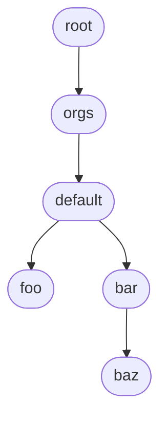

# Account operator

## Purpose

The account operator is the Platform Mesh component that converts defined account or organization entities into live control-plane structure. It owns reconciliation of the `Account`-Resource and ties its lifecycle to **kcp** workspace lifecycle. It ensures that each account gets the right isolation, workspace typing, and discoverable metadata.

Its role is to sit between the tenancy declared and how kcp exposes that tenancy without concerning itself with the implementation of identity or access management.

## Runtime model

The operator runs a
[`multicluster-runtime`](https://github.com/kubernetes-sigs/multicluster-runtime)
`mcmanager.Manager` wired to kcp’s **path-aware APIExport** provider
([`github.com/kcp-dev/multicluster-provider/path-aware`](https://github.com/kcp-dev/multicluster-provider)).
Each logical cluster that is visible through the bound API export `core.platform-mesh.io` is
addressed as a separate cluster.

## Workspace hierarchy

Shared **WorkspaceType** definitions used for Platform Mesh tenancy (including the parent `orgs` type and the per-account `org` / `account` types) are
created in the **`root:orgs`** workspace. **Workspace** objects for each `Account` are created in the respective Workspace they belong to.

### Example workspace tree

Workspace names usually match `Account` **`metadata.name`**. Logical paths (as in
`AccountInfo.spec.*.path`) chain with colons.



| Workspace | Typical contents | Example path |
| --- | --- | --- |
| **root** | kcp root shard; parent of the shared `orgs` workspace. | `root` |
| **orgs** | **WorkspaceType** definitions for Platform Mesh; **`Account`** for organization **`default`** (`spec.type: org`). | `root:orgs` |
| **default** | Organization workspace; **`Account`** **`foo`** and **`bar`** (`spec.type: account`); cluster-scoped **`AccountInfo`** **`account`**. | `root:orgs:default` |
| **foo** | Nested account workspace; **`AccountInfo`** **`account`**. | `root:orgs:default:foo` |
| **bar** | Nested account workspace; **`Account`** **`baz`** (`spec.type: account`); **`AccountInfo`** **`account`**. | `root:orgs:default:bar` |
| **baz** | Nested account workspace (child of **`bar`**); **`AccountInfo`** **`account`**. | `root:orgs:default:bar:baz` |

## Resources

### **Account (`core.platform-mesh.io/v1alpha1`)**

`Account` represents an entity in the workspace tree that can potentially hold other Accounts. `spec.type` currently only distinguishes an **organization** (type: `org`) from an **account** (type: `account`) but will possibly support other account types in the future. The spec carries display metadata, optional extensions, and structured `data`.

Reconciliation of an `Account` resource runs through the following steps:
1. Webhooks validate the `Account` and set `spec.creator` to the respective Kubernetes user creating the resource.
2. Depending on the account type, one or more finalizers are added for later cleanup.
3. For accounts of type `org`, `WorkspaceTypes` for the organization's `Workspace` itself and its child `Accounts` are created.
4. A `Workspace` for the `Account` is created, using one of the previously created `WorkspaceTypes`, depending on the account type.
5. An `AccountInfo` resource of name `account` is created within the `Account`'s `Workspace` and populated with information.
6. Readiness of the resource itself is blocked until the earlier created `Workspace` is ready, that is, potential initializers have finished. This ensures that the [security operator](/reference/components/security-operator.md) is finished with its work.

#### Example

A minimal organization account:

```yaml
apiVersion: core.platform-mesh.io/v1alpha1
kind: Account
metadata:
  name: default
spec:
  type: org
  displayName: default organization
```

#### Status conditions

`Account` exposes standard `metav1.Condition` entries in
`status.conditions`. The [subroutine
lifecycle](https://github.com/platform-mesh/subroutines) adds:

| Condition `type` | Meaning |
| --- | --- |
| `WorkspaceTypeSubroutine` | Workspace types under `root:orgs` are in place. |
| `WorkspaceSubroutine` | The `Workspace` for the account exists. |
| `ManageAccountInfoSubroutine` | The cluster-scoped `AccountInfo` named `account` in the account workspace is populated. |
| `WorkspaceReadySubroutine` | The account workspace has passed kcp readiness (initializers complete). |
| `Ready` | Aggregate: all enabled subroutines in the chain completed successfully. |

Common `reason` values include `Complete`, `Pending`, `Stopped`, `Skipped`,
`Error`, and `Unknown` (see the shared conditions package). Use `Ready == True`
as the high-level readiness signal; inspect per-subroutine conditions when
debugging.

### **AccountInfo (`core.platform-mesh.io/v1alpha1`)**
An `AccountInfo` resource with name `account` is created by the account operator in an account's workspace and holds information about the account the workspace belongs to. Its purpose is to expose that information to internal components that do not have information about or permission to workspaces/accounts higher up in the tree.

It is **cluster-scoped** in each **account workspace** logical cluster. Conventional
**`metadata.name`** is **`account`**. Do not hand-apply these in normal flows;
the **ManageAccountInfo** subroutine creates or updates them from each `Account`.

Reconciliation of an `AccountInfo` resource runs through the following steps:
1. A finalizer is added. There are no other actions happening until the resource is deleted. Other components like the [security operator](/reference/components/security-operator.md) are expected to add their own finalizers when depending on information of the resource, for example for `Workspace` termination.
2. During deletion, removal of the resource is blocked by withholding finalizer removal until the `Workspace`/`Account` does not have any child accounts anymore.

#### Example

Illustrative `spec` after the workspace exists and **initializers / security
operator** have populated OpenFGA and OIDC (placeholders stand in for real
cluster IDs and URLs):

```yaml
apiVersion: core.platform-mesh.io/v1alpha1
kind: AccountInfo
metadata:
  name: account
spec:
  account:
    name: default
    generatedClusterId: "0abcdefshard0001"
    originClusterId: "0abcdeforgsclstr"
    path: root:orgs:default
    url: https://kcp.example.com/clusters/root:orgs:default
    type: org
  organization:
    name: default
    generatedClusterId: "0abcdefshard0001"
    originClusterId: "0abcdeforgsclstr"
    path: root:orgs:default
    url: https://kcp.example.com/clusters/root:orgs:default
    type: org
  clusterInfo:
    ca: |
      -----BEGIN CERTIFICATE-----
      …
      -----END CERTIFICATE-----
  fga:
    store:
      id: "01JHXDCEXAMPLEOPENFGASTORE"
  oidc:
    issuerUrl: https://iam.example.com/realms/org-default
    clients:
      portal:
        clientId: d4e5f6a7-8b9c-0d1e-2f3a-4b5c6d7e8f9a
```

For a nested **`type: account`** workspace, **`spec.parentAccount`** mirrors the parent's **`spec.account`**, and **`spec.organization`** repeats the root org's **`AccountLocation`**; **`spec.fga`** / **`spec.oidc`** are copied from the parent **`AccountInfo`** during reconciliation.

#### Status conditions

`AccountInfo` is informational and currently does not expose any status.

Together, these pieces implement the account model described in [Account model](/concepts/account-model.md) and the resource-oriented view in [Account resource](/reference/resources/account-resource.md).

## RBAC and permissions

The **`account-operator`** Helm chart installs a **ClusterRole** bound to the
operator `ServiceAccount`. That role grants, on the management / parent
cluster:

- `accounts` and `accounts/status` in `core.platform-mesh.io` (full mutating
  verbs where listed in the chart)
- `leases` in `coordination.k8s.io` (leader election, if enabled)
- `namespaces` and `events` in the core API (get/list/watch and event
  recording)

## Metrics

The process exposes **controller-runtime** Prometheus metrics on
`--metrics-bind-address` (default `:9090`; see also `--metrics-secure` and
`--enable-http2`). That includes workqueue depth, reconcile latency, and
standard controller metrics.

## Installation / configuration notes

### Helm
The deployment chart is **`account-operator`** in [platform-mesh/helm-charts](https://github.com/platform-mesh/helm-charts), CRDs ship as **`account-operator-crds`**. The authoritative values table is located in [charts/account-operator README](https://github.com/platform-mesh/helm-charts/blob/main/charts/account-operator/README.md).

### CLI Flags
| Type | Flag | Default | Description |
| --- | --- | --- | --- |
| Account operator-specific | **`--webhooks-enabled`** | `false` | Enable the webhook server |
| Account operator-specific | **`--webhooks-cert-dir`** | `certs` | Webhook TLS certificate directory |
| Account operator-specific | **`--webhooks-port`** | `9443` | Webhook server listen port |
| Account operator-specific | **`--webhooks-deny-list`** | *(empty)* | Comma-separated denied organization names |
| Account operator-specific | **`--webhooks-additional-account-types`** | *(empty)* | Extra allowed `spec.type` values (`StringSlice`; repeat **`--flag=v`** per value) |
| Account operator-specific | **`--subroutines-workspace-type-enabled`** | `true` | WorkspaceType subroutine |
| Account operator-specific | **`--subroutines-workspace-enabled`** | `true` | Workspace subroutine |
| Account operator-specific | **`--subroutines-workspace-ready-enabled`** | `true` | Workspace ready subroutine |
| Account operator-specific | **`--subroutines-account-info-enabled`** | `true` | ManageAccountInfo subroutine |
| Account operator-specific | **`--controllers-account-info-enabled`** | `true` | AccountInfo controller (finalizer / deletion gate) |
| Account operator-specific | **`--kcp-api-export-endpoint-slice-name`** | `core.platform-mesh.io` | APIExportEndpointSlice name |
| Account operator-specific | **`--kcp-provider-workspace`** | `root` | Provider workspace |
| Common | **`--debug-label-value`** | *(empty)* | Debug label value for controller filters |
| Common | **`--max-concurrent-reconciles`** | `10` | Max concurrent reconciles per controller |
| Common | **`--environment`** | *(empty)* | Service environment label |
| Common | **`--region`** | `local` | Region label (for example local, staging, prod) |
| Common | **`--kubeconfig`** | *(empty)* | Kubeconfig file path |
| Common | **`--is-local`** | `false` | Mark execution as local |
| Common | **`--image-name`** | *(empty)* | Image name metadata |
| Common | **`--image-tag`** | *(empty)* | Image tag metadata |
| Common | **`--log-level`** | `info` | Log level |
| Common | **`--no-json`** | `false` | Disable JSON logs |
| Common | **`--shutdown-timeout`** | `1m` | Graceful shutdown timeout |
| Common | **`--metrics-bind-address`** | `:9090` | Metrics bind address |
| Common | **`--metrics-secure`** | `false` | Serve metrics over HTTPS |
| Common | **`--tracing-enabled`** | `false` | Enable OTLP tracing |
| Common | **`--tracing-config-service-name`** | *(empty)* | Trace resource service name |
| Common | **`--tracing-config-service-version`** | *(empty)* | Trace resource service version |
| Common | **`--tracing-config-collector-endpoint`** | *(empty)* | OTLP collector endpoint |
| Common | **`--enable-http2`** | `true` | HTTP/2 for metrics and webhook servers |
| Common | **`--health-probe-bind-address`** | `:8090` | Liveness/readiness bind address |
| Common | **`--leader-elect`** | `false` | Enable controller-manager leader election |

### Environment variables

| Variable | Description |
| --- | --- |
| **`KUBECONFIG`** | Kubeconfig to use |

## Repository

| Kind | Link |
| --- | --- |
| Source repository | [platform-mesh/account-operator](https://github.com/platform-mesh/account-operator) |
| Helm charts | [platform-mesh/helm-charts](https://github.com/platform-mesh/helm-charts) — `charts/account-operator`, `charts/account-operator-crds` |


## Related

- [Account model](/concepts/account-model.md)
- [Account resource](/reference/resources/account-resource.md)
- [Security operator](./security-operator.md)
- [Platform Mesh operator](./platform-mesh-operator.md)
