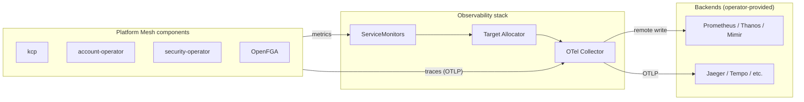

# Observability

The observability stack provides telemetry collection infrastructure for Platform Mesh. It uses OpenTelemetry to collect metrics and traces from Platform Mesh components and forward them to external backends.

::: warning
This component is in alpha. APIs, deployment wiring, and configuration may change on short notice, including breaking changes.
:::

## Purpose

The observability stack collects telemetry data from Platform Mesh components and makes it available for monitoring, alerting, and debugging. Platform Mesh provides the collection infrastructure – operators are responsible for providing the storage backends.

The stack handles:

- Scraping metrics from Platform Mesh components via ServiceMonitors
- Receiving traces from instrumented components via OTLP
- Aggregating telemetry through the OpenTelemetry Collector
- Forwarding metrics to an external backend via Prometheus remote write
- Forwarding traces to an external backend via OTLP

The stack does not provide:

- Long-term metrics or trace storage
- Alerting or alerting rules
- Dashboards or visualization

For local development and testing, a bundled Prometheus instance is included for metrics. This instance is not intended for production use.

## Runtime role

The observability stack deploys the following components:

| Component | Namespace | Role |
| --- | --- | --- |
| OpenTelemetry Operator | `observability` | Manages OpenTelemetry Collector instances and instrumentation |
| OpenTelemetry Collector | `observability` | Receives traces via OTLP and scrapes metrics via Target Allocator |
| Target Allocator | `observability` | Discovers scrape targets from ServiceMonitors and distributes them to collectors |
| Prometheus (optional) | `observability` | Development-only metrics backend with remote write receiver enabled |
| ServiceMonitors | `observability` | Define scrape targets for each Platform Mesh component |

The OpenTelemetry Collector operates in gateway mode. For metrics, it receives targets from the Target Allocator and forwards via Prometheus remote write. For traces, it receives spans via OTLP and forwards to configured trace backends.

## How it fits into Platform Mesh

Platform Mesh separates telemetry collection from storage:



| Component | Role |
| --- | --- |
| Platform Mesh components | Expose metrics endpoints and emit traces via OTLP |
| ServiceMonitors | Define which metrics endpoints to scrape and how |
| Target Allocator | Discovers targets from ServiceMonitors, distributes to collectors |
| OTel Collector | Collects metrics and traces, batches, and forwards to backends |
| Backends | Store telemetry for querying and alerting (operator responsibility) |

## Instrumented components

### Metrics

The observability stack includes ServiceMonitors for the following Platform Mesh components:

| Component | Endpoint | Authentication | Notes |
| --- | --- | --- | --- |
| kcp | `/clusters/root/metrics` (HTTPS) | Client certificate | Requires `kcp-metrics-client-cert` secret with certificates extracted from kubeconfig |
| account-operator | `/metrics` (HTTP) | None | Standard controller-runtime metrics |
| security-operator | `/metrics` (HTTP) | None | Standard controller-runtime metrics |
| OpenFGA | `/metrics` (HTTP) | None | OpenFGA server metrics |

Each ServiceMonitor can be individually enabled or disabled through Helm values.

### Traces

Platform Mesh components that support tracing emit spans via OTLP to the OpenTelemetry Collector. Tracing is configured per-component through their respective Helm values. See each component's reference page for tracing configuration options:

- [Platform Mesh operator](./platform-mesh-operator.md) – `tracing.enabled`, `tracing.collector.endpoint`
- [account-operator](./account-operator.md) – `--tracing-enabled`, `--tracing-config-collector-endpoint`
- [rebac-authz-webhook](./rebac-authz-webhook.md) – configured via `OTEL_*` environment variables

### kcp metrics authentication

Scraping kcp metrics requires client certificate authentication. The observability chart creates a `Kubeconfig` custom resource that generates certificates for the `system:monitoring` group. A Job extracts these certificates and creates a Secret in the `observability` namespace for the collector to use.

TLS verification is disabled between the collector and kcp because service discovery uses Pod IPs that do not match the certificate Common Name.

## Configuration

The observability stack is configured through the Platform Mesh profile and `PlatformMesh` resource values.

### Enabling observability

Observability is enabled through the profile's component configuration:

```yaml
# In the profile ConfigMap
components:
  services:
    observability:
      enabled: true
```

Or via `PlatformMesh` resource overrides:

```yaml
apiVersion: core.platform-mesh.io/v1alpha1
kind: PlatformMesh
metadata:
  name: platform-mesh
spec:
  values:
    observability:
      enabled: true
```

### ServiceMonitor configuration

Each instrumented component has a corresponding ServiceMonitor that can be configured:

| Value | Default | Description |
| --- | --- | --- |
| `serviceMonitors.accountOperator.enabled` | `true` | Enable account-operator metrics scraping |
| `serviceMonitors.securityOperator.enabled` | `true` | Enable security-operator metrics scraping |
| `serviceMonitors.openfga.enabled` | `true` | Enable OpenFGA metrics scraping |
| `serviceMonitors.kcp.enabled` | `true` | Enable kcp metrics scraping |

### Development Prometheus

For local development, a Prometheus instance is bundled:

| Value | Default | Description |
| --- | --- | --- |
| `prometheus.enabled` | `true` | Deploy the development Prometheus instance |
| `prometheus.persistentVolume.enabled` | `false` | Enable persistent storage (disabled for local dev) |

The development Prometheus has `web.enable-remote-write-receiver` enabled, allowing the OTel Collector to push metrics to it.

## Integrating with external infrastructure

For production deployments, configure the OTel Collector to forward telemetry to your existing backends.

### Metrics: Prometheus remote write

To forward metrics to an external Prometheus server:

```yaml
apiVersion: core.platform-mesh.io/v1alpha1
kind: PlatformMesh
metadata:
  name: platform-mesh
spec:
  values:
    observability:
      enabled: true
      prometheus:
        enabled: false  # Disable bundled Prometheus
      otel-collector:
        config:
          exporters:
            prometheusremotewrite:
              endpoint: "https://prometheus.example.com/api/v1/write"
              # Optional: configure authentication
              # headers:
              #   Authorization: "Bearer <token>"
              tls:
                insecure: false
                ca_file: /etc/ssl/certs/ca-certificates.crt
```

The collector batches metrics with a 10-second timeout before forwarding to reduce network overhead.

### Traces: OTLP export

To forward traces to an external trace backend (Jaeger, Tempo, or any OTLP-compatible system):

```yaml
apiVersion: core.platform-mesh.io/v1alpha1
kind: PlatformMesh
metadata:
  name: platform-mesh
spec:
  values:
    observability:
      enabled: true
      otel-collector:
        config:
          exporters:
            otlp:
              endpoint: "tempo.example.com:4317"
              tls:
                insecure: false
```

### Direct scraping

If your metrics backend supports direct Prometheus scraping, you can configure it to scrape the Platform Mesh component endpoints directly. The ServiceMonitors in the observability namespace document the available targets and their authentication requirements.

## Local development

The bundled Prometheus instance provides a quick way to explore Platform Mesh metrics during development. See [Access the observability stack](/how-to-guides/access-observability.md) for instructions on port-forwarding and accessing the Prometheus UI.

## Repository

- Platform Mesh configuration: [platform-mesh/helm-charts](https://github.com/platform-mesh/helm-charts/tree/main/charts/observability)

## Related

- [Observability concepts](/concepts/observability.md)
- [Access the observability stack](/how-to-guides/access-observability.md)
- [account-operator](./account-operator.md)
- [security-operator](./security-operator.md)
- [OpenFGA](./openfga.md)
