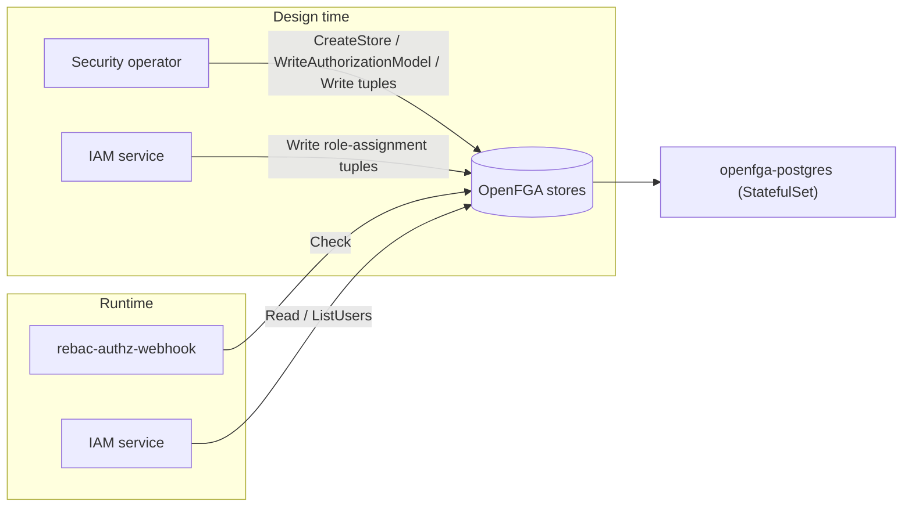

# OpenFGA

## Purpose

OpenFGA is the relationship-based authorization engine used by Platform Mesh. It stores the authorization models and relationship tuples that describe who owns, belongs to, or can operate on Platform Mesh organizations, accounts, namespaces, and API resources.

Platform Mesh uses OpenFGA as the durable policy graph behind [relationship-based authorization](/concepts/security/authorization.md). The [Security operator](./security-operator.md) and [IAM service](./iam-service.md) write authorization data into OpenFGA. The [rebac-authz-webhook](./rebac-authz-webhook.md) and IAM service read that data at request time.

::: warning
This component is in alpha. APIs, deployment wiring, and the Platform Mesh authorization model may change on short notice, including breaking changes.
:::

## Runtime role

At runtime OpenFGA exposes the following endpoints and dependencies:

| Runtime dependency | Default | Role |
| --- | --- | --- |
| gRPC API | Port `8081` | Used by in-cluster Platform Mesh clients such as the Security operator, IAM service, and `rebac-authz-webhook`. |
| HTTP API | Port `8080` | OpenFGA HTTP API endpoint. |
| Playground | Port `3000` | Browser UI for inspecting and querying OpenFGA. |
| Metrics | Port `2112` | OpenFGA metrics endpoint. |
| Datastore | Postgres | Durable storage for stores, authorization models, and relationship tuples. |
| Database migrations | `datastore.applyMigrations: true`, `datastore.migrationType: initContainer` | Runs OpenFGA schema migrations before the OpenFGA container starts. |
| Experimental APIs | `OPENFGA_EXPERIMENTALS=enable-list-users` | Enables `ListUsers`, which the IAM service uses for role-assignment views. |

OpenFGA does not own Platform Mesh CRDs. Platform Mesh represents OpenFGA state through `Store` and `AuthorizationModel` resources from the Security operator API, and the Security operator reconciles those resources into OpenFGA.

OpenFGA stores and evaluates authorization data. It does not create Platform Mesh stores, assemble authorization models, write system tuples, resolve kcp workspace context, or interpret Kubernetes authorization requests; those responsibilities stay with Platform Mesh components.

## How it fits into Platform Mesh

Platform Mesh keeps the OpenFGA service separate from the components that initialize, mutate, and consume authorization data:

| Component | Role |
| --- | --- |
| [Security operator](./security-operator.md) | Creates OpenFGA stores, writes authorization models, and manages initial and system-owned tuples. |
| [IAM service](./iam-service.md) | Reads role assignments and writes user-to-role tuples for IAM workflows. |
| [rebac-authz-webhook](./rebac-authz-webhook.md) | Converts kcp `SubjectAccessReview` requests into OpenFGA `Check` calls. |
| [Account operator](./account-operator.md) | Creates account metadata and propagates the organization's OpenFGA store ID through `AccountInfo`; it does not call OpenFGA directly. |
| [Platform Mesh operator](./platform-mesh-operator.md) | Installs the OpenFGA Helm release through the component chart; it does not call OpenFGA at runtime. |
| OpenFGA | Stores and evaluates the relationship graph. |

## Upstream concepts and dependencies

OpenFGA brings these upstream authorization concepts into Platform Mesh:

| Concept | Platform Mesh page | Role here |
| --- | --- | --- |
| [OpenFGA stores](https://openfga.dev/docs/concepts#what-is-a-store) | [Security operator](./security-operator.md) | Authorization boundaries for the shared `root:orgs` workspace and per-organization workspaces. |
| [Authorization models](https://openfga.dev/docs/concepts#what-is-an-authorization-model) | [Security operator](./security-operator.md) | Define the object types, relations, and permissions used by Platform Mesh authorization checks. |
| [Relationship tuples](https://openfga.dev/docs/concepts#what-is-a-relationship-tuple) | [Identity and authorization](/concepts/identity-and-authorization.md) | Store ownership, membership, role assignment, and resource relationships. |
| [`Check`](https://openfga.dev/docs/getting-started/perform-check) | [rebac-authz-webhook](./rebac-authz-webhook.md) | Runtime authorization operation used by the webhook for kcp requests. |
| [`ListUsers`](https://openfga.dev/docs/interacting/relationship-queries) | [IAM service](./iam-service.md) | IAM role-assignment views rely on this API, so Platform Mesh enables `OPENFGA_EXPERIMENTALS=enable-list-users`. |
| Postgres datastore | [Deployment and Platform Mesh wiring](#deployment-and-platform-mesh-wiring) | Durable storage for OpenFGA stores, authorization models, and tuples. |

## Stores and authorization model layout

Platform Mesh uses OpenFGA stores as authorization boundaries:

| Store | Purpose |
| --- | --- |
| `orgs` | Shared store for the `root:orgs` workspace. The authorization webhook uses this store when checking requests against the organizations workspace. |
| One store per organization | Holds the relationship graph for that organization's account workspaces and resources. Store names match organization names, and `Store.status.storeId` contains the OpenFGA store ID. |

Each store's authorization model is assembled by the Security operator from several inputs:

1. The core module configured in the `security-operator` Helm chart.
2. Kubernetes and kcp API discovery for core resources.
3. Privileged RBAC-derived model fragments for resources such as Kubernetes RBAC objects.
4. `AuthorizationModel` resources created for bound provider APIs.

The Security operator writes the merged model to OpenFGA using schema version `1.2` and records the resulting model ID in `Store.status.authorizationModelId`. See the [Security operator](./security-operator.md) reference for the `Store` and `AuthorizationModel` resource shapes.

For the `Store` CRD fields and lifecycle, see [IAM Store resource](/reference/resources/iamstore-resource.md).

## Data writers

### Security operator: stores and authorization models

The Security operator is the main owner of Platform Mesh authorization data in OpenFGA.

Its `Store` subroutine reconciles Platform Mesh `Store` custom resources to OpenFGA stores. If a `Store` resource has no `status.storeId`, the subroutine first searches OpenFGA by store name and then creates an OpenFGA store if none exists. When a Platform Mesh `Store` resource is deleted, its finalizer deletes the matching OpenFGA store after dependent `AuthorizationModel` resources are gone.

The `AuthorizationModel` subroutine turns the `Store` core module plus all related `AuthorizationModel` extensions into a single OpenFGA authorization model. For organization stores other than `orgs`, it also discovers Kubernetes and kcp API resources in the organization workspace and generates model fragments for them.

### Security operator: initial and system tuples

During organization workspace initialization, the Security operator creates the organization `Store` resource in `root:orgs` and seeds it with the initial owner/member tuples for the organization creator.

For account workspaces below an organization, the `AccountTuplesSubroutine` writes tuples that connect the account to its parent account and creator. During termination, it removes tuples that reference the account and account-specific roles.

The Security operator also writes tuples for other security workflows, including API export binding permissions from `APIExportPolicy` resources and invite-related access setup.

### IAM service: role assignments

The IAM service writes user role assignments into OpenFGA for IAM UI and GraphQL workflows. Assigning a role writes tuples such as `role:<resource-type>/<cluster>/<resource>/<role>#assignee -> user:<id>`. Removing a role deletes the corresponding tuple.

The IAM service looks up the correct organization store before applying these changes, so role assignment data lands in the organization-specific OpenFGA store.

### Non-writers

The Platform Mesh operator installs and configures OpenFGA through Helm, but it does not call the OpenFGA API at runtime.

The Account operator does not call OpenFGA directly. It creates and updates `AccountInfo` resources. For organization accounts, the OpenFGA store ID in `AccountInfo.spec.fga.store.id` is supplied by the external workspace initialization flow. For child accounts, the Account operator copies that ID from the parent `AccountInfo` so account metadata keeps pointing back to the organization's authorization store.

## Data consumers

### rebac-authz-webhook

The authorization webhook is the request-time consumer for kcp authorization. kcp sends it `SubjectAccessReview` requests, and the webhook calls OpenFGA `Check` against either the shared `orgs` store or the organization store for the target account workspace.

The webhook returns `allowed: true` when OpenFGA allows the request. When OpenFGA does not allow the request, or the webhook cannot complete the check, it returns no opinion. In Platform Mesh the webhook is last in the kcp authorizer chain, so no opinion is effectively a deny. See [rebac-authz-webhook](./rebac-authz-webhook.md) for the full request flow.

### IAM service

The IAM service uses OpenFGA to list users assigned to roles, check existing role assignments, and apply role changes. The OpenFGA `ListUsers` API is part of this flow, which is why the Platform Mesh OpenFGA deployment enables the `enable-list-users` experimental feature.

## Deployment and Platform Mesh wiring

OpenFGA is an upstream component, not a Platform Mesh-owned service repository. Platform Mesh consumes the upstream [openfga/openfga](https://github.com/openfga/openfga) Helm chart and image through OCM metadata in [platform-mesh/helm-charts](https://github.com/platform-mesh/helm-charts).

The `platform-mesh-operator-components` chart defines the OpenFGA service entry under `services.openfga`. Important defaults:

| Value | Default | Description |
| --- | --- | --- |
| `services.openfga.enabled` | `true` | Includes OpenFGA in a standard Platform Mesh installation. |
| `services.openfga.external` | `true` | Treats OpenFGA as an external component resolved through OCM metadata. |
| `services.openfga.helmRepo` | `true` | Renders a Flux `HelmRelease` that uses a `HelmRepository` source. |
| `services.openfga.suspend` | `true` | Starts suspended until image resources are resolved by the component flow. |
| `services.openfga.values.image.repository` | `openfga/openfga` | Upstream OpenFGA image repository. |
| `services.openfga.values.datastore.engine` | `postgres` | Uses Postgres as the OpenFGA datastore. |
| `services.openfga.values.datastore.applyMigrations` | `true` | Runs OpenFGA database migrations. |
| `services.openfga.values.datastore.migrationType` | `initContainer` | Runs migrations before the OpenFGA container starts. |
| `services.openfga.values.postgresql.enabled` | `true` | Deploys the bundled Postgres subchart. |

The same component chart wires other Platform Mesh services to OpenFGA:

| Consumer | Default OpenFGA address |
| --- | --- |
| Security operator | `openfga.platform-mesh-system.svc.cluster.local:8081` |
| rebac-authz-webhook | `openfga:8081` |
| IAM service | `openfga:8081` |
| Account operator FGA subroutine config | `openfga:8081` |

The Account operator value is present for account subroutine configuration, but current account-operator code does not call OpenFGA directly.

The `infra` chart declares the service accounts that may write OpenFGA data:

| Value | Default principal |
| --- | --- |
| `openfga.rbac.writePrincipals[0]` | `cluster.local/ns/platform-mesh-system/sa/iam-service` |
| `openfga.rbac.writePrincipals[1]` | `cluster.local/ns/platform-mesh-system/sa/security-operator` |
| `openfga.rbac.writePrincipals[2]` | `cluster.local/ns/platform-mesh-system/sa/account-operator` |

The Account operator principal is present in the infra defaults, but current account-operator code does not call OpenFGA directly.

## Configuration

The authoritative OpenFGA Helm values are the upstream chart values. Platform Mesh passes selected values through `services.openfga.values` in the `platform-mesh-operator-components` chart.

Important Platform Mesh defaults:

| Value | Default | Description |
| --- | --- | --- |
| `extraEnvVars[].OPENFGA_EXPERIMENTALS` | `enable-list-users` | Enables `ListUsers` for IAM service role views. |
| `log.level` | `info` | OpenFGA log level. |
| `replicaCount` | `1` | Single replica by default. |
| `autoscaling.enabled` | `false` | Horizontal autoscaling disabled by default. |
| `checkQueryCache.enabled` | `true` | Enables OpenFGA check query caching. |
| `checkQueryCache.limit` | `10000` | Cache entry limit. |
| `checkQueryCache.ttl` | `10s` | Cache TTL. |
| `telemetry.trace.enabled` | `false` | OpenFGA trace export disabled by default. |
| `telemetry.trace.otlp.endpoint` | `observability-opentelemetry-collector.observability.svc.cluster.local:4317` | Default OTLP endpoint when tracing is enabled. |

OpenFGA clients are configured in their own component charts:

| Component | Configuration |
| --- | --- |
| Security operator | `fga.target`, plus `--fga-*` flags for store ID cache TTL and tuple relation names. |
| rebac-authz-webhook | `openfga.url`, passed to `--openfga-addr`. |
| IAM service | `openfga-grpc-addr` and `openfga-store-cache-ttl`. |

## Local setup

OpenFGA ships with the standard Platform Mesh local setup. For local access to the OpenFGA playground, see [Access the OpenFGA playground](/how-to-guides/access-openfga.md).

## Repository

- Upstream: [openfga/openfga](https://github.com/openfga/openfga)
- Platform Mesh configuration: [platform-mesh/helm-charts](https://github.com/platform-mesh/helm-charts)

## Related

- [Identity and authorization](/concepts/identity-and-authorization.md)
- [Access OpenFGA](/how-to-guides/access-openfga.md)
- [Security operator](./security-operator.md)
- [rebac-authz-webhook](./rebac-authz-webhook.md)
- [Observability](./observability.md)
