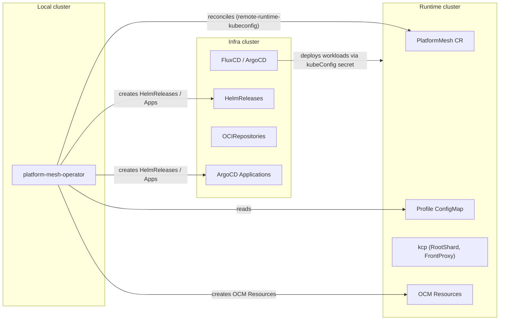
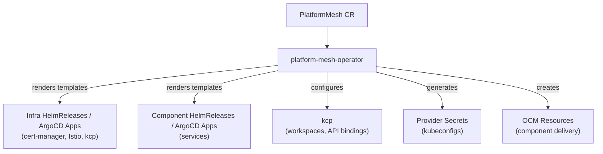

# Platform Mesh operator

## Purpose

The Platform Mesh operator bootstraps and maintains a Platform Mesh environment.
It reconciles a single custom resource — `PlatformMesh` — and drives all infrastructure provisioning through an ordered pipeline of subroutines.

::: warning
This component is in alpha. APIs may change on short notice, including breaking changes.
:::

## Runtime role

Given a `PlatformMesh` resource the operator:

1. Deploys infrastructure and application components via FluxCD HelmReleases (or ArgoCD Applications) and OCM Resources.
2. Configures kcp workspaces, provider connections, and API bindings.
3. Generates scoped kubeconfig secrets for cross-cluster communication.
4. Applies feature toggles (UI content configurations, authentication behavior).
5. Waits for dependent resources to become ready before marking reconciliation complete.

## Custom resource

```yaml
apiVersion: core.platform-mesh.io/v1alpha1
kind: PlatformMesh
metadata:
  name: platform-mesh-sample
  namespace: platform-mesh-system
spec:
  exposure:
    baseDomain: example.com
    port: 443
    protocol: https
  ocm:
    repo:
      name: platform-mesh
    component:
      name: platform-mesh
    referencePath:
    - name: "core"
  kcp:
    providerConnections:
    - endpointSliceName: core.platform-mesh.io
      path: root:platform-mesh-system
      secret: platform-mesh-operator-kubeconfig
    extraWorkspaces:
    - path: "root:orgs:my-workspace"
      type:
        name: "universal"
        path: "root"
    extraProviderConnections:
    - path: "root:orgs:my-workspace"
      secret: "my-workspace-kubeconfig"
  values:
    service1:
      enabled: true
      targetNamespace: default
  featureToggles:
  - name: "feature-enable-getting-started"
```

### Spec fields

| Field | Description |
|-------|-------------|
| `exposure` | External exposure settings: `baseDomain`, `port`, `protocol` |
| `kcp` | kcp workspace topology: provider connections, extra workspaces, API bindings |
| `values` | Free-form JSON deep-merged with the profile's `components` section and passed as Helm values to each service |
| `infraValues` | Free-form JSON merged with the profile's `infra` section |
| `ocm` | OCM repository, component name, and reference path for component delivery |
| `profileConfigMap` | Optional reference to profile ConfigMap (name/namespace). Defaults to `<instance-name>-profile` in the instance namespace |
| `featureToggles` | List of named feature flags (see [Feature toggles](#feature-toggles)) |
| `wait` | Custom readiness criteria for dependent resources |

### Status conditions

The operator reports per-subroutine conditions on the status subresource:

| Condition type | Meaning |
|----------------|---------|
| `KcpsetupSubroutine` | kcp workspace and API binding setup |
| `ProvidersecretSubroutine` | Provider kubeconfig secret generation |
| `DeploymentSubroutine` | Infrastructure and component deployment |
| `WaitSubroutine` | Readiness of downstream resources |
| `Ready` | Overall readiness (all subroutines succeeded) |

## Controllers

The operator runs two independent controllers:

| Controller | Watches | Purpose |
|------------|---------|---------|
| `PlatformMeshReconciler` | `PlatformMesh` (`core.platform-mesh.io/v1alpha1`) | Bootstraps and maintains the environment via subroutines |
| `ResourceReconciler` | `Resource` (`delivery.ocm.software/v1alpha1`) | Syncs OCM-resolved artifacts into FluxCD sources / ArgoCD Applications |

## PlatformMesh subroutines

The `PlatformMeshReconciler` processes the `PlatformMesh` resource through an ordered pipeline of subroutines.
Each can be individually enabled or disabled via operator flags.

### Deployment

Deploys platform-mesh infrastructure and application components using Go templates:

- Reads the profile ConfigMap and renders Go templates from `gotemplates/infra/` and `gotemplates/components/`.
- Creates OCM Resources, HelmReleases (FluxCD) or Applications (ArgoCD) for each enabled service.
- The profile's `components.services.<name>.values` (broad config) are deep-merged with `PlatformMesh.spec.values` (overrides), processed through Go template variable substitution, and passed 1-to-1 as `spec.values` to each service's HelmRelease or as `helm.values` to each ArgoCD Application.
- Manages the authorization webhook secret (issuer, certificate, kcp webhook, CA bundle).
- Waits for cert-manager to be ready before deploying component services.
- Waits for the Istio control plane (`istio-istiod` if Istio is enabled).
- Waits for kcp infrastructure (`RootShard`, `FrontProxy`).

Template variables available include `baseDomain`, `baseDomainPort`, `port`, `protocol`, `iamWebhookCA`, `helmReleaseNamespace`, `kubeConfigEnabled`, and `deploymentTechnology`.

### KcpSetup

Initializes the kcp workspace hierarchy:

- Creates workspaces for all paths referenced in `providerConnections`.
- Provisions all necessery kcp resources from the in the `/manifests/kcp` folder using go templates.
- Creates extra workspaces declared in `spec.kcp.extraWorkspaces`.
- Configures default API bindings from `spec.kcp.extraDefaultAPIBindings`.

### ProviderSecret

Generates kubeconfig secrets for provider connections:

- Creates one Kubernetes Secret per entry in `providerConnections` and `extraProviderConnections`.
- Supports two authentication modes:
  - **Scoped** (default) — writes a kubeconfig with a ServiceAccount token and RBAC derived from the APIExport.
  - **AdminAuth** — writes cluster-admin certificate material.
- Updates secrets when the connection configuration changes.

### FeatureToggles

Applies optional feature-flag manifests during reconciliation (disabled by default).

### Wait

Blocks reconciliation until downstream resources satisfy readiness criteria:

- By default waits for the `platform-mesh-operator-infra-components` HelmRelease to report `Ready=True`.
- Custom criteria can be defined in `spec.wait.resourceTypes`:

```yaml
spec:
  wait:
    resourceTypes:
    - group: helm.toolkit.fluxcd.io
      version: v2
      kind: HelmRelease
      namespace: default
      conditionStatus: "True"
      conditionType: "Ready"
```

### Defaults

Fills in default values for `ocm.repo.name` and `ocm.component.name` when not explicitly set.

## ResourceReconciler

A separate controller that watches OCM `Resource` objects (`delivery.ocm.software/v1alpha1`).
When an OCM Resource's status is updated with resolved artifact information, this controller syncs those references into the corresponding FluxCD or ArgoCD objects so that the deployment technology can fetch and deploy them.

The deployment technology is determined from the profile ConfigMap (`deploymentTechnology: fluxcd` or `argocd`).

**FluxCD mode** — behavior is driven by `repo` and `artifact` annotations (or labels) on the Resource object:

| `repo` | `artifact` | Action |
|--------|-----------|--------|
| `oci` | `chart` | Creates/updates a FluxCD `OCIRepository` with the resolved image reference and version tag |
| `git` | `chart` | Creates/updates a FluxCD `GitRepository` with the resolved commit and repo URL |
| `helm` | `chart` | Creates/updates a FluxCD `HelmRepository` and patches the `HelmRelease` chart version |
| `oci` or `helm` | `image` | Patches an existing `HelmRelease` values path with the resolved image tag |

**ArgoCD mode** — updates ArgoCD Application objects:

| `artifact` | Action |
|-----------|--------|
| `chart` | Updates `spec.source.repoURL` and `spec.source.targetRevision` on the ArgoCD Application |
| `image` | Updates the image tag within `spec.source.helm.values` on the ArgoCD Application |

Additional annotations:

| Annotation | Purpose |
|------------|---------|
| `for` | Override the target HelmRelease name (format: `namespace/name` or `name`) |
| `path` | Dot-separated path within `spec.values` to set the image tag (default: `image.tag`) |
| `version-path` | Dot-separated path within Resource status to read the version (default: `status.resource.version`) |
| `unsuspend` | When `"true"`, sets `spec.suspend: false` on the target HelmRelease after updating |

## Feature toggles

| Name | Description |
|------|-------------|
| `feature-enable-getting-started` | Applies ContentConfiguration for the Getting Started UI page |
| `feature-accounts-in-accounts` | Applies ContentConfiguration for accounts within the account context |
| `feature-enable-account-iam-ui` | Applies ContentConfiguration for the IAM UI Members section |
| `feature-disable-email-verification` | Disables email verification in WorkspaceAuthenticationConfiguration |
| `feature-disable-contentconfigurations` | Disables loading of all ContentConfiguration manifests |

## Configuration

### Operator flags

| Flag | Default | Description |
|------|---------|-------------|
| `--workspace-dir` | `/operator/` | Directory containing operator manifests and templates |
| `--kcp-url` | _(auto-detected)_ | kcp API server URL |
| `--kcp-namespace` | `platform-mesh-system` | Namespace where kcp components run |
| `--kcp-front-proxy-name` | `frontproxy` | Name of the kcp front-proxy service |
| `--kcp-front-proxy-port` | `8443` | Port of the kcp front-proxy |
| `--kcp-root-shard-name` | `root` | Name of the kcp root shard |
| `--kcp-cluster-admin-secret-name` | `kcp-cluster-admin-client-cert` | Secret with cluster-admin credentials |
| `--subroutines-deployment-enabled` | `true` | Enable the Deployment subroutine |
| `--subroutines-deployment-enable-istio` | `true` | Enable Istio integration in Deployment |
| `--subroutines-kcp-setup-enabled` | `true` | Enable the KcpSetup subroutine |
| `--subroutines-provider-secret-enabled` | `true` | Enable the ProviderSecret subroutine |
| `--subroutines-feature-toggles-enabled` | `false` | Enable the FeatureToggles subroutine |
| `--subroutines-wait-enabled` | `true` | Enable the Wait subroutine |
| `--remote-runtime-kubeconfig` | _(none)_ | Kubeconfig for the remote runtime cluster |
| `--remote-runtime-infra-secret-name` | _(none)_ | Secret name for FluxCD to reach the runtime cluster |
| `--remote-runtime-infra-secret-key` | _(none)_ | Secret key for FluxCD to reach the runtime cluster |
| `--remote-infra-kubeconfig` | _(none)_ | Kubeconfig for a remote infra cluster (only needed if Local != Infra) |

### Profile ConfigMap

The operator reads its deployment blueprint from a profile ConfigMap linked to the PlatformMesh resource by naming convention: a PlatformMesh instance named `foo` expects a ConfigMap `foo-profile` in the same namespace (overridable via `spec.profileConfigMap`).

The ConfigMap must contain a `profile.yaml` key with two sections:

- **`infra`** — infrastructure components (cert-manager, traefik, etcd-druid, gateway-api) with enabled state, Helm values, intervals
- **`components`** — application services with enabled state, chart source, Helm values, dependsOn, syncWave, imageResources

The profile itself is rendered as a Go template with variables derived from `spec.exposure` (for example, <code v-pre>{{ .baseDomain }}</code>).

### Configuration and values flow

```
Profile ConfigMap (components.services.<name>.values)   ← broad/general config
        │
        ▼  deep-merge (spec.Values takes precedence)
PlatformMesh CR (spec.values.services.<name>.values)    ← per-instance overrides
        │
        ▼  Go template rendering + variable substitution
Go Templates → HelmRelease spec.values / ArgoCD Application helm.values (1-to-1 per service)
```

The profile provides general configuration for all services. The PlatformMesh CR's `spec.values` provides per-instance customization — it is deep-merged on top of the profile. After merging, Go template expressions are resolved and the resulting values are set directly as each service's HelmRelease `spec.values` or ArgoCD Application `spec.source.helm.values`.

### Deployment technologies

The operator supports two deployment technologies, configured per-section in the profile:

- **FluxCD** (`deploymentTechnology: fluxcd`) — creates HelmRelease and OCM Resource objects
- **ArgoCD** (`deploymentTechnology: argocd`) — creates ArgoCD Application objects with sync-wave ordering

### Remote deployment

Remote deployment is used when the **Runtime** cluster (KCP, OCM) and the **Infra** cluster (FluxCD/ArgoCD) are different clusters.



| Cluster | Role |
|---------|------|
| **Local** | Where the operator pod runs |
| **Runtime** | KCP, OCM Resources, PlatformMesh CR, profile ConfigMap |
| **Infra** | FluxCD HelmReleases / ArgoCD Applications, OCIRepositories, HelmRepositories |

When using remote deployment:
- The PlatformMesh resource and profile ConfigMap must be created on the **runtime** cluster — the operator reconciles them remotely.
- `--remote-runtime-kubeconfig` points the operator's manager to the runtime cluster.
- `--remote-infra-kubeconfig` is only needed if the operator does not run on the infra cluster (**Local** != **Infra**).
- HelmReleases gain `spec.kubeConfig.secretRef` pointing to the runtime cluster secret.
- ArgoCD Applications use `destination.server` to point to the remote runtime cluster.

**Known limitation:** the operator currently supports only a single remote deployment per operator instance.

### Environment variables

| Variable | Description |
|----------|-------------|
| `KUBECONFIG` | Kubeconfig for the cluster hosting the `PlatformMesh` resource |

When unset the operator uses in-cluster credentials.

## Installation

The operator is distributed as a Helm chart from the Platform Mesh OCI registry.

### Quick install

```bash
helm install platform-mesh-operator \
  oci://ghcr.io/platform-mesh/helm-charts/platform-mesh-operator \
  --namespace platform-mesh-system --create-namespace
```

### Chart details

| | |
|-|-|
| **Chart** | `oci://ghcr.io/platform-mesh/helm-charts/platform-mesh-operator` |
| **Type** | application |
| **Source** | [platform-mesh/helm-charts](https://github.com/platform-mesh/helm-charts/tree/main/charts/platform-mesh-operator) |

Dependencies bundled with the chart:

| Dependency | Purpose |
|------------|---------|
| `common` | Shared Helm template snippets |
| `platform-mesh-operator-crds` | CRD definitions (can be disabled via `crds.enabled`) |

### Helm values

| Key | Type | Default | Description |
|-----|------|---------|-------------|
| `crds.enabled` | bool | `true` | Install the PlatformMesh CRD via sub-chart |
| `deployment.replicas` | int | `1` | Number of operator pod replicas |
| `image.name` | string | `ghcr.io/platform-mesh/platform-mesh-operator` | Container image |
| `log.level` | string | `"debug"` | Log verbosity level |
| `operator.leaderElect` | bool | `true` | Enable leader election for HA |
| `extraArgs` | list | `["--subroutines-feature-toggles-enabled=true"]` | Additional CLI flags passed to the operator binary |
| `idp.registrationAllowed` | bool | `false` | Allow IDP self-registration |
| `istio.enabled` | bool | `false` | Enable Istio sidecar injection for the operator pod |
| `tracing.enabled` | bool | `false` | Enable OpenTelemetry tracing |
| `tracing.collector.endpoint` | string | `observability-opentelemetry-collector.observability.svc.cluster.local:4317` | OTLP collector endpoint |
| `remoteInfra.enabled` | bool | `false` | Enables reconciliation of PlatformMesh resources on remote clusters |
| `remoteInfra.secretName` | string | `"platform-mesh-kubeconfig"` | Secret containing kubeconfig for remote PlatformMesh resource access |
| `remoteInfra.secretKey` | string | `"kubeconfig"` | Key within the remote-infra secret |
| `remoteRuntime.enabled` | bool | `false` | Deploy infrastructure artefacts to a remote cluster |
| `remoteRuntime.secretName` | string | `"platform-mesh-secret"` | Secret containing kubeconfig for the remote runtime cluster |
| `remoteRuntime.secretKey` | string | `"kubeconfig"` | Key within the remote-runtime secret |
| `remoteRuntime.infra.secretName` | string | `"platform-mesh-secret"` | Secret containing kubeconfig for the runtime infra cluster |
| `remoteRuntime.infra.secretKey` | string | `"kubeconfig"` | Key within the infra secret |

### Value override mechanism

The chart uses the `common` library's `common.getKeyValue` lookup function. Values resolve in this priority order:

1. `<key>Override` in chart values (highest priority)
2. `global.<key>` in chart or parent chart values
3. `<key>` in chart values
4. `common.defaults.<key>` from the common library (lowest priority)

This allows umbrella charts to set shared defaults via `global.*` while individual charts can still override locally.

## Integration



- **kcp** — the operator creates the workspace hierarchy and provider connections that form the [control plane](/concepts/control-planes) topology.
- **OCM (Open Component Model)** — delivers versioned component descriptors. The operator creates OCM Resource objects, and the ResourceReconciler syncs resolved artifacts into FluxCD/ArgoCD.
- **FluxCD** — the operator creates `HelmRelease` and source resources (OCIRepository, HelmRepository, GitRepository) managed by the Flux controllers.
- **ArgoCD** — alternatively, the operator creates `Application` objects managed by the ArgoCD controller, with sync-wave ordering and automated sync policies.
- **Istio** — deployed as infrastructure; the operator ensures its sidecar is present before communicating with kcp.

## Repository

- [platform-mesh/platform-mesh-operator](https://github.com/platform-mesh/platform-mesh-operator)

## Related

- [Set up remote deployment](/how-to-guides/set-up-remote-deployment.md)
- [Control planes and workspaces](/concepts/control-planes)
- [Account model](/concepts/account-model)
- [Architecture](/concepts/architecture)
