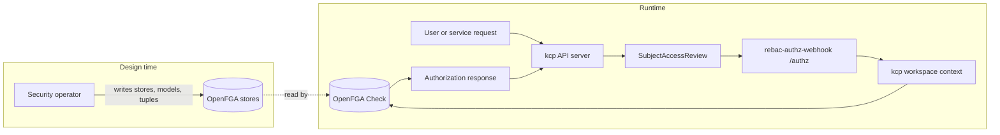
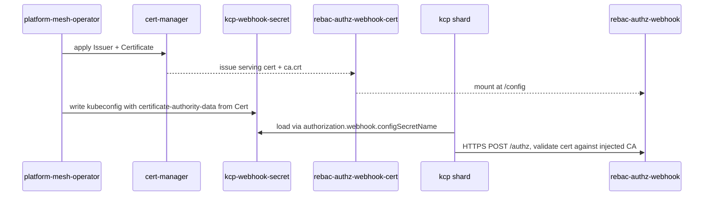

# rebac-authz-webhook

## Purpose

`rebac-authz-webhook` connects kcp authorization requests to the relationship-based authorization data Platform Mesh keeps in OpenFGA. It is installed as a Kubernetes authorization webhook and answers `SubjectAccessReview` requests for kcp logical clusters.

It is the runtime bridge between the Kubernetes authorization path and the Platform Mesh permission model. Users and service accounts still authenticate through kcp and the identity stack; the webhook contributes authorization decisions based on the OpenFGA stores and tuples maintained by the [Security operator](./security-operator.md).

::: warning
This component is in alpha. APIs, request handling, and deployment wiring may change on short notice, including breaking changes.
:::

## Runtime role

At runtime kcp calls this webhook from its authorization chain. The process runs the `serve` command, builds a kcp-aware multicluster manager, and serves an HTTPS endpoint at `/authz`.

The webhook:

1. Receives Kubernetes `SubjectAccessReview` requests from kcp.
2. Identifies the target logical cluster from the request attributes.
3. Looks up workspace and organization context through kcp.
4. Evaluates permissions against the relevant OpenFGA store.
5. Returns an authorization response to kcp.

The webhook does not create workspaces, users, realms, OpenFGA stores, or authorization models. Those resources are prepared by other Platform Mesh components, especially the [Account operator](./account-operator.md) and [Security operator](./security-operator.md).

`rebac-authz-webhook` does not own any CRDs. At runtime it reads `LogicalCluster` (`core.kcp.io`) and `Store` (`core.platform-mesh.io`) resources from kcp, and discovers virtual workspace URLs through `APIExportEndpointSlice`.

## How it fits into Platform Mesh

Platform Mesh separates the responsibilities for identity, tenancy, policy storage, and request-time authorization:

| Component | Role |
| --- | --- |
| [Account operator](./account-operator.md) | Creates the account workspace structure in kcp. |
| [Security operator](./security-operator.md) | Creates OpenFGA stores, authorization models, tuples, and identity configuration. |
| [OpenFGA](./openfga.md) | Stores and evaluates relationship-based authorization data. |
| kcp | Receives Kubernetes API requests and calls the authorization webhook. |
| `rebac-authz-webhook` | Translates kcp authorization reviews into OpenFGA checks. |

## Upstream concepts and dependencies

`rebac-authz-webhook` depends on these Kubernetes and kcp concepts:

| Concept | Platform Mesh page | Role here |
| --- | --- | --- |
| [Kubernetes webhook authorization](https://kubernetes.io/docs/reference/access-authn-authz/webhook/) | None | The HTTPS webhook protocol used by kcp to call `/authz`. |
| [`SubjectAccessReview`](https://kubernetes.io/docs/reference/access-authn-authz/authorization/#checking-api-access) | None | Request and response object sent between kcp and the webhook. |
| [Kubernetes RBAC](https://kubernetes.io/docs/reference/access-authn-authz/rbac/) | None | Used for the management-cluster `ClusterRole` listed under [RBAC and permissions](#rbac-and-permissions). |
| [kcp workspaces and logical clusters](https://docs.kcp.io/kcp/main/concepts/workspaces/) | [kcp workspaces](./kcp/workspaces.md) | Each kcp workspace is a logical cluster; the webhook reads `LogicalCluster` to identify the request's workspace. |
| [kcp `APIExport` / `APIExportEndpointSlice`](https://docs.kcp.io/kcp/main/concepts/apis/exporting-apis/) | [API sharing](./kcp/api-sharing.md) | Used at startup to discover virtual-workspace URLs for per-shard access. |
| [kcp virtual workspaces](https://docs.kcp.io/kcp/main/concepts/workspaces/virtual-workspaces/) | [Virtual workspaces](./kcp/virtual-workspaces.md) | Per-export endpoints the webhook uses to read kcp resources. |
| [multicluster-runtime](https://github.com/kubernetes-sigs/multicluster-runtime) + [kcp-dev/multicluster-provider](https://github.com/kcp-dev/multicluster-provider) | [multi-cluster-runtime](./multi-cluster-runtime.md) | Provide the multicluster manager used to watch kcp logical clusters. |
| [kcp-operator](./kcp-operator.md) | [kcp-operator](./kcp-operator.md) | Reconciles `RootShard` and `Shard` CRs into running kcp shards, including the `spec.authorization.webhook` configuration that points kcp at this webhook. |
| [OpenFGA](./openfga.md) | [OpenFGA](./openfga.md) | The relationship-based authorization engine the webhook delegates `Check` calls to. |

## Authorization model

The webhook accepts JSON `authorization.k8s.io/v1` and `v1beta1` `SubjectAccessReview` requests and returns the matching `SubjectAccessReview` response. Platform Mesh's kcp `AuthorizationConfiguration` requests `subjectAccessReviewVersion: v1` (see [kcp identity and authorization](./kcp/identity-and-authorization.md)).

kcp authenticates the caller before invoking the webhook and sends the resulting user in `spec.user`. The webhook trusts that identity and only decides whether the requested verb and resource are allowed in OpenFGA.

The authorization path has three high-level cases:

| Case | What happens |
| --- | --- |
| Non-resource requests | This branch is only relevant for clusters that call the webhook without `matchConditions`. In Platform Mesh's default kcp config, `matchConditions: has(request.resourceAttributes)` prevents non-resource SARs from reaching the webhook, and kcp's `AlwaysAllowPaths` authorizer runs earlier in the chain. If a cluster does send non-resource SARs to the webhook, paths with a configured prefix (default `/api`, `/openapi`, `/version`) return `allowed: true`; other non-resource paths get no opinion. |
| The `root:orgs` workspace | Requests against the parent workspace that hosts all organizations are checked against the shared OpenFGA store named `orgs`. |
| Workspaces under `root:orgs` | Requests against an organization workspace (for example `root:orgs:default`) or any account workspace beneath it (for example `root:orgs:default:foo`) are checked against that organization's own OpenFGA store. |

The webhook returns `allowed: true` when OpenFGA authorizes the request. Otherwise it returns `allowed: false` without setting `denied: true` ("no opinion"). In Platform Mesh, the webhook is last in the kcp authorizer chain (after RBAC and Node, see [kcp identity and authorization](./kcp/identity-and-authorization.md)), so a no-opinion result is effectively a deny.

### Workspace context

For account workspaces the webhook keeps a per-logical-cluster cache linking the logical cluster to its organization, account, REST mapping, and OpenFGA store ID. The cache is consulted on every request to evaluate Kubernetes verbs (`get`, `create`, `list`, `watch`, `update`, `patch`, `delete`) against the correct OpenFGA store.

### Relationship-based checks

OpenFGA stores the relationship graph for organizations, accounts, namespaces, and resources. The webhook turns the Kubernetes request into an OpenFGA check using the requesting user, the requested verb, the resource type, and the workspace context. For account workspaces, the request can also include contextual parent relationships so OpenFGA can evaluate inherited permissions.

## kcp and OpenFGA integration

The webhook needs access to the root kcp API server for discovery. It reads the `APIExportEndpointSlice` (default `core.platform-mesh.io`) from the root API server; the slice enumerates one virtual-workspace URL per kcp shard. The webhook connects to those URLs and uses the multicluster manager (multicluster-runtime + kcp-dev/multicluster-provider) to partition the resulting stream by logical cluster.

The default endpoint slice name is `core.platform-mesh.io`. This can be overridden with `--kcp-api-export-endpoint-slice-name`.

### Startup dependencies

`rebac-authz-webhook` reads the following resources at startup. If a required resource is absent, the process exits.

| Resource | Kind | Purpose |
| --- | --- | --- |
| `core.platform-mesh.io` (or value of `--kcp-api-export-endpoint-slice-name`) | `APIExportEndpointSlice` | Provides the per-shard virtual-workspace URLs the webhook connects to. |
| `cluster` in `root:orgs` | `LogicalCluster` (`core.kcp.io/v1alpha1`) | Self-object for `root:orgs`; anchors the workspace context cache. |
| Store named `orgs` | OpenFGA store | Required shared OpenFGA store for `root:orgs`. |
| Per-organization stores | `Store` (`core.platform-mesh.io`, in `root:orgs`) | Read by the cluster cache; `status.storeId` routes account-workspace checks to the right OpenFGA store. |

## Configuration

### CLI flags

| Flag | Default | Description |
| --- | --- | --- |
| `--metrics-bind-address` | `:9090` | Bind address for controller-runtime metrics. |
| `--health-probe-bind-address` | `:8090` | Bind address for health and readiness probes. |
| `--openfga-addr` | `openfga.platform-mesh-system:8081` | OpenFGA gRPC address. |
| `--webhook-cert-dir` | `config` | Directory containing webhook serving certificates. The chart mounts the cert secret at `/config`, matching this flag's working directory. |
| `--webhook-cluster-key` | `authorization.kubernetes.io/cluster-name` | `SubjectAccessReview.spec.extra` key for the target logical-cluster ID. kcp sets this; the webhook uses it to route OpenFGA checks. |
| `--webhook-allowed-nonresource-prefixes` | `/api`, `/openapi`, `/version` | Non-resource URL prefixes the webhook allows directly. |
| `--kcp-api-export-endpoint-slice-name` | `core.platform-mesh.io` | kcp `APIExportEndpointSlice` used for logical-cluster discovery. |

::: info
`authorization.kubernetes.io/cluster-name` is the legacy kcp extra key. It is deprecated as of kcp v0.28.3; the canonical key is `authorization.kcp.io/cluster-name`. Set `--webhook-cluster-key=authorization.kcp.io/cluster-name` when running against a kcp version that emits only the canonical key. See the [kcp webhook authorizer documentation](https://docs.kcp.io/kcp/main/concepts/authorization/authorizers/).
:::

### Environment variables

| Variable | Description |
| --- | --- |
| `KUBECONFIG` | Kubeconfig used by controller-runtime. In the Helm chart this points to `/api-kubeconfig/kubeconfig` when `kcp.kubeconfig.secret` is set. |

### Helm

The deployment chart is `rebac-authz-webhook` in [platform-mesh/helm-charts](https://github.com/platform-mesh/helm-charts/tree/main/charts/rebac-authz-webhook). The authoritative values table is generated in the chart README.

Important defaults:

| Value | Default | Description |
| --- | --- | --- |
| `image.name` | `ghcr.io/platform-mesh/rebac-authz-webhook` | Container image. |
| `openfga.url` | `openfga:8081` | OpenFGA address passed to `--openfga-addr`. |
| `kcp.kubeconfig.secret` | `rebac-authz-webhook-kubeconfig` | Secret mounted at `/api-kubeconfig`; must contain key `kubeconfig`. |
| `service.port` | `9443` | HTTPS authorization webhook service port. |
| `service.metricsPort` | `8080` | Metrics port exposed by the Service. |
| `healthProbeBindAddress` | `:8081` | Health/readiness bind address used by the chart; passed to `--health-probe-bind-address` and overrides the binary default `:8090`. |
| `certificates.create` | `false` | When true, the chart renders cert-manager issuer and certificate resources. |

The Deployment runs the binary with `serve`, mounts serving certificates from `rebac-authz-webhook-cert` at `/config`, and exposes container ports `9443` (webhook server) and `8080` (metrics, also exposed by the Service).

## RBAC and permissions

The chart installs a `ClusterRole` bound to the webhook's `ServiceAccount` on the management cluster:

| API group | Resources | Verbs |
| --- | --- | --- |
| `core.platform-mesh.io` | `accounts`, `accounts/status` | `get`, `list`, `watch` |
| (core) | `namespaces` | `get`, `list`, `watch` |

All workspace-scoped reads (`LogicalCluster`, `Store`, `APIExportEndpointSlice`, dynamic REST mapping) go through the kcp kubeconfig mounted from `rebac-authz-webhook-kubeconfig`, not through the management-cluster `ClusterRole`.

## Observability

The webhook exposes controller-runtime Prometheus metrics on `--metrics-bind-address` (binary default `:9090`). Standard controller-runtime metrics are exported, including reconcile counts, latencies, and workqueue depth.

OpenTelemetry instrumentation covers outgoing kcp HTTP calls and OpenFGA gRPC calls. Trace export is configured through standard `OTEL_*` environment variables, which can be supplied through the chart's `extraEnvs`.

Logging uses `klog` and the standard Kubernetes logging flags. The chart appends `--v={{ .Values.v }}` when `v` is set.

## TLS and trust

kcp calls the webhook over HTTPS, so it must trust the certificate served by `/authz`. That certificate is signed by an in-cluster CA. The [Platform Mesh operator](./platform-mesh-operator.md) copies the matching CA bundle into the kubeconfig kcp uses for the webhook call.

The webhook does not authenticate the caller itself. In the default setup, it relies on the in-cluster Service and serving certificate, and does not use client-certificate mTLS.

## Deployment and Platform Mesh wiring

Platform Mesh installs the webhook through the `platform-mesh-operator-components` chart. The service entry is enabled by default:

| Value | Default |
| --- | --- |
| `services.rebac-authz-webhook.enabled` | `true` |
| `services.rebac-authz-webhook.values.openfga.url` | `openfga:8081` |
| `services.rebac-authz-webhook.values.certManager.enabled` | `true` |
| `services.rebac-authz-webhook.values.certManager.createCA` | `true` |
| `services.rebac-authz-webhook.imageResources[].annotations.for` | `rebac-authz-webhook` |

The `infra` chart configures kcp to call the webhook:

| Value | Default |
| --- | --- |
| `kcp.webhook.enabled` | `true` |
| `kcp.webhook.server` | `https://rebac-authz-webhook.platform-mesh-system.svc.cluster.local:9443/authz` |
| `kcp.webhook.authorizationWebhookSecretName` | `kcp-webhook-secret` |
| `kcp.webhook.port` | `9443` |
| `kcp.webhook.version` | `v1` |

The infra chart templates these values into the `RootShard` and `Shard` custom resources (`operator.kcp.io/v1alpha1`) under `spec.authorization.webhook.{configSecretName,version}`. The [kcp-operator](./kcp-operator.md) reconciles those CRs into the running kcp shards.

At runtime, kcp loads `kcp-webhook-secret` and calls its `/authz` URL for authorization decisions. The CA bundle in that kubeconfig is filled in by the Platform Mesh operator, as described in [TLS and trust](#tls-and-trust). The chart's own `certificates.create` is left at `false` because the certificate is issued by the Platform Mesh operator.

## Local setup

For local setup, see [Set up Platform Mesh locally](/how-to-guides/set-up-platform-mesh-locally.md). The webhook ships with the standard local stack and depends on OpenFGA and the Security operator being healthy before it can return useful authorization decisions.

## Repository

- [platform-mesh/rebac-authz-webhook](https://github.com/platform-mesh/rebac-authz-webhook)
- [platform-mesh/helm-charts](https://github.com/platform-mesh/helm-charts/tree/main/charts/rebac-authz-webhook)

## Related

- [OpenFGA](./openfga.md)
- [Security operator](./security-operator.md)
- [Account operator](./account-operator.md)
- [kcp](./kcp.md)
- [kcp identity and authorization](./kcp/identity-and-authorization.md)
- [Identity and authorization](../../concepts/identity-and-authorization.md)
- [Authentication](../../concepts/security/authentication.md)
