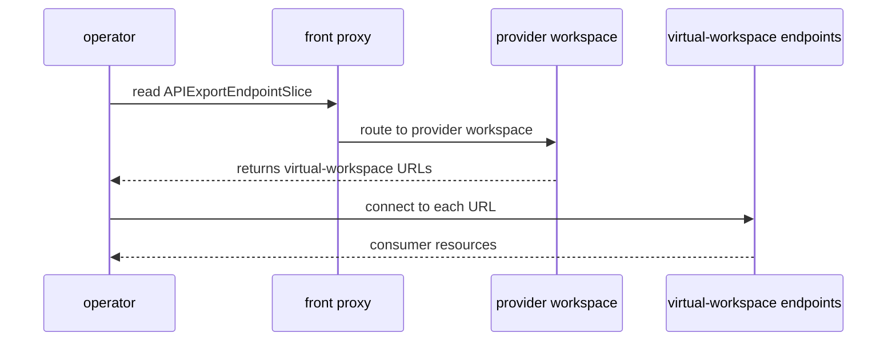

# Sharding

> [!WARNING]
> In Platform Mesh 0.3 sharding is experimental and expected to break. It
> is possible to deploy the local-setup with multiple shards by using
> one of the `:sharded` tasks or adding `--sharded` to the deployment
> script.

kcp's architecture primarily consists of the front-proxy, the cache-server and shards. Shards are kcp's primary scaling mechanism for workspace capacity.

This page only provides a terse overview of kcp's sharding to convey the concept. For a detailed discussion review the official kcp documentation:

https://docs.kcp.io/kcp/main/setup/sharding/

> [!WARNING]
> Always deploy in a sharded setup, even in development, to surface sharding issues early.

## High availability

Sharding is a capacity mechanism, not a high availability mechanism.

High availability is achieved by making each component highly available by itself, e.g. by deploying multiple replicas in different availability zones and making its backing storage highly available.

## kcp components

### shard

A shard is a kcp process (or processes with replicas) with its own etcd and hosts a set of [logical clusters](https://docs.kcp.io/kcp/main/concepts/terminology/#logical-cluster), the low-level primitive of [Workspaces](/reference/components/kcp/workspaces.md).

Every kcp instance consists of one `root` shard, which also contains the special [`root` Workspace](https://docs.kcp.io/kcp/main/concepts/workspaces/workspace-types/#root-workspace).
The `root` Workspace contains e.g. the `Shard` resource, which is managed by each shard itself to signal to the front-proxy and other shards that it exists.

Shards contain the controllers and reconcilers that make kcp mechanisms like [API sharing](/reference/components/kcp/api-sharing.md) work.

### front-proxy

The front-proxy is a stateless proxy routing client requests for a workspace to the correct shard.

### cache-server

Data between shards is primarily replicated through the cache-server - an eventually-consistent fan-in point for shared data.

It replicates e.g. APIExports without direct shard-to-shard connections.

For more details on the cache-server review the kcp [cache-server](https://docs.kcp.io/kcp/main/concepts/sharding/cache-server/) documentation.

## Workspace scheduling

When a Workspace is created the scheduler picks a random valid shard to schedule the logical cluster for that Workspace on.

> [!NOTE]
> The shard allocation is currently static and migrating a logical cluster is not possible.
> Migrating is however planned: https://github.com/kcp-dev/kcp/issues/3498

## Operators and sharding

Operators built with [multicluster-runtime](https://github.com/kubernetes-sigs/multicluster-runtime) and kcp's [multicluster-provider](https://github.com/kcp-dev/multicluster-provider) natively handle sharding.

To reconcile consumer resources, operators read the `APIExportEndpointSlice`, which lists one Virtual Workspace URL per shard where the `APIExport` is bound. The URLs are added and removed as consumers bind or unbind APIExports and the respective Virtual Workspaces are established or torn down.

Operators then connect to the Virtual Workspace endpoints directly to interact with the consumer workspaces.

### Example

An `APIExport` in the provider workspace:

```yaml
apiVersion: apis.kcp.io/v1alpha1
kind: APIExport
metadata:
  name: widgets.example.io
```

The corresponding `APIExportEndpointSlice` populated by kcp:

```yaml
apiVersion: apis.kcp.io/v1alpha1
kind: APIExportEndpointSlice
metadata:
  name: widgets.example.io
spec:
  export:
    name: widgets.example.io
    path: root:providers:widget-provider
status:
  endpoints:
    - url: https://root.kcp.example.io:6443/services/apiexport/abc123/widgets.example.io
    - url: https://nereus.kcp.example.io:6443/services/apiexport/abc123/widgets.example.io
    - url: https://triton.kcp.example.io:6443/services/apiexport/abc123/widgets.example.io
```

Each URL is a virtual workspace endpoint for a respective shard, serving a filtered view and access of consumer workspaces on that shard that bind the `APIExport`.



## Related

- [kcp](./kcp.md)
- [API sharing](/reference/components/kcp/api-sharing.md)
- [Control planes and workspaces](/concepts/control-planes.md)
- [Virtual workspaces](/reference/components/kcp/virtual-workspaces.md)
- [kcp-operator](./kcp-operator.md)
- [kcp sharding concepts](https://docs.kcp.io/kcp/main/concepts/sharding/)
- [kcp sharding setup guide](https://docs.kcp.io/kcp/main/setup/sharding/)
- [kcp logical clusters](https://docs.kcp.io/kcp/main/concepts/terminology/#logical-cluster)
- [kcp root Workspace](https://docs.kcp.io/kcp/main/concepts/workspaces/workspace-types/#root-workspace)
- [kcp cache-server](https://docs.kcp.io/kcp/main/concepts/sharding/cache-server/)
