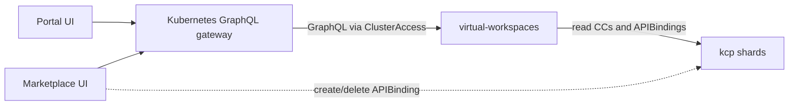

# virtual-workspaces

The Platform Mesh `virtual-workspaces` component is a standalone virtual workspace apiserver built on kcp's `pkg/virtual/framework`. It hosts two named virtual workspaces — `contentconfigurations` and `marketplace` — that serve curated, multi-workspace views of UI extension data and the service marketplace catalog.

This page documents the deployed Platform Mesh component. It is distinct from the kcp framework primitive described in [kcp virtual workspaces](./kcp/virtual-workspaces.md), which the component builds on.

::: warning
This component is in alpha. CLI flags, the `MarketplaceEntry` schema, authentication, authorization, and deployment wiring may change on short notice, including breaking changes.
:::

## Purpose

The server exposes two read endpoints:

- The `contentconfigurations` virtual workspace serves a merged view of `ContentConfiguration` resources, drawing from the system workspace and from any provider workspace that the consumer's account workspace binds. The Platform Mesh Portal uses this view to assemble navigation for the active workspace.
- The `marketplace` virtual workspace serves a `MarketplaceEntry` view derived from `APIExport` state. The Marketplace UI uses this view to render the provider catalog.

Mutations happen elsewhere. Installing a provider creates an `APIBinding` in the consumer workspace, not in the virtual workspace.

## Runtime role

The binary runs the `start` subcommand and serves an HTTPS apiserver on the configured port (chart default `8443`). Clients reach it through the kcp front-proxy at `/services/<vw-name>/...`; the front-proxy mapping is owned by the kcp installation, not by the `virtual-workspaces` chart.

The server does not own any persistent state. At runtime it:

- Connects to the kcp root through the configured kubeconfig.
- Reads `apis.kcp.io/v1alpha1.APIResourceSchema` for the `contentconfigurations` schema and `apis.kcp.io/v1alpha1.APIBinding` resources in consumer workspaces.
- Aggregates `ContentConfiguration` and `MarketplaceEntry` data into the dynamic forwarding storage exposed by each virtual workspace.

The `MarketplaceEntry.status` field is empty in v0.3.0; the Marketplace UI infers installation state from `APIBinding` resources in the consumer workspace.

## Exposed virtual workspaces

| Name | Base URL | Resource | Schema source |
| --- | --- | --- | --- |
| `contentconfigurations` | `/services/contentconfigurations/clusters/<path>/...` | `contentconfigurations.ui.platform-mesh.io/v1alpha1` | Loaded at runtime from the `APIResourceSchema` named by `--resource-schema-name` in the workspace named by `--resource-schema-workspace`. |
| `marketplace` | `/services/marketplace/clusters/<path>/...` | `marketplaceentries.marketplace.platform-mesh.io/v1alpha1` | Loaded from a schema embedded in the binary at build time. |

Both endpoints accept the kcp wildcard form `clusters/*`, which delivers a multi-workspace view that the consumer can fan out from a single connection. The URL shape carries one cluster path per request and one resource per virtual workspace; there is no per-export segment between `<vw-name>` and `clusters/`.

## How it fits into Platform Mesh

| Component | Role |
| --- | --- |
| [Platform Mesh Portal](./portal.md) | Reads the aggregated `ContentConfiguration` view through the [Kubernetes GraphQL gateway](./kubernetes-graphql-gateway.md) to render navigation for the active workspace. |
| [Marketplace](./marketplace.md) | Reads `MarketplaceEntry` through the gateway and writes `APIBinding` resources directly to the consumer workspace. |
| [Kubernetes GraphQL gateway](./kubernetes-graphql-gateway.md) | Introspects each virtual workspace through a `gateway.platform-mesh.io/v1alpha1.ClusterAccess` resource and serves the result as GraphQL. |
| [extension-manager-operator](https://github.com/platform-mesh/extension-manager-operator) | Validates `ContentConfiguration.spec` and writes the processed result into `.status`. The `contentconfigurations` virtual workspace reads that processed state. |
| [kcp](./kcp.md) | Upstream framework. Provides the virtual workspace primitives (`pkg/virtual/framework`), the `forwardingregistry` proxy storage, and the front-proxy that publishes the virtual workspace URLs. |

## Authentication

Authentication is layered. The standard delegating authentication options accept tokens through `--authentication-kubeconfig`, matching the kube-apiserver conventions. In addition, the binary registers a custom bearer-token authenticator that probes upstream kcp at `<root>/clusters/<path>/version` with the caller's token. Both are unioned, so a request is authenticated if either path accepts it.

The custom authenticator returns the user as `system:anonymous` in group `system:authenticated`. It treats kcp responses `200`, `201`, and `403` as success: a `403` from kcp means kcp recognized the token but denied the specific call, which the `virtual-workspaces` server interprets as proof that the token is valid, not that the call is allowed.

The custom authenticator does not propagate the upstream identity. Downstream code only sees the synthetic `system:anonymous` identity, so per-user authorization decisions inside `virtual-workspaces` are not yet possible.

## Authorization

Authorization is intentionally minimal in v0.3.0. The kcp `VirtualWorkspaceAuthorizer` runs at the framework root, and each named virtual workspace adds an `AttributesKeeper` wrapping a single decision: `system:authenticated` is allowed, every other principal is denied.

Any authenticated principal can read every `ContentConfiguration` and `MarketplaceEntry` reachable through the served virtual workspaces. The component is intended for use behind the kcp front-proxy and inside trusted Platform Mesh control planes; it does not enforce per-resource Platform Mesh authorization in v0.3.0. A `SubjectAccessReview`-based authorizer is tracked as future work.

## API surface

### `MarketplaceEntry`

The component owns the `MarketplaceEntry` cluster-scoped resource:

- API group: `marketplace.platform-mesh.io`
- Version: `v1alpha1`
- Scope: `Cluster`
- Storage in v0.3.0: served virtually from the `marketplace` virtual workspace; the embedded `APIResourceSchema` is exposed through the `marketplace.platform-mesh.io` `APIExport`.

| Field | Type | Description |
| --- | --- | --- |
| `spec.apiBindingName` | string | `metadata.name` of the `APIBinding` backing this installation in the consumer workspace. Empty when the provider is not installed. |
| `spec.providerMetadata` | object | Provider metadata (name, descriptions, contacts, support, icons). Imported verbatim from the [extension-manager-operator](https://github.com/platform-mesh/extension-manager-operator) `ProviderMetadata` type. |
| `spec.apiExport` | object | The source `apis.kcp.io/v1alpha2.APIExport` whose schemas the entry exposes for binding. |
| `status` | object | Empty in v0.3.0. |

### `marketplace.platform-mesh.io` APIExport

The component ships a static `apis.kcp.io/v1alpha2.APIExport` named `marketplace.platform-mesh.io`. The export references the `marketplaceentries` schema and is what consumer workspaces bind to gain access to the marketplace virtual workspace.

## URL contract

| Pattern | Purpose |
| --- | --- |
| `/services/contentconfigurations/clusters/<path>/...` | Per-workspace view of `ContentConfiguration` for the requested logical cluster. |
| `/services/contentconfigurations/clusters/*/...` | Wildcard view of `ContentConfiguration` across all clusters the caller can read. |
| `/services/marketplace/clusters/<path>/...` | Per-workspace view of `MarketplaceEntry` for the requested logical cluster. |
| `/services/marketplace/clusters/*/...` | Wildcard view of `MarketplaceEntry` across all clusters the caller can read. |

When a request matches one of these patterns, the server resolves the cluster name through kcp's logical-cluster machinery and forwards reads to the upstream resource using `forwardingregistry`. See [kcp virtual workspaces](./kcp/virtual-workspaces.md) for the broader URL convention.

## Configuration

### Component flags

The `start` subcommand accepts the following component flags. Defaults reflect the values that ship in v0.3.0; chart values that override the binary defaults are noted.

| Flag | Effective default in v0.3.0 | Description |
| --- | --- | --- |
| `--kubeconfig` | (required) | Kubeconfig used to reach the kcp root API server. |
| `--server-url` | `https://frontproxy-front-proxy.platform-mesh-system:8443` | Overrides `clusters[].cluster.server` from the kubeconfig. Must point at the kcp root URL, not the `root` cluster. |
| `--entity-label` | `ui.platform-mesh.io/entity` | Label key used by the `contentconfigurations` virtual workspace to identify provider-published `ContentConfiguration` resources. |
| `--content-for-label` | `ui.platform-mesh.io/content-for` | Label key indicating which workspace entity a `ContentConfiguration` applies to. |
| `--main-entity-name` | `main` | Entity name selected for the `root:orgs` workspace. |
| `--account-entity-name` | `core_platform-mesh_io_account` | Entity name selected for account workspaces. |
| `--resource-schema-name` | `v250704-6d57f16.contentconfigurations.ui.platform-mesh.io` | Name of the `apis.kcp.io/v1alpha1.APIResourceSchema` exposed by the `contentconfigurations` virtual workspace. |
| `--resource-schema-workspace` | `root:platform-mesh-system` | Workspace path that holds the `APIResourceSchema`. |
| `--resource-apiexport-endpointslice-name` | `core.platform-mesh.io` | `APIExportEndpointSlice` name reserved for endpoint discovery. The flag is wired by the chart in v0.3.0 but is not consumed by the current request paths. |

The `--entity-label` and `--content-for-label` defaults match the labels documented for the [`ContentConfiguration` resource](/reference/resources/content-configuration.md) and the [Metadata catalog](/reference/resources/metadata-catalog.md).

### Standard apiserver flags

The component embeds the standard `k8s.io/apiserver` `SecureServingOptions` and `DelegatingAuthenticationOptions`. The chart sets the following:

| Flag | Default in chart | Description |
| --- | --- | --- |
| `--bind-address` | `0.0.0.0` | Apiserver bind address. |
| `--secure-port` | `8443` | HTTPS port. |
| `--tls-cert-file` | `/certs/tls.crt` | Serving certificate. |
| `--tls-private-key-file` | `/certs/tls.key` | Serving certificate key. |
| `--client-ca-file` | `/client-ca/tls.crt` | Front-proxy client CA. |
| `--requestheader-client-ca-file` | `/requestheader-client-ca/tls.crt` | Request-header client CA. |
| `--requestheader-username-headers` | `X-Remote-User` | Request-header username header. |
| `--requestheader-group-headers` | `X-Remote-Group` | Request-header group header. |
| `--requestheader-extra-headers-prefix` | `X-Remote-Extra-` | Request-header extra-attribute header prefix. |
| `--authentication-kubeconfig` | `/api-authentication-kubeconfig/kubeconfig` | Kubeconfig used by the standard delegating authenticator. |
| `--authentication-skip-lookup` | (set) | Skip the kube-apiserver authentication ConfigMap lookup. |

## Deployment and Platform Mesh wiring

The `platform-mesh-operator-components` chart installs the component when `services.virtual-workspaces.enabled` is `true`. This is the default in a standard Platform Mesh installation.

| Value | Default | Description |
| --- | --- | --- |
| `services.virtual-workspaces.enabled` | `true` | Includes `virtual-workspaces` in the standard Platform Mesh installation. |
| `services.virtual-workspaces.values.deployment.serverUrl` | `https://frontproxy-front-proxy.platform-mesh-system:8443` | kcp root URL passed to `--server-url`. |
| `services.virtual-workspaces.values.deployment.resourceSchemaWorkspace` | `root:platform-mesh-system` | Workspace holding the `APIResourceSchema` for `ContentConfiguration`. |
| `services.virtual-workspaces.values.deployment.resourceSchemaName` | `v250704-6d57f16.contentconfigurations.ui.platform-mesh.io` | Pinned `APIResourceSchema` name. |

The `virtual-workspaces` chart itself (`charts/virtual-workspaces`) wires:

| Value | Default | Description |
| --- | --- | --- |
| `image.name` | `ghcr.io/platform-mesh/virtual-workspaces` | Container image. |
| `service.port` | `8443` | HTTPS service port. |
| `kubeconfigSecretName` | `account-operator-kubeconfig` | Secret mounted at `/api-kubeconfig`. The kubeconfig host is replaced by `--server-url`. |
| `authenticationKubeconfigSecretName` | `portal-kubeconfig` | Secret mounted at `/api-authentication-kubeconfig` for the delegating authenticator. |
| `clientCASecretName` | `root-front-proxy-client-ca` | Front-proxy client CA secret. |
| `requestHeaderClientCASecretName` | `root-requestheader-client-ca` | Request-header client CA secret. |
| `cert.secretName` | `virtual-workspaces-cert` | Serving certificate secret, populated by cert-manager. |
| `cert.issuer.name` | `root-server-ca` | Cert-manager `Issuer` used to mint the serving certificate. |
| `clusterAccess.marketplace.enabled` | `true` | Renders a `gateway.platform-mesh.io/v1alpha1.ClusterAccess` named `marketplace` so the [Kubernetes GraphQL gateway](./kubernetes-graphql-gateway.md) can introspect the marketplace virtual workspace. |

The rendered `ClusterAccess` resource uses `introspectionPath: /clusters/*` and `requestPathTemplate: /clusters/{clusterTarget}` so the gateway routes per-workspace GraphQL requests to the matching cluster path on the virtual workspace.

## Known limitations in v0.3.0

| Topic | Status |
| --- | --- |
| Authorization | Allows every `system:authenticated` principal. There is no per-resource check; treat the served data as visible to anyone with a valid kcp token. |
| Authenticator | Returns `system:anonymous`/`system:authenticated`. Identity is not propagated downstream, so per-user authorization is not yet possible. |
| `MarketplaceEntry.status` | Empty. The Marketplace UI infers installation state from `APIBinding` resources in the consumer workspace. |
| Readiness | The readiness probe accepts traffic before all upstream watches have synced; readiness is not gated on cache sync in v0.3.0. |
| Sharding | The component runs as a single deployment. Multi-shard kcp setups need additional front-proxy mapping; v0.3.0 ships against the single-shard local setup. |
| Schema pinning | `--resource-schema-name` pins the `APIResourceSchema` for `ContentConfiguration`. Updating the schema requires a redeploy with a matching value. |
| `--resource-apiexport-endpointslice-name` | Defined and templated by the chart but not consumed by request paths in v0.4.7. |

## Local setup

The component ships with the standard Platform Mesh local setup. See [Set up Platform Mesh locally](/how-to-guides/set-up-platform-mesh-locally.md).

## Repository

- [github.com/platform-mesh/virtual-workspaces](https://github.com/platform-mesh/virtual-workspaces)
- [Helm chart](https://github.com/platform-mesh/helm-charts/tree/main/charts/virtual-workspaces)

## Related

- [kcp virtual workspaces](./kcp/virtual-workspaces.md) — kcp framework primitives and URL conventions
- [Marketplace](./marketplace.md) — UI consumer of the `marketplace` virtual workspace
- [Platform Mesh Portal](./portal.md) — UI consumer of the `contentconfigurations` virtual workspace
- [Kubernetes GraphQL gateway](./kubernetes-graphql-gateway.md) — fronts both virtual workspaces as GraphQL endpoints
