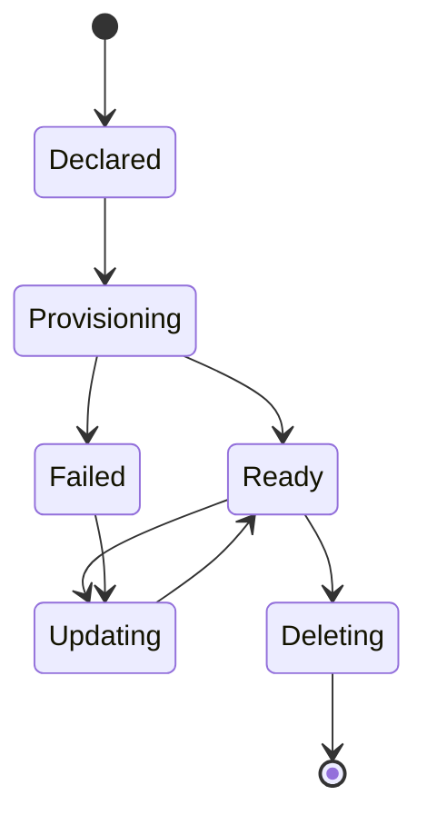

# Account CR

## Definition

The Account custom resource represents an account managed by Platform Mesh. It is the Kubernetes Resource Model object used to declare or observe an account lifecycle.

The Account CR connects the Platform Mesh account model to the kcp workspace hierarchy.

## Who creates it

Depending on permissions and deployment configuration, an Account CR can be created by:

- a user through the portal
- platform automation
- GitOps or IaC workflows
- an administrator using Kubernetes tooling

## Who reconciles it

The account operator reconciles Account resources and the related workspace, identity, and authorization state.

The Platform Mesh operator installs and wires the runtime components that make this reconciliation possible.

## What it represents

An Account CR is expected to represent:

- account identity
- parent-child relationship in the account hierarchy
- desired account type or role
- lifecycle state
- links to backing control-plane resources

The exact fields are version-specific and should be documented from the account operator API reference.

## Lifecycle

## Related

- [Account model](./account-model.md)
- [Control planes and workspaces](./control-planes.md)
- [Account operator](/reference/components/account-operator.md)
