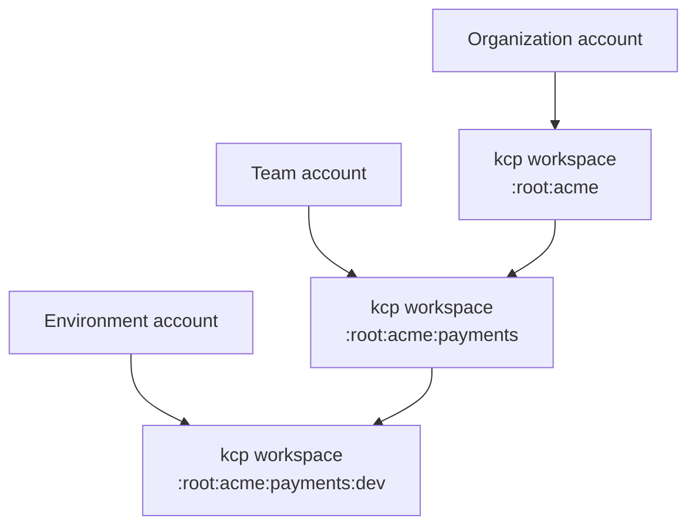

# Account model

## Definition

The Platform Mesh account model maps organizational structure to kcp workspaces. Each account is an isolated control plane boundary with its own API surface and authorization context.

Accounts are the Platform Mesh abstraction that users and platform components reason about. Workspaces are the kcp primitive that provides the API isolation behind those accounts.

## Common account roles

Platform Mesh can use accounts to represent several roles:

| Role | Purpose |
| --- | --- |
| Organization | Top-level tenant or business boundary |
| Team or project | Internal ownership boundary inside an organization |
| Environment | Development, staging, production, or other lifecycle boundary |
| Provider | Space where service provider APIs and automation are managed |
| Consumer | Space where users bind and consume provider APIs |

The exact account types available in an installation depend on the Platform Mesh version and account operator configuration.

## Relationship to workspaces

The account hierarchy and workspace hierarchy should align so policies, identity, authorization, and available APIs can follow organizational boundaries.

## Who manages accounts

The account operator manages account lifecycle and the corresponding kcp workspace structure.

Users may create accounts through the portal, automation, or Kubernetes clients if they have the required permissions.

## What an account controls

An account can influence:

- workspace creation and hierarchy
- available APIs
- identity realm or identity integration
- authorization store or authorization relationships
- portal navigation and account context
- provider and consumer relationships

## Provider-consumer relationship

Provider and consumer accounts stay isolated. The connection between them happens through APIExports, APIBindings, and authorization policy.

This lets a provider expose a declarative service API without giving consumers direct access to the provider runtime.

## Related

- [Account model concept](/concepts/account-model.md)
- [Account CR](./account-cr.md)
- [Control planes and workspaces](./control-planes.md)
- [Account operator](/reference/components/account-operator.md)
