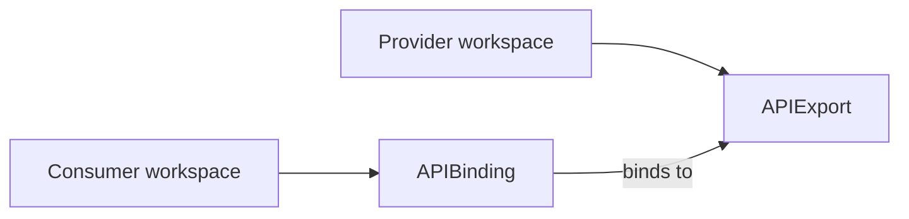

# APIExport and APIBinding

## Platform Mesh meaning

Platform Mesh uses APIExports and APIBindings to connect providers and consumers.

An APIExport is the provider-side API contract. An APIBinding makes that provider API available in a consumer workspace.

## Who creates them

| Object | Created by | Location |
| --- | --- | --- |
| APIExport | service provider or provider automation | provider workspace |
| APIBinding | service consumer, marketplace flow, or account automation | consumer workspace |

## Upstream ownership

kcp owns APIExport, APIBinding, APIResourceSchema, permission claim, identity, and virtual workspace semantics.

Use upstream kcp documentation for canonical details:

- [Exporting and binding APIs](https://docs.kcp.io/kcp/main/concepts/apis/exporting-apis/)

## Platform Mesh notes

- api-syncagent can populate APIExports for CRD-based provider services.
- custom provider controllers can use multi-cluster-runtime to watch resources through kcp.
- Marketplace and portal workflows can create or guide APIBinding flows for consumers.
- Permission claims matter because providers may need access to related consumer resources such as Secrets or ConfigMaps.

## Related

- [Control planes and workspaces](./control-planes.md)
- [Integration paths](/concepts/integration-paths.md)
- [api-syncagent](/concepts/integration/api-syncagent.md)
- [multi-cluster-runtime](/concepts/integration/multi-cluster-runtime.md)
