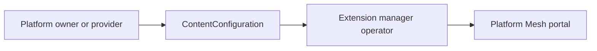

# ContentConfiguration

## Definition

ContentConfiguration describes portal content and extension configuration. Platform Mesh uses it to register UI modules and content without redeploying the portal.

## Who creates it

ContentConfiguration resources are created by platform owners or provider automation when new portal content should be exposed.

Examples include:

- registering a provider UI module
- exposing marketplace content
- adding navigation entries for account or service views
- configuring content delivered by a micro-frontend

## Who reconciles it

The extension manager operator validates and reconciles ContentConfiguration resources. The portal reads the reconciled content configuration at runtime.

## Flow

## Operational notes

- ContentConfiguration is platform content, not service instance data.
- It should be treated as part of portal extension management.
- Validation and status behavior are component-specific and should be documented with the extension manager or portal component.

## Related

- [Portal component](/reference/components/portal.md)
- [Architecture](/concepts/architecture.md)
