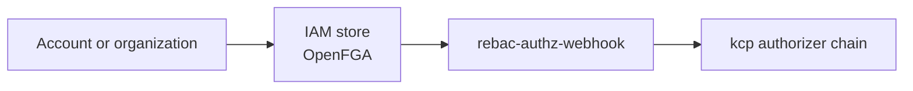

# IAM store

## Definition

An IAM store represents authorization state associated with an organization or account. Platform Mesh uses OpenFGA stores for relationship-based authorization data.

## Who creates it

Platform Mesh automation creates and wires IAM stores as part of account and organization lifecycle. End users usually do not create these stores directly.

## What it contains

An IAM store can contain:

- authorization models
- relationship tuples
- account and organization relationships
- provider-consumer relationships used for access decisions

The exact model is owned by the security and IAM components.

## Runtime relationship

## Operational notes

- IAM stores are part of platform security state.
- They should not be edited manually unless the relevant component documentation says so.
- Missing or stale authorization data can surface as authorization failures in kcp, the GraphQL gateway, or the portal.

## Related

- [OpenFGA component](/reference/components/openfga.md)
- [Security operator](/reference/components/security-operator.md)
- [rebac-authz-webhook](/reference/components/rebac-authz-webhook.md)
