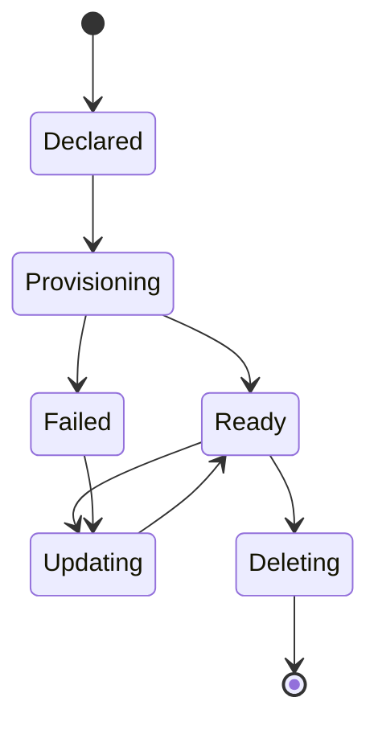

# Account resource

## Definition

The Account custom resource represents an account managed by Platform Mesh. It is the Kubernetes Resource Model object used to declare or observe account lifecycle and connects the Platform Mesh account model to the kcp workspace hierarchy.

The Account CR is defined by the [account-operator](https://github.com/platform-mesh/account-operator) in the API group `core.platform-mesh.io/v1alpha1`. That operator reconciles Accounts into kcp workspaces, workspace types, and related tenancy metadata. **Identity and fine-grained authorization** (for example Keycloak realms and OpenFGA stores) are handled by the [security operator](/reference/components/security-operator.md), not the account-operator.

## Schema

A minimal Account looks like this:

```yaml
apiVersion: core.platform-mesh.io/v1alpha1
kind: Account
metadata:
  name: platform-team
spec:
  type: org              # org | account
  displayName: "Platform Team"
  creator: alice@example.com   # set by the mutating webhook from the API user
```

| Field | Purpose |
| --- | --- |
| `spec.type` | Account type. `org` for an organization (kcp workspace type `org`), `account` for a nested account workspace (type `account`). Additional types may be allowed when configured on the operator webhooks. |
| `spec.displayName` | Human-readable label used by the Platform Mesh Portal and marketplace. |
| `spec.creator` | The Kubernetes user who created the resource; the mutating webhook typically sets this from the requesting user. Downstream components (for example the security operator) may use it when provisioning identity. |
| `spec.extensions` | Optional list of `AccountExtension` resources that attach additional configuration to the Account (for example, quotas or custom policies). |
| `spec.data` | Free-form structured data the Account exposes to the portal and to children for inheritance. |

The exact field set is version-specific. Use the [account-operator](https://github.com/platform-mesh/account-operator) API reference for the authoritative list.

## Who creates it

| Account type | Created by |
| --- | --- |
| Organization (`type: org`) | Platform owner, usually as part of onboarding a new tenant. Typically committed in local setup or an equivalent GitOps repository. |
| Nested account (`type: account`) | The parent account's admin (delegated through OpenFGA), typically via the portal or `kubectl`. |

The Account CR is **not** created by service providers or service consumers directly. Providers and consumers operate inside workspaces that the Account hierarchy provisions for them.

Account resources can therefore originate from:

- a user through the portal
- platform automation
- GitOps or IaC workflows
- an administrator using Kubernetes tooling

## Who reconciles it

The **account-operator** reconciles each `Account` into kcp **Workspace** and **WorkspaceType** objects, creates **AccountInfo** in the account workspace, and drives `Account` **status** (including readiness once the workspace is initialized).

The **security-operator** reconciles identity and authorization resources (OpenFGA **Store**, **AuthorizationModel**, Keycloak-related configuration, and related CRs) that attach to that tenancy. See [Account operator](/reference/components/account-operator.md) and [Security operator](/reference/components/security-operator.md).

The Platform Mesh operator installs and wires the runtime components that make both possible.

## What happens when you apply one

When the account-operator reconciles a new `Account`, it:

1. **Validates** the object via webhooks and sets **`spec.creator`** from the requesting user where applicable.
2. **Adds finalizers** for ordered cleanup (additional finalizers may apply depending on type).
3. For **`type: org`**, ensures **WorkspaceType** resources exist under **`root:orgs`** for organization and child account workspaces.
4. **Creates the kcp `Workspace`** for this account using the appropriate workspace type (`org` vs `account`) and parent path.
5. **Creates the cluster-scoped `AccountInfo`** named `account` in that workspace and fills **spec** with workspace paths, URLs, cluster CA, and tenancy lineage. **OpenFGA store IDs, OIDC clients, and other IAM fields** are populated later by workspace initializers and the security operator, not by the account-operator.
6. **Blocks readiness** until the workspace is **Ready** (kcp initializers complete), so components such as the security operator can finish setup before the account is considered usable.

OpenFGA store provisioning, authorization models, Keycloak realm wiring, and similar **identity and authorization** work happen in **separate reconcilers** (the security operator) that react to the workspace and CRs in the mesh—not inside the account-operator.

The `Account` becomes **Ready** when its subroutine **status conditions** (including aggregate **`Ready`**) succeed; see [Account operator](/reference/components/account-operator.md).

## Lifecycle



## Example: root organization from local setup

The following is the root organization Account from the Platform Mesh local setup:

```yaml
apiVersion: core.platform-mesh.io/v1alpha1
kind: Account
metadata:
  name: default
spec:
  type: org
  displayName: platform-mesh Org
```

Applied at the root workspace, this provisions the top-level `platform-mesh` organization that all other accounts are children of in a default deployment.

## Related

- [Account model](/concepts/account-model.md)
- [Control planes and workspaces](/concepts/control-planes.md)
- [Account operator](/reference/components/account-operator.md)
- [Metadata catalog](./metadata-catalog.md)
