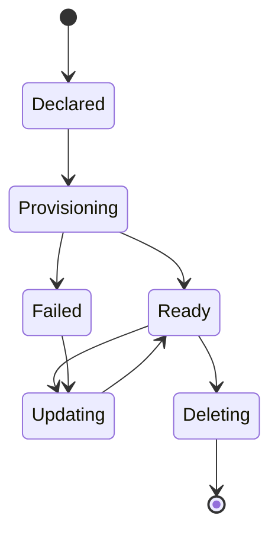

# Account resource

## Definition

The Account custom resource represents an account managed by Platform Mesh. It is the Kubernetes Resource Model object used to declare or observe account lifecycle and connects the Platform Mesh account model to the kcp workspace hierarchy.

The Account CR is defined by the [account-operator](https://github.com/platform-mesh/account-operator) in the API group `core.platform-mesh.io/v1alpha1`. The operator reconciles Accounts into kcp workspaces, sets up workspace types, and wires identity and authorization for each one.

## Schema

A minimal Account looks like this:

```yaml
apiVersion: core.platform-mesh.io/v1alpha1
kind: Account
metadata:
  name: platform-team
spec:
  type: org              # org | folder
  displayName: "Platform Team"
  creator: alice@example.com
```

| Field | Purpose |
| --- | --- |
| `spec.type` | Account type. `org` for a root organization (mapped to a kcp workspace type), `folder` for a sub-account or nesting level. |
| `spec.displayName` | Human-readable label used by the Platform Mesh Portal and marketplace. |
| `spec.creator` | The user who owns the Account. Used as the initial admin in the IAM store. |
| `spec.extensions` | Optional list of `AccountExtension` resources that attach additional configuration to the Account (for example, quotas or custom policies). |
| `spec.data` | Free-form structured data the Account exposes to the portal and to children for inheritance. |

The exact field set is version-specific. Use the [account-operator](https://github.com/platform-mesh/account-operator) API reference for the authoritative list.

## Who creates it

| Account type | Created by |
| --- | --- |
| Root organization (`type: org`) | Platform owner, usually as part of onboarding a new tenant. Typically committed in the local-setup chart or an equivalent GitOps repository. |
| Folder or sub-account (`type: folder`) | The parent account's admin (delegated through OpenFGA), often via the portal or `kubectl`. |

The Account CR is **not** created by service providers or service consumers directly. Providers and consumers operate inside workspaces that the Account hierarchy provisions for them.

Account resources can therefore originate from:

- a user through the portal
- platform automation
- GitOps or IaC workflows
- an administrator using Kubernetes tooling

## Who reconciles it

The account-operator reconciles Account resources and the related workspace, identity, and authorization state. The Platform Mesh operator installs and wires the runtime components that make this reconciliation possible.

## What happens when you apply one

When the account-operator sees a new Account CR, it:

1. **Creates a kcp workspace** for the Account under its parent (or at root for `type: org`).
2. **Sets the workspace type** based on `spec.type`, applying the right RBAC and initialization policies for an org or folder.
3. **Provisions an IAM store** (OpenFGA store) for this Account.
4. **Initializes identity** — for `org` accounts, a Keycloak realm is created or referenced if federation is configured.
5. **Adds finalizers** (`account.core.platform-mesh.io/finalizer`, `workspacetype.core.platform-mesh.io/finalizer`) so deletion is reconciled in the right order.
6. **Writes status** with the workspace path, the IAM store name, and references to the identity realm.

The Account becomes ready when all of the above complete. Until then, the workspace exists but is not usable for binding services or onboarding users.

## Lifecycle



## Example: root organization from local setup

The following is the root organization Account from the Platform Mesh local setup:

```yaml
apiVersion: core.platform-mesh.io/v1alpha1
kind: Account
metadata:
  name: default
spec:
  type: org
  displayName: platform-mesh Org
```

Applied at the root workspace, this provisions the top-level `platform-mesh` organization that all other accounts are children of in a default deployment.

## Related

- [Account model](/concepts/account-model.md)
- [Control planes and workspaces](/concepts/control-planes.md)
- [Identity and authorization](/concepts/identity-and-authorization.md)
- [Account operator](/reference/components/account-operator.md)
- [Metadata catalog](./metadata-catalog.md)
