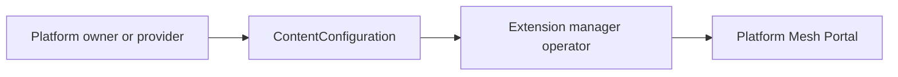

# ContentConfiguration

## Definition

ContentConfiguration is the Platform Mesh custom resource that registers a UI extension with the Platform Mesh Portal. It carries a configuration fragment that tells the portal how a micro-frontend should appear in the navigation, what entity it represents, and how it should behave.

ContentConfiguration is defined in the API group `ui.platform-mesh.io/v1alpha1`. It is processed by the extension manager operator (running inside the portal stack), which validates the configuration, resolves any remote references, and stores the processed result in the resource's `.status` so the portal can serve it without a runtime dependency on remote endpoints.

## Schema

```yaml
apiVersion: ui.platform-mesh.io/v1alpha1
kind: ContentConfiguration
metadata:
  name: account-home
  labels:
    ui.platform-mesh.io/entity: core_platform-mesh_io_account
spec:
  inlineConfiguration:
    contentType: json   # json | yaml
    content: |-
      {
        "name": "overview",
        "navigationConfig": {
          "data": {
            "nodes": [ ... ]
          }
        }
      }
  # OR remote-loaded:
  # remoteConfiguration:
  #   url: https://example.com/config.yaml
  #   authentication:
  #     type: bearer
  #     secretRef:
  #       name: example-credentials
```

| Field | Purpose |
| --- | --- |
| `metadata.labels["ui.platform-mesh.io/entity"]` | Attaches this configuration to a navigation entity in the portal (for example, `core_platform-mesh_io_account` to extend Account pages). |
| `spec.inlineConfiguration.content` | Configuration fragment delivered directly. Best for small, self-contained UI extensions. |
| `spec.inlineConfiguration.contentType` | `json` or `yaml` — how to parse `content`. |
| `spec.remoteConfiguration.url` | URL to fetch the configuration from. Best when the UI team owns the config independently from the cluster. |
| `spec.remoteConfiguration.authentication` | Auth for the remote URL: `none`, `basic`, `bearer`, or `clientCredentials` with a `secretRef`. |

## Who creates it

| Use case | Created by |
| --- | --- |
| Built-in portal pages (for example, the Account dashboard) | Platform owner, deployed alongside the portal as part of the Platform Mesh installation. |
| Provider-supplied extensions (for example, a custom UI for a database service) | Service provider, packaged with their service or applied during marketplace onboarding. |
| Tenant-specific extensions | Account admin, applied inside the Account's workspace. |

ContentConfiguration must be created **in a workspace where the portal's extension manager operator can reconcile it** — typically a Platform Mesh system workspace for built-ins and provider workspaces for service extensions.

## Who reconciles it

The extension manager operator validates and reconciles ContentConfiguration resources. The Platform Mesh Portal reads the reconciled configuration at runtime.

## What happens when you apply one

1. The extension manager operator picks up the new ContentConfiguration.
2. If `remoteConfiguration` is set, it fetches the remote content (using the configured authentication).
3. It validates the configuration fragment against the portal's schema.
4. It writes the processed (validated, normalized) configuration to `.status`.
5. The portal queries `.status` at request time to render navigation and load the micro-frontend.

This processing model keeps the portal highly available: the portal does not call out to remote URLs at request time, so a failing extension endpoint cannot bring the portal down.

## Flow



## Example: Account dashboard extension

The following ContentConfiguration registers a "Dashboard" tab on every Account page in the portal:

```yaml
apiVersion: ui.platform-mesh.io/v1alpha1
kind: ContentConfiguration
metadata:
  name: account-home
  labels:
    ui.platform-mesh.io/entity: core_platform-mesh_io_account
spec:
  inlineConfiguration:
    contentType: json
    content: |-
      {
        "name": "overview",
        "navigationConfig": {
          "data": {
            "nodes": [{
              "entityType": "main.core_platform-mesh_io_account",
              "pathSegment": "dashboard",
              "label": "Dashboard",
              "url": "/assets/platform-mesh-portal-ui-wc.js#generic-detail-view",
              "webcomponent": { "selfRegistered": true }
            }]
          }
        }
      }
```

The label `ui.platform-mesh.io/entity: core_platform-mesh_io_account` tells the portal: "When rendering an Account page, include this configuration's nodes." The `entityType: main.core_platform-mesh_io_account` inside the configuration places the navigation node in the main slot for Account pages.

## Trade-offs

- Inline configurations are limited by the Kubernetes resource size limit (~1 MiB total, less in practice once status is populated). Large extensions should use `remoteConfiguration`.
- Remote configurations require periodic reconciliation to pick up changes — there is no live trigger when the remote endpoint updates.
- Validation happens before configuration is applied, which improves reliability but means broken configs surface as `.status` errors rather than runtime portal failures.

## Operational notes

- ContentConfiguration is platform content, not service instance data.
- It should be treated as part of portal extension management.

## Related

- [Portal component](/reference/components/portal.md)
- [Architecture](/concepts/architecture.md)
- [Metadata catalog](./metadata-catalog.md) — see `ui.platform-mesh.io/entity` label usage
