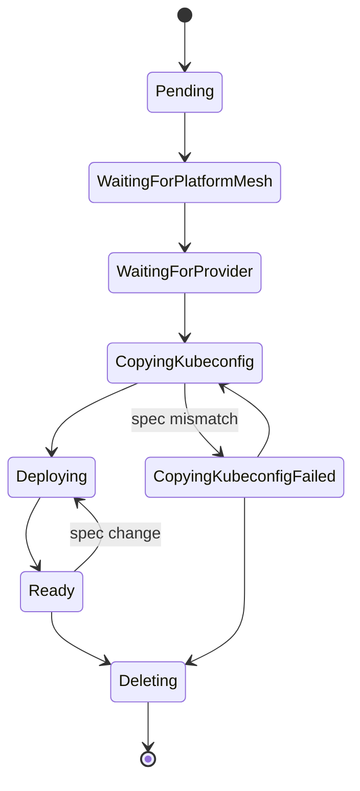

# ManagedProvider resource

## Definition

`ManagedProvider` is a namespace-scoped custom resource in the `providers.platform-mesh.io/v1alpha1` API group. It is a convenience API for platform admins to onboard platform-owned services end-to-end: it creates and manages a `Provider` on the kcp side, then copies the resulting kubeconfig and deploys service operator components on the runtime side.

For the conceptual overview, see [Provider bootstrap](/concepts/provider-bootstrap.md).

## Schema

A minimal `ManagedProvider` requires a `platformMeshRef` and at least one `runtimeDeployments` entry. Each entry deploys one Helm chart and sets exactly one of `flux` (chart fetched directly from an OCI registry or Helm repository) or `ocm` (chart resolved from an OCM component descriptor):

```yaml
apiVersion: providers.platform-mesh.io/v1alpha1
kind: ManagedProvider
metadata:
  name: my-service
  namespace: platform-mesh-system
spec:
  platformMeshRef:
    name: platform-mesh
  runtimeDeployments:
  - flux:
      registry: ghcr.io/my-org/charts
      chart: my-service-operator
      version: "1.0.0"
```

The same deployment resolved from an OCM component instead:

```yaml
  runtimeDeployments:
  - ocm:
      registry: ghcr.io/my-org
      component: github.com/my-org/my-service
      version: "1.0.0"
      resourceName: chart
```

### Spec fields

| Field | Required | Default | Description |
| --- | --- | --- | --- |
| `platformMeshRef.name` | Yes | — | Name of the `PlatformMesh` instance this `ManagedProvider` belongs to. |
| `runtimeDeployments` | Yes | — | List of components to deploy on the runtime cluster. Each entry sets exactly one of `flux` or `ocm`. |
| `runtimeDeployments[].flux.type` | No | `oci` | How the chart is fetched: `oci` (OCI artifact via a Flux `OCIRepository`) or `helm` (HTTP(S) Helm repository via a Flux `HelmRepository`). |
| `runtimeDeployments[].flux.registry` | Yes | — | Chart source: for `type: oci`, the OCI registry host and base path (e.g. `ghcr.io/my-org/charts`); for `type: helm`, the Helm repository URL. |
| `runtimeDeployments[].flux.chart` | Yes | — | Chart name: the OCI repository path under the registry, or the chart name within the Helm repository. |
| `runtimeDeployments[].flux.version` | Yes | — | Chart version to deploy (the OCI tag for `type: oci`). |
| `runtimeDeployments[].flux.values` | No | — | Helm values passed to the deployed chart. |
| `runtimeDeployments[].flux.insecure` | No | `false` | Allow plain-HTTP access to the OCI repository. |
| `runtimeDeployments[].ocm.registry` | Yes | — | OCM/OCI registry root that holds the component (e.g. `ghcr.io/my-org`). |
| `runtimeDeployments[].ocm.component` | Yes | — | Fully qualified OCM component name (e.g. `github.com/my-org/my-service`). |
| `runtimeDeployments[].ocm.version` | Yes | — | OCM component version (semver). |
| `runtimeDeployments[].ocm.resourceName` | No | `chart` | OCM resource name within the component to deploy. |
| `runtimeDeployments[].ocm.referencePath` | No | — | List of `{name: ...}` elements navigating nested component references to reach the resource. |
| `runtimeDeployments[].ocm.name` | No | Derived from `resourceName`, `referencePath`, or the component name | Name for the generated deployment objects. Set it explicitly when several entries share the same component name. |
| `runtimeDeployments[].ocm.values` | No | — | Helm values passed to the resolved chart. |
| `runtimeDeployments[].ocm.insecure` | No | `false` | Allow plain-HTTP access to the registry. |
| `provider.path` | No | `root:providers:system` | kcp workspace path where the `Provider` is created or adopted. |
| `provider.name` | No | `<ManagedProvider.name>` | Name of the `Provider` to create or adopt at `provider.path`. |
| `providerKubeconfigSecret.name` | No | `<ManagedProvider.name>-provider-kubeconfig` | Name of the Secret to store the copied kubeconfig in the runtime cluster. |
| `providerKubeconfigSecret.key` | No | `kubeconfig` | Key in the Secret's data map. |
| `runtimeKubeconfigSecretName` | No | Hosting cluster | Name of the Secret containing the kubeconfig for the target runtime cluster. |
| `providerHostOverride` | No | Operator-configured front-proxy URL | Overrides the kcp front-proxy host in the generated kubeconfig. |
| `cleanupOnDelete` | No | `false` | When `true`, also deletes the `Provider` on the kcp side when this resource is deleted, cascading to workspace deletion. |

### Status fields

| Field | Description |
| --- | --- |
| `phase` | Current lifecycle phase. See [Lifecycle](#lifecycle). |
| `providerKubeconfigSecretRef` | Reference to the Secret in the runtime cluster containing the copied kubeconfig. |
| `conditions` | Standard Kubernetes conditions, including `Ready`. |

## Who creates it

Platform admins create `ManagedProvider` resources to onboard platform-owned services.

::: tip
For service providers managing their own onboarding, see [`Provider`](./provider-resource.md).
:::

## Who reconciles it

The **ManagedProvider controller**, part of the [Platform Mesh operator](/reference/components/platform-mesh-operator.md), orchestrates the full provider lifecycle — from platform readiness checks through `Provider` creation, kubeconfig distribution, and operator deployment.

## What happens when you apply one

1. Finalizers are added for ordered cleanup.
2. The controller waits for the referenced `PlatformMesh` to be ready.
3. It creates (or adopts) a `Provider` at the target kcp path, defaulting to `root:providers:system`.
4. Once the `Provider` is ready, it copies the resulting kubeconfig into a Secret on the runtime cluster.
5. It deploys each component listed in `runtimeDeployments`: `flux` entries go straight to Flux (`OCIRepository`/`HelmRepository` + `HelmRelease`); `ocm` entries first have their component descriptor resolved by the ocm-controller (which must be installed in the runtime cluster), and the resolved chart is then deployed via Flux.

By default, deleting a `ManagedProvider` removes the runtime deployments and the copied kubeconfig but leaves the kcp `Provider` and its workspace intact. Set `cleanupOnDelete: true` to also remove the `Provider` and cascade to the workspace.

## Lifecycle



## Related

- [Provider bootstrap](/concepts/provider-bootstrap.md)
- [Provider resource](./provider-resource.md)
- [Platform Mesh operator](/reference/components/platform-mesh-operator.md)
- [Platform owner persona](/concepts/personas/platform-owner.md)
