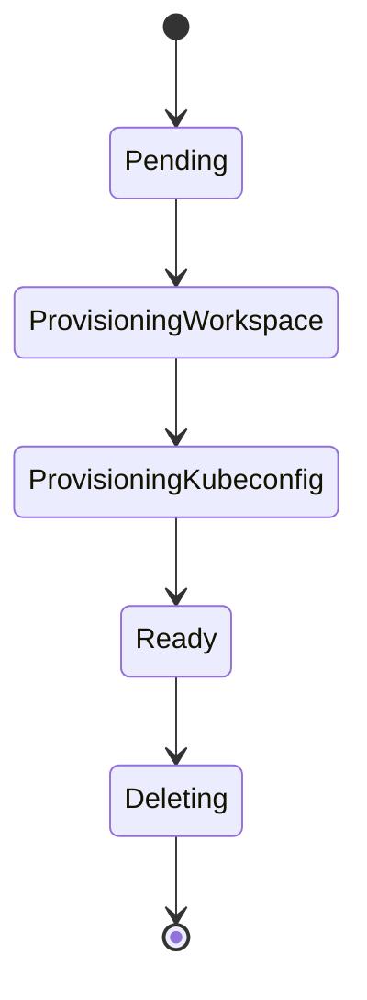

# Provider resource

## Definition

`Provider` is a kcp-facing, cluster-scoped custom resource in the `providers.platform-mesh.io/v1alpha1` API group. Creating one provisions a dedicated workspace and a scoped kubeconfig for the service provider.

For the conceptual overview, see [Provider bootstrap](/concepts/provider-bootstrap.md).

::: info
`Provider` resources are available in workspaces that have an `APIBinding` to the `providers.platform-mesh.io` export from `root:platform-mesh-system`. The workflow for obtaining that binding (the "become a provider" onboarding path) is TBD. For now, platform owners can create the binding manually where needed.
:::

## Schema

All spec fields are optional. A minimal `Provider` has an empty spec:

```yaml
apiVersion: providers.platform-mesh.io/v1alpha1
kind: Provider
metadata:
  name: my-service
spec: {}
```

### Spec fields

| Field | Required | Default | Description |
| --- | --- | --- | --- |
| `providerKubeconfigSecret.name` | No | `<Provider.name>-provider-kubeconfig` | Name of the Secret to write the generated kubeconfig into. |
| `providerKubeconfigSecret.namespace` | No | `default` | Namespace of the Secret. |
| `providerKubeconfigSecret.key` | No | `kubeconfig` | Key in the Secret's data map. |
| `hostOverride` | No | Operator-configured front-proxy URL | Overrides the kcp front-proxy host written into the generated kubeconfig. |

### Status fields

| Field | Description |
| --- | --- |
| `phase` | Current bootstrap phase. See [Lifecycle](#lifecycle). |
| `providerKubeconfigSecretRef` | Reference to the Secret containing the scoped kubeconfig for the provider workspace. |
| `conditions` | Standard Kubernetes conditions, including `Ready`. |

## Who creates it

Service providers — any team in the [service provider persona](/concepts/personas/service-provider.md) — create `Provider` resources in their kcp workspace.

::: tip
For platform admins who want to automate the full onboarding lifecycle, see [ManagedProvider](./managed-provider-resource.md).
:::

## Who reconciles it

The **Provider controller**, part of the [Platform Mesh operator](/reference/components/platform-mesh-operator.md), provisions the workspace and kubeconfig for each `Provider`.

## What happens when you apply one

1. Finalizers are added for ordered cleanup.
2. A workspace (WorkspaceType **`provider`**, declared in `root`) is created under `root:providers`. Its name is `<Provider.name>-<cluster-id>`, where `<cluster-id>` is the logical cluster ID (the `kcp.io/cluster` annotation) of the workspace holding the `Provider`. The name is deterministic: recreating the same `Provider` in the same workspace maps back to the same provider workspace, while equal names created by different tenants do not collide.
3. Inside that workspace, a ServiceAccount, ClusterRoleBinding, and token Secret are created.
4. A kubeconfig is generated from those credentials and written to the Secret specified by `providerKubeconfigSecret` (or the default location). The Secret is placed in the workspace where the `Provider` object lives, not in the provider workspace itself.
5. `status.phase` transitions to `Ready` once provisioning completes.

## Lifecycle



## Related

- [Provider bootstrap](/concepts/provider-bootstrap.md)
- [ManagedProvider resource](./managed-provider-resource.md)
- [Platform Mesh operator](/reference/components/platform-mesh-operator.md)
- [Service provider persona](/concepts/personas/service-provider.md)
