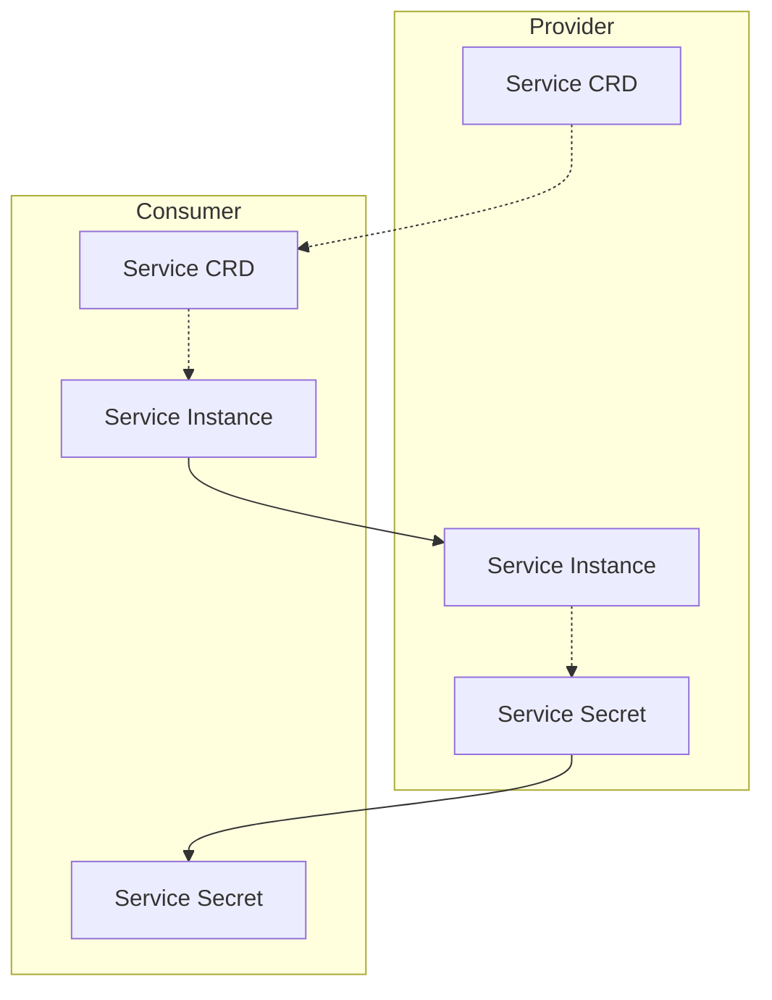
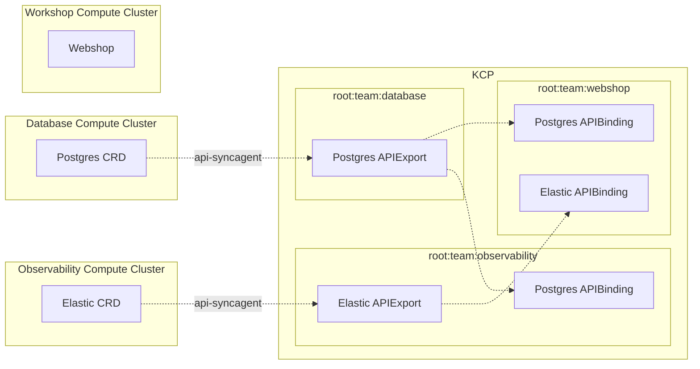
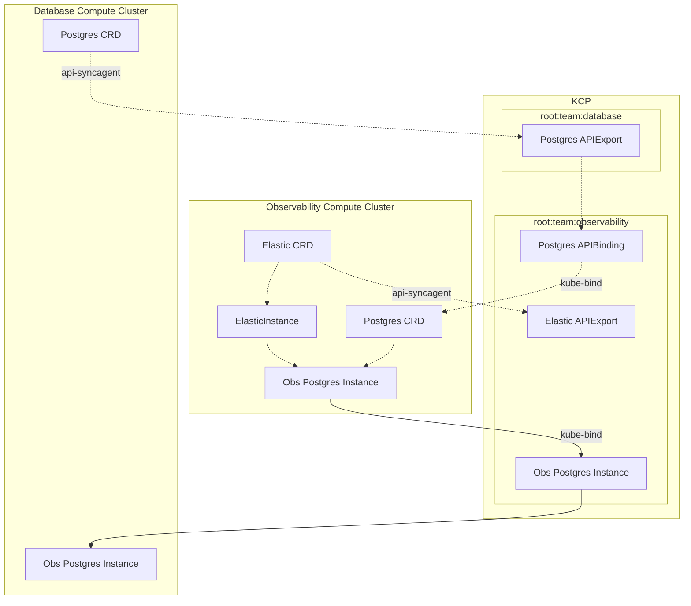
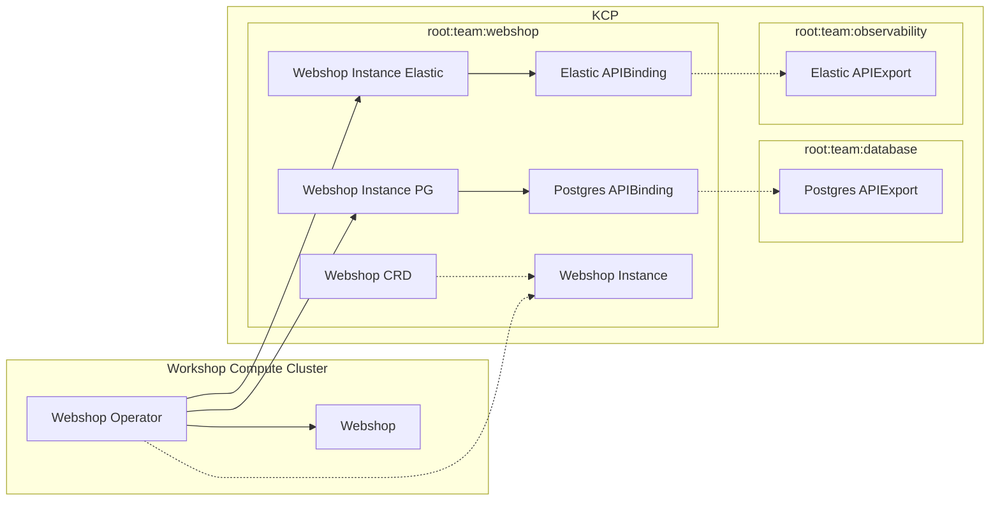

---

outline: deep
---
# Provider to Consumer (P2C)

This section describes high-level scenarios of how the **Platform Mesh** enables secure, declarative, and flexible **Provider to Consumer** (P2C) interactions across clusters, organizations, and teams. It builds on concepts such as the [**Account Model**](../overview/account-model.md), [**Control Planes**](../overview/control-planes.md), and [**Managed Service Provider Pattern**](../overview/design-decision.md) to unify service exchange.

## Kube to Kube

### Problem Description

In a direct **provider to consumer** setting, a provider wants to transfer technical information in a secure way to a consumer for a given service.

* The **Provider** must expose as little internal detail as possible.
* The **Consumer** should be able to automatically discover and consume instances of the service.
* Both parties must rely on a secure, declarative, contract-driven interaction.

### Solution

The provider can offer a **kube-bind backend**, allowing the consumer to:

* Authenticate with OIDC.
* Bind the service’s CRD (or any KRM API) into their own cluster.
* Automatically receive service instances and secrets.

---

## Kube to KCP to Kube

### Problem Description

Within an **Internal Developer Platform (IDP)** setup, multiple teams act both as providers and consumers.

* **Database Team (DB)** offers a Postgres service.
* **Observability Team (Obs)** wants to consume Postgres for their Elastic service.
* **Webshop Team (WS)** wants to consume both Postgres and Elastic services for their applications.

This creates a mesh of dependencies where teams provide and consume services through shared contracts.

Teams use GitOps and declarative manifests to manage components in their respective clusters.

### Tools Solution

The **Observability Team** leverages **KRO (Kubernetes Resource Orchestrator)** to:

* Instantiate Elastic services.
* Pull Postgres CRDs from their APIBinding using **kube-bind**.
* Define resource graphs that mirror Postgres instance requests back to KCP.

### Operator Solution

The **Webshop Team** uses its own **operator** built with **multicluster-runtime**:

* Webshop definitions live in their KCP workspace.
* Operator deploys workloads across clusters.
* Operator consumes Postgres and Elastic bindings.

The operator ensures database and observability service data flows securely into webshop workloads.

---

## How This Fits Into Platform Mesh

The above flows illustrate how **Provider to Consumer** interactions are standardized in the Platform Mesh:

* **Providers** expose declarative APIs using [**APIExports**](../overview/control-planes.md).
* **Consumers** bind to those APIs using **APIBindings**, gaining seamless access through the [**Account Model**](../overview/account-model.md).
* [**Control planes**](../overview/control-planes.md) reconcile declarative manifests into real-world capabilities.
* **Operators and orchestration tools** (kube-bind, KRO, multicluster-runtime) implement automation across boundaries.

This creates a secure, flexible, and decoupled ecosystem where services can be:

* Exposed minimally.
* Discovered and consumed declaratively.
* Composed across organizational or cluster boundaries.
* Governed through the [**Account Model**](../overview/account-model.md) and [**Managed Service Provider pattern**](../overview/design-decision.md).

Ultimately, Platform Mesh provides the **P2C fabric** for multi-team, multi-cluster, and multi-organization service interactions.
